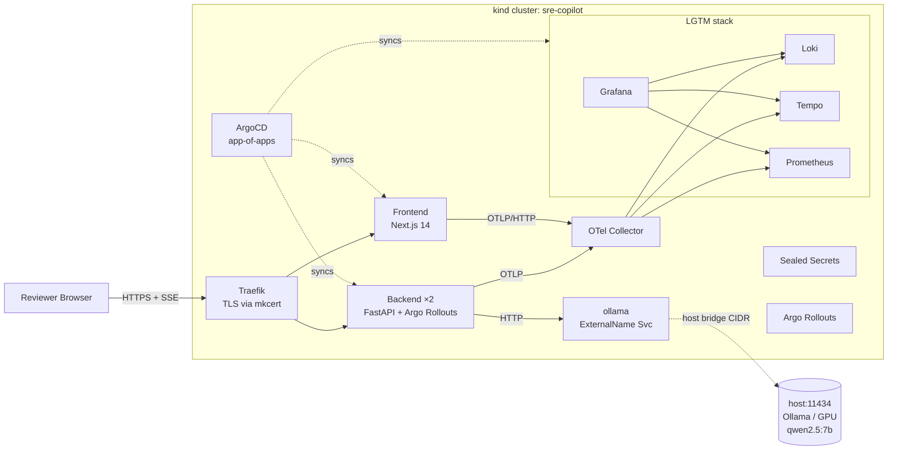

# SRE Copilot

[](https://github.com/zanonicode/sre-copilot/actions/workflows/ci.yml)
[](https://github.com/zanonicode/sre-copilot/actions/workflows/nightly-eval.yml)
[](https://github.com/zanonicode/sre-copilot/actions/workflows/release.yml)

> A kind-native, locally-runnable SRE assistant: streaming LLM log analysis, postmortem generation, full LGTM observability, GitOps via ArgoCD, and progressive delivery via Argo Rollouts — running entirely on your laptop.

---

## About this project

**SRE Copilot is an experiment.** The entire codebase — backend, frontend, Helm charts, Terraform, dashboards, CI, and documentation — was built using **[Spec-Driven Development (SDD)](.claude/sdd/readme.md) with [Claude Code](https://claude.ai/code)**. Each sprint went through the same workflow:

```
brainstorm → define → design → build → ship
```

Every decision is traceable: the [BRAINSTORM](.claude/sdd/features/BRAINSTORM_sre-copilot.md), [DEFINE](.claude/sdd/features/DEFINE_sre-copilot.md), and [DESIGN](.claude/sdd/features/DESIGN_sre-copilot.md) docs drove the four sprint builds, captured in [build reports](.claude/sdd/reports/). The architecture decisions live in [docs/adr/](docs/adr/).

The goal wasn't just to ship a working product. It was to exercise — end-to-end, in one cohesive system — the major skills that define modern SRE work:

| Skill | How this project exercises it |
|---|---|
| **Infrastructure as Code** | Terraform provisions a `kind` cluster; HCL state is the single source of truth |
| **Kubernetes** | 3-node kind cluster, namespaces, NetworkPolicies, PDBs, HPAs, probes, securityContexts |
| **GitOps** | ArgoCD app-of-apps: 13 Applications synced from git in wave order |
| **Progressive delivery** | Argo Rollouts canary with Prometheus `AnalysisTemplate` gating |
| **Helm packaging** | Helmfile orchestrates 12 releases with `needs:` ordering |
| **Secrets management** | Bitnami Sealed Secrets (asymmetric crypto, public encryption) |
| **Local LLM serving** | Ollama on the host, reached from cluster via ExternalName Service |
| **Python / FastAPI** | Async streaming endpoints, Pydantic schemas, Jinja prompts, OTel tracing |
| **TypeScript / React** | Next.js 14 App Router, EventSource SSE consumer, browser OTel SDK |
| **Observability** | OpenTelemetry → Collector → LGTM (Loki, Grafana, Tempo, Prometheus) |
| **SLOs & alerting** | Multi-window multi-burn-rate (MWMBR) PrometheusRules for 3 SLOs |
| **Eval & quality gates** | Layer-1 structural eval + Layer-2 LLM-as-judge, run nightly in CI |
| **Spec-Driven Development** | Brainstorm → Define → Design → Build with claude-code subagents |

## What it does

Three user-facing capabilities, each with full observability:

1. **Log analyzer** — paste log lines, get an AI-streamed root-cause hypothesis (SSE token stream from Qwen 2.5 7B running locally).
2. **Postmortem generator** — feed log analysis + timeline, get a structured postmortem in markdown.
3. **Anomaly injector** (admin endpoint, token-gated) — emits synthetic log patterns to demo the dashboards and triggers.

Plus a `make demo-canary` flow that ships a backend image bump as a canary rollout — Prometheus gates progression at 25% → 50% → 100% based on the live error budget.

## Architecture at a glance



For the full architecture (each component explained in depth), see [docs/INFRASTRUCTURE.md](docs/INFRASTRUCTURE.md) and [docs/OBSERVABILITY.md](docs/OBSERVABILITY.md).

## Quickstart

Three commands to a running stack on a fresh laptop:

```bash
# 1. Pull LLM models (~8.8 GB) — once per machine
make seed-models

# 2. Provision kind cluster + ArgoCD bootstrap + all 13 Applications
make up

# 3. Mint a local TLS cert for *.localtest.me + run smoke tests
make trust-certs && make smoke
```

Then visit:

| Service | URL |
|---|---|
| App frontend | https://sre-copilot.localtest.me |
| Backend API | https://api.sre-copilot.localtest.me |
| ArgoCD UI | https://argocd.sre-copilot.localtest.me |
| Grafana | https://grafana.sre-copilot.localtest.me |
| Prometheus | https://prometheus.sre-copilot.localtest.me |

ArgoCD password: `kubectl -n argocd get secret argocd-initial-admin-secret -o jsonpath='{.data.password}' | base64 -d`
Grafana password: see [docs/DEPLOYMENT.md](docs/DEPLOYMENT.md#how-to-get-grafana-password).

**Full setup, prerequisites, every Make target, and demo flows** → [docs/DEPLOYMENT.md](docs/DEPLOYMENT.md).

## Documentation map

This README is the front door. The deep docs are split for focus:

| Doc | What's in it |
|---|---|
| **[docs/DEPLOYMENT.md](docs/DEPLOYMENT.md)** | Prerequisites, tools used, step-by-step bootstrap (`detect-bridge` → `seed-models` → `up` → `trust-certs` → `dashboards` → `smoke`), every Make target with description, all endpoints, demo + canary flows, ArgoCD/Grafana password recipes, troubleshooting |
| **[docs/APP_GUIDE.md](docs/APP_GUIDE.md)** | How the app works end-to-end as a story: frontend ↔ backend ↔ Ollama, the SSE streaming protocol, prompt assembly, schemas, chunking, eval pipeline (local + GitHub nightly), seed-models, try-it-yourself walkthroughs |
| **[docs/INFRASTRUCTURE.md](docs/INFRASTRUCTURE.md)** | Each infra component explained for newbies and advanced readers: Terraform → kind → Traefik → ArgoCD → Helmfile → Helm charts → Sealed Secrets → Argo Rollouts → NetworkPolicies → tests. GitOps mental model. Tiltfile vs Make decision matrix. Bootstrap race teachable moment |
| **[docs/OBSERVABILITY.md](docs/OBSERVABILITY.md)** | OTel SDK (backend + browser) → Collector → LGTM. **Panel-by-panel walkthrough of every dashboard** with the source-code line that emits the data. TraceQL exploration playbook. SLO + MWMBR alert lineage. How to add a new metric end-to-end |

Other reference docs: [docs/adr/](docs/adr/) (architecture decisions), [docs/runbooks/](docs/runbooks/), [docs/eval/](docs/eval/), [docs/policy.md](docs/policy.md), [docs/security.md](docs/security.md), [docs/chaos.md](docs/chaos.md), [docs/aws-migration.md](docs/aws-migration.md), [docs/loom-script.md](docs/loom-script.md).

## Project structure

```
sre-copilot/
├── src/
│   ├── backend/             # FastAPI app — api/, admin/, schemas/, prompts/,
│   │                        #   observability/, middleware/, chunking/
│   └── frontend/            # Next.js 14 SPA — app/, components/, lib/sse.ts,
│                            #   observability/ (browser OTel)
├── helm/                    # Project-local Helm charts (backend, frontend,
│                            #   ollama-externalname, networkpolicies, …)
├── helmfile.yaml.gotmpl     # Helmfile orchestration of 12 releases (Go-templated
│                            #   per-machine env values)
├── argocd/
│   ├── bootstrap/           # root-app.yaml — the app-of-apps entry point
│   └── applications/        # 14 child Applications (one per workload)
├── terraform/local/         # kind cluster definition (Terraform-managed,
│                            #   kubeconfig → ~/.kube/sre-copilot.config)
├── observability/
│   ├── dashboards/          # 4 Grafana dashboard JSONs (overview, llm-perf,
│   │                        #   cluster, cost) + regen-configmaps.py
│   ├── alerts/              # PrometheusRules — SLO recording + MWMBR alerts
│   ├── ingressroutes.yaml   # Traefik IngressRoutes for grafana, prometheus,
│   │                        #   argocd
│   └── kustomization.yaml   # Kustomize entry that aggregates the above
├── tests/
│   ├── backend/             # pytest unit tests
│   ├── integration/         # in-cluster integration tests
│   ├── smoke/               # end-to-end smoke probes (SSE round-trip, ingress, Ollama)
│   └── eval/                # Layer-1 structural eval harness
├── datasets/
│   ├── eval/                # Golden labels + LLM-judge fixtures (Layer-2 eval)
│   └── loghub/              # Loghub log samples used as analyzer test inputs
├── deploy/
│   └── secrets/             # Sealed Secret manifests (committed encrypted blobs)
├── docs/                    # README's deep-dive companions: DEPLOYMENT, APP_GUIDE,
│                            #   INFRASTRUCTURE, OBSERVABILITY + adr/, runbooks/, eval/
├── notes/                   # Free-form planning notes (project plan, scratch)
├── .claude/
│   ├── sdd/                 # Brainstorm / Define / Design / Build / Ship artifacts
│   ├── kb/                  # Knowledge bases consumed by claude-code subagents
│   ├── agents/              # 18 specialized agents used during the build
│   └── commands/            # Slash commands (/workflow:brainstorm, /build, …)
├── .github/workflows/       # CI (ci.yml), nightly eval, release pipeline
├── Makefile                 # Bootstrap, demo, lint, test, judge, seal, trust-certs
├── Tiltfile                 # Inner-dev-loop live-reload (alternative to make up)
├── pyproject.toml           # Python package + ruff/mypy/pytest config
└── LICENSE                  # Apache 2.0
```

## Status

The cluster boots end-to-end on a fresh `make up`, smoke tests pass, the demo + canary flows work, and the nightly eval pipeline scores LLM output quality on labeled fixtures. See the [build reports](.claude/sdd/reports/) for what shipped in each sprint.

## License

[See LICENSE](LICENSE).

---

*Built as an SDD experiment with Claude Code. If you're reading this and thinking "I want to do the same for my project" — start with [.claude/sdd/readme.md](.claude/sdd/readme.md).*
