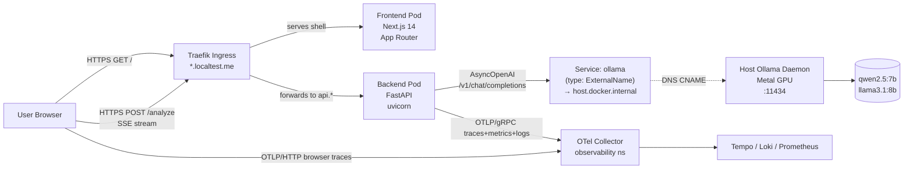

# SRE Copilot — App Usage Guide

> A narrative, code-anchored tour of how the app is used, how it streams,
> and how the LLM pipeline is wired end-to-end.
>
> Written for two readers at once: the newcomer who wants to *use* the app,
> and the engineer who wants to *debug* the LLM pipeline. Concepts are
> introduced before they are used. Every claim points at real code.

**See also:** for how to bring the cluster up so the app can run, see [DEPLOYMENT.md](DEPLOYMENT.md). For how the OTel spans created here flow through the observability stack, see [OBSERVABILITY.md §1 — Architecture](OBSERVABILITY.md#1-architecture-how-data-flows). For why the cluster is shaped the way it is, see [INFRASTRUCTURE.md](INFRASTRUCTURE.md).

---

## Table of Contents

1. [What you can do with the app](#1-what-you-can-do-with-the-app)
   - [1.1 Log Analyzer](#11-log-analyzer)
   - [1.2 Postmortem Generator](#12-postmortem-generator)
   - [1.3 Anomaly Injector (admin endpoint)](#13-anomaly-injector-admin-endpoint)
2. [The architecture, told as a story](#2-the-architecture-told-as-a-story)
   - [What happens when you click "Analyze"](#what-happens-when-you-click-analyze)
3. [The four layers in depth](#3-the-four-layers-in-depth)
   - [3.1 Frontend layer — Next.js 14 App Router](#31-frontend-layer--nextjs-14-app-router)
   - [3.2 Backend layer — FastAPI](#32-backend-layer--fastapi)
   - [3.3 Ollama layer — local LLM serving](#33-ollama-layer--local-llm-serving)
   - [3.4 Datasets layer — eval](#34-datasets-layer--eval)
4. [The LLM logic in depth](#4-the-llm-logic-in-depth)
   - [4.1 System prompt structure](#41-system-prompt-structure)
   - [4.2 Prompt assembly code](#42-prompt-assembly-code)
   - [4.3 Token estimation and chunking](#43-token-estimation-and-chunking)
   - [4.4 Streaming protocol — `_sse(event)`](#44-streaming-protocol--_sseevent)
   - [4.5 Error handling on partial streams](#45-error-handling-on-partial-streams)
   - [4.6 OTel spans wrapping the Ollama call](#46-otel-spans-wrapping-the-ollama-call)
   - [4.7 Why `AsyncOpenAI` against Ollama?](#47-why-asyncopenai-against-ollama)
5. [The seed-models process](#5-the-seed-models-process)
6. [Eval pipeline (local + nightly)](#6-eval-pipeline-local--nightly)
   - [6.1 `make test` — Layer 1 (structural)](#61-make-test--layer-1-structural)
   - [6.2 `make judge` — Layer 2 (LLM-as-judge)](#62-make-judge--layer-2-llm-as-judge)
   - [6.3 GitHub Actions nightly job](#63-github-actions-nightly-job)
7. [Try it yourself](#7-try-it-yourself)
   - [7.1 Port-forward the backend](#71-port-forward-the-backend)
   - [7.2 Watch SSE tokens stream](#72-watch-sse-tokens-stream)
   - [7.3 Trigger the anomaly injector](#73-trigger-the-anomaly-injector)
   - [7.4 Watch in Grafana](#74-watch-in-grafana)
   - [7.5 Poke the SSE protocol directly](#75-poke-the-sse-protocol-directly)
   - [7.6 Run the full demo](#76-run-the-full-demo)

---

## 1. What you can do with the app

The app is a local-first **SRE assistant**. It does not replace an SRE — it
shortens the loop between *seeing logs* and *writing a postmortem*. There are
three entry points worth knowing: a log analyzer, a postmortem generator, and
a hidden anomaly-injector endpoint used by the demo.

Before diving in, two terms you'll see repeatedly:

- **SSE (Server-Sent Events).** A simple HTTP streaming protocol where the
  server keeps the response open and writes lines that look like
  `data: {"...":"..."}\n\n`. The browser reads them as they arrive. This is
  how every "tokens streaming live" effect in this app works.
- **LLM token.** A small piece of text — usually a few characters — that the
  language model emits one at a time. Streaming = sending tokens as they're
  produced instead of waiting for the whole answer.

### 1.1 Log Analyzer

**UI flow.** Open the app and click **Analyze Logs** on the home page
([src/frontend/src/app/page.tsx](../src/frontend/src/app/page.tsx)). You land
on `/analyzer`, which renders [src/frontend/src/app/analyzer/page.tsx](../src/frontend/src/app/analyzer/page.tsx#L8).
You will see:

- A row of **Sample scenarios** buttons — `HDFS DataNode Failure`,
  `Cascade Retry Storm`, `Memory Leak / OOM` — defined in
  [src/frontend/src/components/SampleButtons.tsx](../src/frontend/src/components/SampleButtons.tsx#L3).
  Click one and the textarea below auto-fills with realistic log lines.
- A `<textarea>` where you can paste your own log payload (10–500,000 chars,
  enforced server-side in [src/backend/schemas/analyze.py:8](../src/backend/schemas/analyze.py#L8)).
- An optional **Context** input ("e.g. HDFS cluster, production, 2024-06-21").
- A green **Analyze** button rendered by
  [src/frontend/src/components/SseStream.tsx](../src/frontend/src/components/SseStream.tsx#L49).

When you click **Analyze**, the button toggles to red **Stop** and the panel
underneath begins to fill with JSON, character by character, with a blinking
cursor. When the model finishes, a small `123 tokens` counter appears in the
lower-right of the panel ([SseStream.tsx:72](../src/frontend/src/components/SseStream.tsx#L72)).

**API call.** The frontend POSTs to `/analyze/logs`. The fetch is in
[src/frontend/src/lib/sse.ts:19](../src/frontend/src/lib/sse.ts#L19):

```ts
const res = await fetch(`${API_URL}/analyze/logs`, {
  method: 'POST',
  headers: { 'Content-Type': 'application/json', Accept: 'text/event-stream' },
  body: JSON.stringify({ log_payload: logPayload, context }),
  signal,
})
```

**Real curl.** Once you've port-forwarded the backend to localhost:8000:

```bash
curl -N -X POST http://localhost:8000/analyze/logs \
  -H 'Content-Type: application/json' \
  -d '{
    "log_payload": "081109 203520 35 ERROR dfs.DataNode: DatanodeRegistered at namenode: 10.251.73.220:9000 error\n081109 203522 35 ERROR dfs.DataNode: DataNode is shutting down",
    "context": "HDFS lab cluster"
  }'
```

The `-N` flag disables curl buffering so you actually see the SSE events stream:

```text
data: {"type": "delta", "token": "{\""}
data: {"type": "delta", "token": "severity"}
data: {"type": "delta", "token": "\":\""}
data: {"type": "delta", "token": "critical"}
...
data: {"type": "done", "output_tokens": 184}
```

**Response shape.** The streamed tokens, when concatenated, form a JSON
document validated by `LogAnalysis` in
[src/backend/schemas/postmortem.py:53](../src/backend/schemas/postmortem.py#L53):
five fields — `severity`, `summary`, `root_cause`, `runbook`,
`related_metrics`. The schema enforced at the boundary; the prompt asks the
model to obey it.

### 1.2 Postmortem Generator

**UI flow.** Click **Postmortem** in the top nav, or `Generate Postmortem`
on the home page. The page is [src/frontend/src/app/postmortem/page.tsx](../src/frontend/src/app/postmortem/page.tsx#L7).
You paste **the JSON output from the analyzer** into the first textarea.
The frontend `JSON.parse`s it and reports a red parse error if it's
malformed ([postmortem/page.tsx:18](../src/frontend/src/app/postmortem/page.tsx#L18)).
Optional context goes into a second input. Hit **Analyze** (yes — same green
button; the SseStream component is reused).

**API call.** POST `/generate/postmortem` with `{ log_analysis, timeline?, context? }`.

```bash
curl -N -X POST http://localhost:8000/generate/postmortem \
  -H 'Content-Type: application/json' \
  -d '{
    "log_analysis": {
      "severity": "critical",
      "summary": "DataNode registration failures cascaded into cluster-wide write failures.",
      "root_cause": "DataNode could not register with NameNode due to network partition",
      "runbook": ["check namenode connectivity", "restart datanode"],
      "related_metrics": ["hdfs_datanode_block_reports_total"]
    },
    "context": "Production HDFS, 2024-06-21"
  }'
```

The streamed JSON is shaped by `Postmortem` in
[src/backend/schemas/postmortem.py:28](../src/backend/schemas/postmortem.py#L28):
Google SRE Workbook format with `summary`, `impact`, `severity` (SEV1–SEV4),
`detection`, `root_cause`, `trigger`, `resolution`, `timeline[]`,
`what_went_well[]`, `what_went_wrong[]`, `action_items[]`, `lessons_learned[]`.
The schema also enforces a **chronological-timeline** rule via a
`field_validator` ([postmortem.py:45](../src/backend/schemas/postmortem.py#L45)).

### 1.3 Anomaly Injector (admin endpoint)

This one is **not** in the UI on purpose. It's a token-gated POST that
synthesizes log noise inside the running backend pod, used by `make demo`
to create something interesting to look at on the dashboards. The route is
[src/backend/admin/injector.py:26](../src/backend/admin/injector.py#L26).

There are two scenarios baked in
([injector.py:11](../src/backend/admin/injector.py#L11)):

- `cascade_retry_storm` — downstream timeouts → retries → circuit-breaker open.
- `memory_leak` — long GC pauses → high heap → OOM-imminent.

Each scenario is a list of `(level, event, message)` tuples; the handler
loops the pattern 15 times with a small jitter sleep between log lines, so
the dashboards see a believable burst of structured log records that carry
`extra={"event": ..., "synthetic_anomaly": True}`. Those `extra` fields are
promoted into the JSON log envelope by the JsonFormatter at
[src/backend/observability/logging.py:22](../src/backend/observability/logging.py#L22).

**Real curl.**

```bash
curl -X POST "http://localhost:8000/admin/inject?scenario=cascade_retry_storm" \
  -H "X-Inject-Token: $ANOMALY_INJECTOR_TOKEN"
```

Without the token (or with the wrong one) the handler returns 403
([injector.py:31](../src/backend/admin/injector.py#L31)). The endpoint is
also marked `include_in_schema=False` so it won't appear in `/docs`.

---

## 2. The architecture, told as a story

> **Beginner**: TL;DR — your browser opens an SSE stream that travels through Traefik to the backend pod. The backend calls Ollama on your laptop's host (not in the cluster) via a magic DNS name. Tokens stream back the same path in reverse. OTel SDKs in the browser and backend send traces to the OTel Collector for the observability stack to consume.

Here is the whole thing in one diagram. Read it left to right, top to bottom. Note that *all* browser→backend traffic — including the SSE stream from the analyzer fetch — goes through Traefik; the frontend pod never receives that traffic. The frontend pod only serves the static Next.js shell.



A few clarifications about the arrows:

- The **SSE fetch from the analyzer page** is initiated by JavaScript in the user's browser, not by the frontend pod. The browser's `fetch()` opens a connection to `https://api.sre-copilot.localtest.me`, Traefik terminates TLS, and Traefik forwards to the backend Service. Tokens stream back the same way.
- **Browser OTLP traces** also go directly from the browser to the OTel Collector (via its OTLP/HTTP receiver, exposed via an IngressRoute). The frontend pod is not in that path.
- The frontend pod's only role is to serve the Next.js bundle (HTML/JS/CSS). Once the page is loaded, all subsequent calls are browser→Traefik→backend.

### What happens when you click "Analyze"

Let's trace one click end-to-end. Imagine you've pasted the HDFS sample
and clicked the green button.

1. **Browser**: `SseStream.start` ([SseStream.tsx:22](../src/frontend/src/components/SseStream.tsx#L22))
   creates an `AbortController`, then calls
   `streamAnalysis()` from `lib/sse.ts`.
2. **Browser → backend**: a POST goes to `/analyze/logs`. Because the
   browser was instrumented at first paint by `OtelInitializer` /
   `initBrowserOtel()` ([src/frontend/observability/otel.ts:18](../src/frontend/observability/otel.ts#L18)),
   the global `FetchInstrumentation` injects a W3C **traceparent** header
   on the outgoing request. Now everything has a shared trace ID.
3. **Traefik**: matches the host rule and forwards to the backend Service.
4. **Middleware (request_id)**: every request hits
   `RequestIdMiddleware.dispatch` first ([src/backend/middleware/request_id.py:14](../src/backend/middleware/request_id.py#L14)),
   which mints a `X-Request-ID` if absent and emits a structured
   `request started` log line. Combined with OTel auto-instrumentation
   (`FastAPIInstrumentor`, [observability/init.py:107](../src/backend/observability/init.py#L107)),
   you get logs, metrics, and a server span — all carrying the same
   `trace_id`.
5. **FastAPI route**: `analyze_logs` in
   [src/backend/api/analyze.py:42](../src/backend/api/analyze.py#L42)
   parses the body via the `LogAnalysisRequest` Pydantic model, runs
   `render_log_analyzer()` to assemble the prompt, and computes
   `input_tokens` via `tiktoken`.
6. **Prompt assembly**: `render_log_analyzer()` in
   [src/backend/prompts/__init__.py:27](../src/backend/prompts/__init__.py#L27)
   loads the Jinja template
   [src/backend/prompts/log_analyzer.j2](../src/backend/prompts/log_analyzer.j2)
   and stitches in a one-shot HDFS example as guidance.
7. **Streaming generator**: the route returns
   `StreamingResponse(stream(), media_type="text/event-stream")`. The
   `stream()` async generator opens an OTel span `ollama.host_call`
   ([analyze.py:51](../src/backend/api/analyze.py#L51)) and calls the
   Ollama-hosted model via `AsyncOpenAI.chat.completions.create(stream=True)`.
8. **Ollama call hop**: the URL is
   `http://ollama.sre-copilot.svc.cluster.local:11434/v1`. Inside the
   cluster, that DNS name resolves to a `type: ExternalName` Service whose
   `externalName` is `host.docker.internal`. So the TCP connection
   actually goes from the backend pod, over the Docker host bridge, into
   the host's `ollama` daemon listening on port 11434
   ([helm/platform/ollama-externalname/templates/service.yaml](../helm/platform/ollama-externalname/templates/service.yaml)).
9. **Token loop** ([analyze.py:79](../src/backend/api/analyze.py#L79)):
   for each chunk Ollama returns, the backend yields
   `data: {"type":"delta","token":"<text>"}\n\n`. The first non-empty
   delta records `llm.ttft_seconds` and adds a `first_token` event to
   the span ([analyze.py:88](../src/backend/api/analyze.py#L88)).
10. **Done**: when Ollama closes the stream, the route emits
    `data: {"type":"done","output_tokens":N}\n\n` and a synthetic span
    `ollama.inference` is created via
    [observability/spans.py:12](../src/backend/observability/spans.py#L12)
    to represent host-side work that OTel cannot auto-instrument.
11. **Browser SSE consumer**: `streamAnalysis()` reads the response with a
    `ReadableStream` reader, splits on `\n\n`, parses each `data:` line as
    JSON, and calls the `onToken` callback for every delta. `SseStream`
    appends each token to its `output` state, which React renders.
12. **JSON pretty-print**: `SseStream` keeps trying to
    `JSON.parse(output)` and pretty-print it
    ([SseStream.tsx:43](../src/frontend/src/components/SseStream.tsx#L43));
    once the JSON is complete it formats nicely; before that it just
    shows the raw streaming text.

Cancellation is honoured the whole way: clicking **Stop** aborts the
fetch (`AbortController`), the server sees `request.is_disconnected()`
and `aclose()`s the upstream stream
([analyze.py:80–83](../src/backend/api/analyze.py#L80)), tagging the
span as cancelled.

---

## 3. The four layers in depth

### 3.1 Frontend layer — Next.js 14 App Router

**Location**: [src/frontend/](../src/frontend/). Routing uses the
[App Router](https://nextjs.org/docs/app), where every folder under
`src/app/` is a route segment. Three pages exist:

- `/` — [src/frontend/src/app/page.tsx](../src/frontend/src/app/page.tsx)
  (landing).
- `/analyzer` — [src/frontend/src/app/analyzer/page.tsx](../src/frontend/src/app/analyzer/page.tsx).
- `/postmortem` — [src/frontend/src/app/postmortem/page.tsx](../src/frontend/src/app/postmortem/page.tsx).

The shared chrome (nav, body styles, OTel boot) is in
[src/frontend/src/app/layout.tsx](../src/frontend/src/app/layout.tsx),
which embeds `<OtelInitializer />` once at the root so browser tracing
boots on first paint.

**The SSE consumer.** Both pages share `SseStream`. The streaming logic
itself lives in `lib/sse.ts`. Notice this is *not* the browser's built-in
`EventSource` API — that API is GET-only, and we need POST. So we use
`fetch` + a manual reader that splits on `\n\n`:

```ts
// src/frontend/src/lib/sse.ts:31-49
const reader = res.body.getReader()
const decoder = new TextDecoder()
let buf = ''
while (true) {
  const { done, value } = await reader.read()
  if (done) break
  buf += decoder.decode(value, { stream: true })
  const parts = buf.split('\n\n')
  buf = parts.pop() ?? ''
  for (const part of parts) {
    const line = part.trim()
    if (!line.startsWith('data: ')) continue
    const evt: SseEvent = JSON.parse(line.slice(6))
    if (evt.type === 'delta' && evt.token) onToken(evt.token)
    else if (evt.type === 'done') onDone(evt.output_tokens ?? 0)
    else if (evt.type === 'error') onError(evt.message ?? 'unknown error')
  }
}
```

The `buf.split('\n\n')` / `buf = parts.pop()` trick is the canonical SSE
parser: incomplete frames stay in `buf` until the next chunk completes
them. This is robust against TCP fragmentation.

**OTel browser instrumentation** is in
[src/frontend/observability/otel.ts](../src/frontend/observability/otel.ts).
Key points:

- A `WebTracerProvider` exports OTLP-over-HTTP to the OTel Collector at
  `http://otel-collector.observability.svc.cluster.local:4318/v1/traces`
  ([otel.ts:14](../src/frontend/observability/otel.ts#L14)).
- The W3C Trace Context propagator is set globally
  ([otel.ts:37](../src/frontend/observability/otel.ts#L37)).
- `FetchInstrumentation` wraps `window.fetch` and injects `traceparent`
  on every outgoing request that matches `propagateTraceHeaderCorsUrls:
  [/.*/]` ([otel.ts:42](../src/frontend/observability/otel.ts#L42)).
- `DocumentLoadInstrumentation` auto-records the navigation timeline.

**traceparent propagation.** When the analyzer fires a POST to
`/analyze/logs`, the fetch instrumentation adds e.g.
`traceparent: 00-4bf92f3577b34da6a3ce929d0e0e4736-00f067aa0ba902b7-01`.
On the backend, `instrument_app(app)` is configured with
`http_capture_headers_server_request=["traceparent","x-request-id"]`
([init.py:110](../src/backend/observability/init.py#L110)), so the
incoming server span links to the same trace and dashboards can show the
full client-to-LLM path under one trace ID.

**web-vitals.** [src/frontend/observability/web-vitals.ts](../src/frontend/observability/web-vitals.ts)
subscribes to `onCLS/onFCP/onFID/onLCP/onTTFB` from the `web-vitals`
package and emits each as a single span (`web-vital.cls`,
`web-vital.lcp`, …) tagged with
`web_vital.value` and `web_vital.rating`. The OtelInitializer calls
`measureWebVitals()` after `initBrowserOtel()`
([OtelInitializer.tsx:9](../src/frontend/src/components/OtelInitializer.tsx#L9)).

### 3.2 Backend layer — FastAPI

> **Beginner**: TL;DR — the backend is a FastAPI app whose `/analyze/logs` route returns an SSE stream. It calls Ollama via the OpenAI SDK (Ollama speaks the OpenAI wire format), wraps the call in an OTel span, and yields one `data: {...}` line per token. Three failure modes are handled: Ollama unreachable, client disconnects mid-stream, and normal completion. Each instrumentation choice has a reason — read the triple-nested `try` blocks carefully.

**Entrypoint** is [src/backend/main.py](../src/backend/main.py). Read the
top comment carefully — it explains a foot-gun:

> *OTel SDK providers MUST be installed before importing any module that
> creates meters/instruments at import time… Otherwise instruments bind
> to the no-op ProxyMeterProvider permanently.*

That is why `init_observability_providers()` is called *before*
`backend.api.*` are imported ([main.py:19](../src/backend/main.py#L19)).
Most "my metrics aren't showing up" bugs trace back to violating this
invariant.

**Route registration** at [main.py:57–60](../src/backend/main.py#L57):

```python
app.include_router(analyze_router, prefix="/analyze")
app.include_router(postmortem_router, prefix="/generate")
app.include_router(health_router)        # /healthz
app.include_router(admin_router)         # /admin/*
```

**Middlewares**:

- `CORSMiddleware` — wide open for local dev, locked down at ingress in
  prod.
- `RequestIdMiddleware` ([middleware/request_id.py](../src/backend/middleware/request_id.py))
  — mints an `X-Request-ID`, logs request start/end with structured
  `extra={"event": ...}` fields the JSON formatter promotes to
  top-level keys.
- `register_error_handlers(app)`
  ([middleware/error_handler.py](../src/backend/middleware/error_handler.py))
  — registers two exception handlers:
  - `RequestValidationError` → 400 with the Pydantic error list and the
    request_id.
  - `StarletteHTTPException` → JSON envelope with the request_id (so a
    user reporting a 500 includes a correlation ID).

**Pydantic schemas** sit in [src/backend/schemas/](../src/backend/schemas/):

- [analyze.py](../src/backend/schemas/analyze.py) — `LogAnalysisRequest`
  (input). Notice `estimated_tokens()` uses `tiktoken.cl100k_base` —
  the same encoder OpenAI ships, used as a *budget* heuristic only;
  Ollama tokenizes differently.
- [postmortem.py](../src/backend/schemas/postmortem.py) — output schemas
  (`LogAnalysis`, `LogAnalysisV2`, `Postmortem`, `TimelineEvent`,
  `ActionItem`) and the input `PostmortemRequest`. The `Postmortem.timeline`
  validator at line 45 rejects out-of-order timelines.

**The SSE generator pattern** is the heart of the backend. Here is the
real stream function from
[src/backend/api/analyze.py:47–106](../src/backend/api/analyze.py#L47):

```python
async def stream() -> AsyncIterator[bytes]:
    LLM_INPUT_TOKENS.add(input_tokens)
    LLM_ACTIVE.add(1)
    try:
        with tracer.start_as_current_span(
            "ollama.host_call",
            attributes={
                "llm.model": LLM_MODEL,
                "llm.input_tokens": input_tokens,
                "peer.service": "ollama-host",
                "net.peer.name": "host.docker.internal",
                "net.peer.port": 11434,
            },
        ) as span:
            try:
                stream_resp = await client.chat.completions.create(
                    model=LLM_MODEL,
                    messages=[{"role": "user", "content": prompt}],
                    stream=True,
                    response_format={"type": "json_object"},
                )
            except APIConnectionError as e:
                span.record_exception(e)
                span.set_status(trace.StatusCode.ERROR, "ollama unreachable")
                yield await _sse({"type": "error", "code": "ollama_unreachable",
                                  "message": "LLM backend is unavailable"})
                return

            t0 = asyncio.get_event_loop().time()
            first_token_seen = False
            output_tokens = 0
            try:
                async for chunk in stream_resp:
                    if await request.is_disconnected():
                        await stream_resp.aclose()
                        span.set_status(trace.StatusCode.ERROR, "cancelled")
                        return
                    delta = chunk.choices[0].delta.content or ""
                    if not delta:
                        continue
                    if not first_token_seen:
                        ttft = asyncio.get_event_loop().time() - t0
                        LLM_TTFT.record(ttft)
                        span.add_event("first_token", {"ttft_seconds": ttft})
                        first_token_seen = True
                    output_tokens += 1
                    yield await _sse({"type": "delta", "token": delta})
            finally:
                duration = asyncio.get_event_loop().time() - t0
                LLM_OUTPUT_TOKENS.add(output_tokens)
                LLM_RESPONSE.record(duration)
                synthetic_ollama_span(
                    parent=span, duration=duration,
                    output_tokens=output_tokens,
                    input_tokens=input_tokens,
                )
                extra_fields: dict = {}
                if ENABLE_CONFIDENCE:
                    extra_fields["confidence"] = round(random.uniform(0.72, 0.97), 3)
                yield await _sse({"type": "done", "output_tokens": output_tokens, **extra_fields})
    finally:
        LLM_ACTIVE.add(-1)
```

There's a lot packed in here. Three things to notice:

1. **Triple-nested `try`**. Outer `try/finally` to decrement
   `LLM_ACTIVE`. Inner `try/except` around the `client.chat.completions.create`
   call to catch unreachable-Ollama errors and turn them into a clean
   SSE `error` event. Innermost `try/finally` around the streaming loop
   to *always* record duration, output tokens, the synthetic span, and
   the `done` envelope — even on cancel.
2. **Cancellation handling**. `request.is_disconnected()` is checked
   inside the loop; on disconnect we call `stream_resp.aclose()` to
   propagate cancel back to Ollama (so the model stops generating)
   and tag the span as cancelled.
3. **Canary feature flag**. `ENABLE_CONFIDENCE` lets you build a v2
   image (`make demo-canary`) that emits an extra `confidence` float in
   the `done` payload. v1 replicas omit it. That difference is what
   makes Argo Rollouts canary visible to clients.

**Prompt assembly** is its own §4 below.

**Chunking strategy** lives in
[src/backend/chunking/strategy.py](../src/backend/chunking/strategy.py):

```python
SINGLE_PASS_LIMIT = 6_000      # tokens — direct prompt
SUMMARIZE_LIMIT   = 18_000     # summarize-then-analyze
CHUNK_SIZE        = 4_000

def select_strategy(log_payload: str) -> str:
    n = count_tokens(log_payload)
    if n <= SINGLE_PASS_LIMIT: return "single"
    if n <= SUMMARIZE_LIMIT:   return "summarize"
    return "map_reduce"
```

The thresholds are sized for Qwen 2.5 7B's 32k context window. The
`chunk_text()` helper splits by lines, never mid-line, so DAG-style log
records remain readable. As of this writing the analyze route always
single-passes — the strategy module is wired in for the next iteration
(per [.claude/sdd/features/DESIGN_sre-copilot.md](../.claude/sdd/features/DESIGN_sre-copilot.md) §9.1).

**Observability subpackage** (see [OBSERVABILITY.md §2.1](OBSERVABILITY.md#21-opentelemetry-sdk-backend-python) for the full pipeline view):

- [observability/init.py](../src/backend/observability/init.py) — phased
  init (providers first, then `instrument_app`). Sets up Trace, Metric,
  and Log providers all exporting OTLP/gRPC to
  `OTEL_EXPORTER_OTLP_ENDPOINT`. Also installs filters that suppress
  benign async-context-detach noise from cancelled SSE generators
  ([init.py:88](../src/backend/observability/init.py#L88)).
- [observability/metrics.py](../src/backend/observability/metrics.py) —
  five OTel instruments: `llm.ttft_seconds`, `llm.response_seconds`,
  `llm.tokens_output_total`, `llm.tokens_input_total`,
  `llm.active_requests`.
- [observability/logging.py](../src/backend/observability/logging.py) —
  `JsonFormatter` that injects `trace_id`/`span_id` into every log line
  by reading the current OTel span. This is what makes Loki ↔ Tempo
  click-through work in Grafana.
- [observability/spans.py](../src/backend/observability/spans.py) — the
  `synthetic_ollama_span` helper that re-creates a child span for
  host-side work using `time.time_ns()` (not the asyncio monotonic
  clock — the comment at line 22 explains why).

### 3.3 Ollama layer — local LLM serving

**The problem.** The backend runs in a kind cluster (Linux containers
on a Mac). It needs to call a model that runs on the *host* (Apple
Metal GPU on macOS). There is no Metal GPU passthrough into Docker.
And shipping a 5–8 GB model image into kind would blow up cold-start
times.

**The trick.** Run Ollama natively on the Mac. Inside the cluster,
create a `Service` of `type: ExternalName` whose `externalName` is
`host.docker.internal` — a Docker-Desktop / OrbStack / Colima magic
DNS name that resolves to the host bridge IP. Pods then dial the
service by its in-cluster DNS, which resolves via CNAME to the
host name, which resolves to a host-bridge IP. That IP routes to the
host process.

The Service is rendered from
[helm/platform/ollama-externalname/templates/service.yaml](../helm/platform/ollama-externalname/templates/service.yaml):

```yaml
apiVersion: v1
kind: Service
metadata:
  name: ollama
  namespace: {{ .Release.Namespace }}
spec:
  type: ExternalName
  externalName: {{ .Values.externalName }}   # host.docker.internal
  ports:
    - name: ollama
      port: {{ .Values.port }}               # 11434
      protocol: TCP
      targetPort: {{ .Values.port }}
```

Defaults are in [values.yaml](../helm/platform/ollama-externalname/values.yaml):
`externalName: host.docker.internal`, `port: 11434`, and crucially
`hostBridgeCIDR: "192.168.65.0/24"` (Docker Desktop's typical bridge —
override per-runtime).

**The NetworkPolicy gate.** A default-deny posture is in effect for the
`sre-copilot` namespace. The same chart ships a NetworkPolicy that
*only* allows backend pods to:

1. DNS to kube-system CoreDNS (UDP/TCP 53).
2. Other pods within the same namespace (intra-namespace traffic).
3. The host bridge CIDR on TCP 11434 (the actual Ollama hop).

From [helm/platform/ollama-externalname/templates/networkpolicy.yaml](../helm/platform/ollama-externalname/templates/networkpolicy.yaml):

```yaml
- to:
    - ipBlock:
        cidr: {{ .Values.hostBridgeCIDR }}
  ports:
    - protocol: TCP
      port: 11434
```

This is also why `make smoke` ([Makefile:271](../Makefile#L271)) explicitly
verifies that egress to `api.openai.com:443` is **blocked** — confirming
the policy is doing its job and no traffic can escape to public LLM
APIs. The bridge CIDR is runtime-dependent; `make detect-bridge`
([Makefile:26](../Makefile#L26)) prints the right value for your runtime
by `docker run`-ing an alpine and resolving `host.docker.internal`.

**Why this matters** (covered in [.claude/kb/ollama-local-serving/](../.claude/kb/ollama-local-serving/)):

| Decision | Why |
|---|---|
| Ollama on host, not in Pod | Need Metal GPU acceleration; M-series chips, no Metal-in-Docker. |
| ExternalName Service | Pods reach host via cluster DNS; allows NetworkPolicy gating + hostname stability across `kubectl` contexts. |
| OpenAI-compatible API | Ollama exposes `/v1/chat/completions`; the AsyncOpenAI client works unchanged. |
| Two models, rotated | qwen2.5:7b serves prod; llama3.1:8b judges. Both loaded simultaneously on a 16GB Mac would thrash — KB calls this out explicitly. |

### 3.4 Datasets layer — eval

Ground-truth fixtures live at
[datasets/eval/ground_truth/](../datasets/eval/ground_truth/) — JSON files
named `hdfs_001.json`…`hdfs_005.json` and `synth_001.json`…`synth_005.json`.
Each pairs a real or synthetic log payload with the expected severity,
root-cause keywords, and runbook steps.

**Layer 1 — structural eval (`make test`).** No LLM is called. Tests in
[tests/eval/structural/test_schema.py](../tests/eval/structural/test_schema.py)
exercise the Pydantic schema against good/bad payloads:

- `test_valid_payload_passes` — happy path.
- `test_all_severity_values_accepted` — parametrized over
  `info|warning|critical`.
- `test_invalid_severity_rejected` — rejects `"unknown"`.
- `test_missing_required_field_rejected` — drops each required field in
  turn and asserts validation error.
- `test_summary_minimum_length_enforced`,
  `test_summary_maximum_length_enforced` — boundary checks.

There is also [tests/eval/structural/test_sse_contract.py](../tests/eval/structural/test_sse_contract.py)
which exercises the `data: {...}\n\n` framing without invoking Ollama.
This is the CI gate that runs on every commit (AT-008, AT-010) and
fails fast if the contract drifts.

**Layer 2 — Llama-judge eval (`make judge`).** This *does* call live
LLMs. The runner is
[tests/eval/judge/run_judge.py](../tests/eval/judge/run_judge.py):

1. Load each ground-truth JSON.
2. POST its `log_payload` to the running backend's `/analyze/logs`,
   collect the streamed JSON.
3. Build a judge prompt from
   [tests/eval/judge/rubric.yaml](../tests/eval/judge/rubric.yaml) and
   the long `JUDGE_PROMPT` literal in run_judge.py. The rubric defines
   three dimensions: `root_cause_match` (binary), `remediation_soundness`
   (0–3), `hallucination` (binary).
4. Call `llama3.1:8b-instruct-q4_K_M` via the OpenAI client pointed at
   Ollama, with `response_format={"type":"json_object"}`.
5. Aggregate `root_cause_match_rate` and exit non-zero if it falls
   below `JUDGE_PASS_THRESHOLD` (default `0.80`).

Results land in `datasets/eval/judge_runs/<timestamp>.json`. That
directory is `.gitignore`d — runs are uploaded as workflow artifacts
instead.

**Nightly evals** are wired by
[.github/workflows/nightly-eval.yml](../.github/workflows/nightly-eval.yml).
The job runs at `0 3 * * *` UTC (configurable via `workflow_dispatch`
inputs `pass_threshold` and `sample_size`). Notable steps:

- Installs Ollama on the runner via `curl -fsSL https://ollama.com/install.sh | sh`.
- Pulls `llama3.1:8b-instruct-q4_K_M` (with retry).
- Spins up the backend with `OLLAMA_BASE_URL=http://localhost:11434/v1`,
  `LLM_MODEL=llama3.1:8b-instruct-q4_K_M` — note the **same Llama model
  serves and judges** in CI to avoid pulling two 8GB models on a runner.
- Runs `tests/eval/judge/run_judge.py` with `JUDGE_SAMPLE_SIZE=6`
  (≈30–35 min on `ubuntu-latest`).
- Uploads `datasets/eval/judge_runs/` as `judge-results-${run_number}` for
  30 days.

The manual checklist for human review is
[docs/eval/manual_checklist.md](./eval/manual_checklist.md).

---

## 4. The LLM logic in depth

> **Beginner**: TL;DR — the prompt is a Jinja template with one HDFS one-shot example, anti-leak warnings, and a trailing `ANALYSIS:` hand-off. The model emits JSON token-by-token; we wrap the call in two OTel spans (`ollama.host_call` real, `ollama.inference` synthetic) so Tempo can show the host-side work that Docker can't see across.

### 4.1 System prompt structure

There is no separate "system" message — Ollama handles a single user
message containing the whole prompt. The Jinja template at
[src/backend/prompts/log_analyzer.j2](../src/backend/prompts/log_analyzer.j2)
is rendered into that message. Its structure is:

```text
You are an SRE assistant. Analyze the log payload below and produce STRICT JSON
matching this schema (no prose, no markdown):
{
  "severity": "info" | "warning" | "critical",
  "summary":  "<one sentence, ≤400 chars>",
  "root_cause": "<concise reasoning, MUST quote or paraphrase the specific log line(s) that prove this cause>",
  "runbook":  ["<step 1>", "<step 2>", ...],
  "related_metrics": ["<promql or metric name>", ...]
}

CRITICAL — read the actual log carefully:
- The example below shows ONE specific failure mode. Other logs will have
  DIFFERENT failure modes. Do NOT default to the example's root cause.
- Before writing root_cause, identify the strongest signal in the log...
- Your root_cause MUST reference the literal evidence...

### Example (HDFS DataNode block-write mirror failure)
LOGS:    {{ few_shot_hdfs_logs }}
ANALYSIS:{{ few_shot_hdfs_analysis }}

NOTE: the example above is ONE failure mode...

### Now analyze
LOGS: {{ user_logs }}
CONTEXT: {{ context }}
ANALYSIS:
```

Three notes for prompt-engineers:

1. **Schema first, examples later.** The model sees the contract before
   any concrete demonstration, then a single labeled HDFS one-shot.
2. **Anti-leak instructions.** The "CRITICAL" block + "NOTE" block
   explicitly tell the model: *don't copy the example's root cause*.
   Without these, Qwen tends to over-anchor on the few-shot.
3. **Trailing `ANALYSIS:`** — the classic completion-style hand-off so
   the model knows "your turn".

The postmortem template ([prompts/postmortem.j2](../src/backend/prompts/postmortem.j2))
follows the same pattern but with a Cloudflare-style postmortem one-shot
loaded from `prompts/few_shots/cloudflare_pm.txt`.

### 4.2 Prompt assembly code

[src/backend/prompts/__init__.py](../src/backend/prompts/__init__.py)
sets up Jinja with `trim_blocks=True, lstrip_blocks=True` (so blank
lines around `` blocks don't pollute the prompt), reads the
two `few_shots/*.txt` files at import time, splits the HDFS one on
`ANALYSIS:` to separate logs from labeled answer, and exposes:

```python
def render_log_analyzer(log_payload: str, context: str | None = None) -> str:
    tmpl = _env.get_template("log_analyzer.j2")
    return tmpl.render(
        few_shot_hdfs_logs=_HDFS_LOGS,
        few_shot_hdfs_analysis=_HDFS_ANALYSIS,
        user_logs=log_payload,
        context=context,
    )
```

`render_postmortem` is similar but JSON-serializes `log_analysis` and
`timeline` (with `indent=2`) before substitution — that way the model
sees the analyzer output in the same canonical shape it produces.

### 4.3 Token estimation and chunking

`LogAnalysisRequest.estimated_tokens()` uses tiktoken's `cl100k_base`:

```python
# src/backend/schemas/analyze.py:13
def estimated_tokens(self) -> int:
    return len(_enc.encode(self.log_payload))
```

For postmortem requests, [api/postmortem.py:35](../src/backend/api/postmortem.py#L35)
takes a more pragmatic path — JSON-serialize each part, divide chars by 4:

```python
def _estimate_tokens(req: PostmortemRequest) -> int:
    parts = [
        json.dumps(req.log_analysis, separators=(",", ":")) if req.log_analysis else "",
        json.dumps(req.timeline,     separators=(",", ":")) if req.timeline     else "",
        req.context or "",
    ]
    return max(1, sum(len(p) for p in parts) // 4)
```

The comment at line 36 calls out the bug this replaces: an earlier
implementation did `dict + str`, raising `TypeError`. Both estimates
feed `LLM_INPUT_TOKENS` and the `llm.input_tokens` span attribute —
they're for billing/observability only, not for routing decisions.

### 4.4 Streaming protocol — `_sse(event)`

The wire format is identical in both routes:

```python
async def _sse(event: dict) -> bytes:
    return f"data: {json.dumps(event)}\n\n".encode()
```

Three event types travel over the wire:

| `type` | Payload | Emitted when |
|---|---|---|
| `delta` | `{"token": "<text>"}` | Each non-empty Ollama chunk |
| `done`  | `{"output_tokens": N, "confidence?": float}` | After upstream stream closes |
| `error` | `{"code": "ollama_unreachable", "message": "..."}` | `APIConnectionError` from AsyncOpenAI |

The frontend dispatches on `evt.type` in
[lib/sse.ts:45](../src/frontend/src/lib/sse.ts#L45).

### 4.5 Error handling on partial streams

Three failure modes are handled, each in a different branch:

1. **Ollama unreachable before any token.** The
   `try/except APIConnectionError` block ([analyze.py:68](../src/backend/api/analyze.py#L68))
   records the exception on the span, sets span status `ERROR`, emits a
   single `error` SSE event, and returns. The client sees one frame and
   stops.
2. **Client disconnects mid-stream.**
   `await request.is_disconnected()` is polled on every chunk; if true,
   we call `stream_resp.aclose()` and tag the span `cancelled`. The
   outer `finally` blocks still run, so metrics and the synthetic
   `ollama.inference` span still reflect the partial work that
   happened.
3. **Stream completes normally.** The inner `finally` records duration,
   counts, the synthetic span, and emits the `done` event.

The async-generator cleanup is delicate: when the generator's `finally`
runs in a different task than where `start_as_current_span` was entered
(common during cancellation), OTel logs `"Failed to detach context"`
warnings. Those are filtered as noise by `_AsyncCtxNoise`
([init.py:89](../src/backend/observability/init.py#L89)).

### 4.6 OTel spans wrapping the Ollama call

For where these spans land in the wider pipeline (Collector → Tempo → Grafana), see [OBSERVABILITY.md §1 — Architecture](OBSERVABILITY.md#1-architecture-how-data-flows) and [OBSERVABILITY.md §4.3 Real TraceQL queries](OBSERVABILITY.md#43-real-traceql-queries-for-this-app).

Two spans cover one Ollama request:

1. **`ollama.host_call`** (real, server-side) — opened in the route
   handler, covers the entire `client.chat.completions.create` →
   stream-drain lifecycle. It receives a `first_token` *event* with
   `ttft_seconds` ([analyze.py:90](../src/backend/api/analyze.py#L90))
   so dashboards can render TTFT distributions.

2. **`ollama.inference`** (synthetic, child) — created after the stream
   finishes by `synthetic_ollama_span()`
   ([observability/spans.py:12](../src/backend/observability/spans.py#L12))
   to *represent* the host-side inference work that OTel cannot
   auto-instrument across the kind→host boundary. Critical detail: the
   start time is `time.time_ns() - duration*1e9`, **not** the asyncio
   monotonic clock. The comment at lines 21–24 explains why — using
   asyncio's clock would land the span in "1970+uptime", which Tempo
   would happily render but no dashboards could correlate.

   The span is `SpanKind.INTERNAL` with attributes:
   `llm.model`, `llm.input_tokens`, `llm.output_tokens`,
   `llm.duration_seconds`, `llm.tokens_per_second`, `synthetic=True`.

In Tempo this gives you a span tree you can show in a demo:

```text
http.server (POST /analyze/logs)
└── ollama.host_call
    ├── event: first_token (ttft_seconds=0.42)
    └── ollama.inference (synthetic, tokens_per_second=38.7)
```

### 4.7 Why `AsyncOpenAI` against Ollama?

```python
# api/analyze.py:35
client = AsyncOpenAI(base_url=OLLAMA_BASE_URL, api_key="ollama")
```

Ollama implements the OpenAI Chat Completions wire format at `/v1`
(see [.claude/kb/ollama-local-serving/concepts/openai-compat-api.md](../.claude/kb/ollama-local-serving/concepts/openai-compat-api.md)).
This means:

- The widely-used, well-typed `openai` Python SDK works as-is.
- `response_format={"type":"json_object"}` is honored — Ollama will
  bias decoding toward a valid JSON object. We still validate with
  Pydantic on the consumer side because *bias* ≠ *guarantee*.
- Switching to OpenAI-the-real-thing later is a one-env-var change
  (`OLLAMA_BASE_URL` and `LLM_MODEL`).
- The `api_key="ollama"` value is a placeholder; Ollama doesn't
  authenticate, but the OpenAI SDK requires *something* there.

---

## 5. The seed-models process

The `make seed-models` target ([Makefile:36](../Makefile#L36)) is the
**one** thing you run before `make up`. It does four things:

```makefile
seed-models: ## Pull Ollama models and pre-pull all container images (run once)
	@echo "==> Pulling Ollama models (LLM_MODEL=$(LLM_MODEL), JUDGE=$(LLM_JUDGE_MODEL))..."
	until OLLAMA_KEEP_ALIVE=24h ollama pull $(LLM_MODEL); do echo "[retry] $(LLM_MODEL)"; sleep 5; done
	@if [ "$(SKIP_JUDGE)" != "1" ]; then \
		until OLLAMA_KEEP_ALIVE=24h ollama pull $(LLM_JUDGE_MODEL); do echo "[retry] $(LLM_JUDGE_MODEL)"; sleep 5; done; \
	else \
		echo "==> Skipping $(LLM_JUDGE_MODEL) (judge model) — unset SKIP_JUDGE to include"; \
	fi
	@echo "==> Pre-pulling platform images (kind, traefik, argocd)..."
	docker pull kindest/node:v1.31.0
	docker pull traefik:v3.1
	docker pull $(ARGOCD_IMAGE)
	@echo "==> Building application images..."
	docker build -t $(BACKEND_IMAGE) src/backend
	docker build -t $(FRONTEND_IMAGE) src/frontend
```

1. **Pull the serving model.** Default `LLM_MODEL` is
   `qwen2.5:7b-instruct-q4_K_M` ([Makefile:15](../Makefile#L15)) — about
   **4.7 GB** on disk, ~5 GB resident at runtime. `OLLAMA_KEEP_ALIVE=24h`
   tells the daemon to keep the model loaded for a day after the last
   request, so the second analyze call doesn't pay model-load latency.
2. **Pull the judge model.** Default `LLM_JUDGE_MODEL` is
   `llama3.1:8b-instruct-q4_K_M` — about **4.9 GB**. Set `SKIP_JUDGE=1`
   to skip it (you only need it for `make judge` and the nightly eval).
3. **Pre-pull platform images** — `kindest/node:v1.31.0`, `traefik:v3.1`,
   `quay.io/argoproj/argocd:v2.14.5`. This sidesteps any quay.io TLS
   issues at cluster-up time ([Makefile:59](../Makefile#L59)).
4. **Build the app images** locally so `kind load docker-image` in
   `make up` has something to load.

**Total disk hit:** ~4.7 GB (Qwen) + ~4.9 GB (Llama) + ~3 GB (platform
images) ≈ **12.6 GB**. The "~8.8 GB" referred to in the task brief is
the **model-only** footprint (Qwen + Llama); platform images add the
rest.

**Where models live on disk** (Ollama's default, on macOS):
`~/.ollama/models/`. Run `ollama list` to see them, `ollama show
qwen2.5:7b-instruct-q4_K_M` for metadata.

**How the backend selects which model.** Two env vars:

- `LLM_MODEL` — read at module load in [api/analyze.py:26](../src/backend/api/analyze.py#L26)
  and [api/postmortem.py:24](../src/backend/api/postmortem.py#L24). Same
  default as the Makefile.
- `OLLAMA_BASE_URL` — defaults to
  `http://ollama.sre-copilot.svc.cluster.local:11434/v1` (the
  ExternalName). For local non-cluster runs (e.g. CI), point at
  `http://localhost:11434/v1`.

Both are passed into the `AsyncOpenAI` constructor; changing model is
a Helm value change + rollout restart.

---

## 6. Eval pipeline (local + nightly)

### 6.1 `make test` — Layer 1 (structural)

Runs three pytest collections ([Makefile:290](../Makefile#L290)):

```makefile
test:
	pytest tests/backend/unit/ -v --tb=short
	pytest tests/integration/ -v --tb=short
	pytest tests/eval/structural/ -v --tb=short
```

Layer-1 eval is the third one. It validates the *shape* of model
output against the Pydantic schema. Sample dataset entry (illustrative
of what the test schema mirrors):

```json
{
  "severity": "critical",
  "summary": "DataNode replication failures causing data loss risk in HDFS cluster.",
  "root_cause": "Network partition between DataNode and NameNode interrupted heartbeats.",
  "runbook": ["Check DataNode logs", "Verify network connectivity", "Restart DataNode service"],
  "related_metrics": ["hdfs_datanode_block_reports_total", "hdfs_namenode_missing_blocks"]
}
```

Layer-1 takes ~1 second to run. Run it on every save.

### 6.2 `make judge` — Layer 2 (LLM-as-judge)

Runs the live-call judge ([Makefile:296](../Makefile#L296)):

```makefile
judge:
	PYTHONPATH=src python tests/eval/judge/run_judge.py
```

Requires:
- the backend up at `BACKEND_URL` (default `http://localhost:8000`),
- Ollama up at `OLLAMA_BASE_URL` (default
  `http://localhost:11434/v1`),
- `llama3.1:8b-instruct-q4_K_M` already pulled.

The rubric scores three dimensions ([rubric.yaml](../tests/eval/judge/rubric.yaml)):

- `root_cause_match` (0/1, threshold 1) — did we identify the same
  failure mechanism?
- `remediation_soundness` (0–3, threshold 2) — are the runbook steps
  operationally sound?
- `hallucination` (0/1, threshold 0) — did the model invent facts?

Aggregate gate: `root_cause_match_rate >= 0.80` (AT-011).

### 6.3 GitHub Actions nightly job

[.github/workflows/nightly-eval.yml](../.github/workflows/nightly-eval.yml)
runs at 03:00 UTC every day. It does what `make judge` does, but on a
fresh `ubuntu-latest` runner:

1. Install Ollama via the official installer.
2. Pull the judge model (with retry).
3. Boot the backend pointing at `localhost:11434`.
4. Run `run_judge.py` with `JUDGE_SAMPLE_SIZE=6` (≈30–35 min wall) —
   sampling is deterministic (alphabetic, take first N) so trends are
   comparable across runs.
5. Upload `datasets/eval/judge_runs/` as a 30-day artifact.

The job exits non-zero on failure, which marks the workflow red. There
is no auto-rollback wired off this signal yet — it's a watchdog, not a
control-plane action.

---

## 7. Try it yourself

Assuming you ran `make seed-models` and `make up` once, the cluster is
running and ArgoCD has reconciled all releases.

### 7.1 Port-forward the backend

```bash
kubectl --kubeconfig=$HOME/.kube/sre-copilot.config \
  port-forward -n sre-copilot svc/backend 8000:8000
```

(or use the ingress URL `https://api.sre-copilot.localtest.me` if you
ran `make trust-certs`).

### 7.2 Watch SSE tokens stream

```bash
curl -N -X POST http://localhost:8000/analyze/logs \
  -H 'Content-Type: application/json' \
  -d '{
    "log_payload": "GC pause 1.4s, heap=82%\nGC pause 1.8s, heap=89%\nGC pause 2.1s, heap=94%\nheap=96%, eviction failed\nOOMKiller invoked: killed process backend-worker-3",
    "context": "production checkout service"
  }'
```

You should see `data: {"type":"delta","token":"..."}` lines flow byte-by-byte,
followed by a `data: {"type":"done","output_tokens":...}` terminator.

First call after a cold cluster takes a few seconds (Ollama loads the
model into RAM); subsequent calls are sub-second TTFT.

### 7.3 Trigger the anomaly injector

```bash
export ANOMALY_INJECTOR_TOKEN=...   # whatever you sealed via `make seal`

curl -X POST "http://localhost:8000/admin/inject?scenario=cascade_retry_storm" \
  -H "X-Inject-Token: $ANOMALY_INJECTOR_TOKEN"
```

Response:

```json
{ "status": "injected", "scenario": "cascade_retry_storm", "events": 60 }
```

The pod will emit 60 structured log lines tagged
`synthetic_anomaly: true` over a few seconds.

### 7.4 Watch in Grafana

```bash
kubectl --kubeconfig=$HOME/.kube/sre-copilot.config \
  port-forward -n observability svc/grafana 3001:80
```

Then `https://grafana.sre-copilot.localtest.me` (or `localhost:3001`).
Useful dashboards:

- **Backend** — `llm.ttft_seconds`, `llm.response_seconds`,
  `llm.active_requests` panels.
- **Recent LLM Traces** — table of the last few traces with a
  click-through to Tempo (Tempo data link landed in commit
  `7bc7577`).
- **Loki** — filter
  `{service="backend"} | json | event="http.request"` to follow
  individual requests by `request_id`.

### 7.5 Poke the SSE protocol directly

Unbuffered, so you can see the framing:

```bash
curl -N --no-buffer -X POST http://localhost:8000/analyze/logs \
  -H 'Content-Type: application/json' \
  -d '{"log_payload":"ERROR connection reset by peer (12 occurrences in 30s)"}' \
  | sed -u 's/^data: //'
```

Pipe through `jq -c` for compact one-line per token if you want to
count:

```bash
curl -N -X POST http://localhost:8000/analyze/logs \
  -H 'Content-Type: application/json' \
  -d '{"log_payload":"..."}' \
  | grep -E '^data: ' \
  | sed 's/^data: //' \
  | jq -c .
```

### 7.6 Run the full demo

```bash
make demo            # paced; ENTER between beats
make demo-canary     # build :v2, watch Argo Rollout progress
make smoke           # end-to-end health check
make test            # Layer-1 structural eval
make judge           # Layer-2 LLM judge (needs Ollama up)
```

---

## Closing notes

- **Where to start reading the code** if you want to understand the
  pipeline in one sitting: `main.py` → `api/analyze.py` →
  `prompts/__init__.py` → `prompts/log_analyzer.j2` →
  `observability/spans.py`. That's the whole hot path.
- **Where to extend** for new analysis types: add a new prompt template
  + render function in `prompts/`, a new schema in `schemas/`, and a
  new router in `api/`. Wire it in `main.py`. Layer-1 tests come almost
  for free.
- **What this guide deliberately doesn't cover**: the ArgoCD app-of-apps
  bootstrap, sealed-secrets workflow, Argo Rollouts canary analysis
  templates, and Traefik IngressRoute setup. Those are platform
  concerns documented elsewhere in `docs/` and in the Helm charts under
  `helm/`.

Happy debugging.
