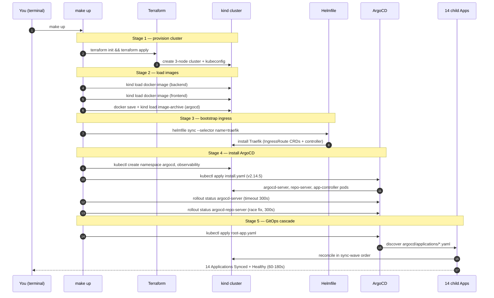

# SRE Copilot — Deployment Guide

> Operational reference for bringing up sre-copilot on a fresh laptop and keeping it running.
> Beginners: read top-to-bottom — every tool gets a one-line "why we use it" the first time it shows up. Experienced operators: skim the tables; the troubleshooting section at the end is the load-bearing part.

All file references in this guide are clickable in IDEs that render Markdown links: e.g. [Makefile](../Makefile), [helmfile.yaml.gotmpl](../helmfile.yaml.gotmpl), [argocd/bootstrap/root-app.yaml](../argocd/bootstrap/root-app.yaml).

---

## Table of contents

1. [Overview — what `make up` actually does](#1-overview--what-make-up-actually-does)
2. [Prerequisites](#2-prerequisites)
   - [Required](#required)
   - [Optional (lint, frontend dev, eval pipeline)](#optional-lint-frontend-dev-eval-pipeline)
3. [Tools used (concept table)](#3-tools-used-concept-table)
4. [Pre-flight: per-machine config](#4-pre-flight-per-machine-config)
   - [The four overridable knobs](#the-four-overridable-knobs)
   - [The `.envrc` pattern (recommended)](#the-envrc-pattern-recommended)
   - [Why `HOST_BRIDGE_CIDR` matters (the deep version)](#why-host_bridge_cidr-matters-the-deep-version)
5. [Step-by-step deploy](#5-step-by-step-deploy)
   - [Step 1 — `make detect-bridge`](#step-1--make-detect-bridge)
   - [Step 2 — `make seed-models`](#step-2--make-seed-models)
   - [Step 3 — `make up`](#step-3--make-up)
   - [Step 4 — `make trust-certs`](#step-4--make-trust-certs)
   - [Step 5 — `make dashboards`](#step-5--make-dashboards)
   - [Step 6 — `make smoke`](#step-6--make-smoke)
6. [Demo flows](#6-demo-flows)
   - [`make demo` — paced narrated walkthrough](#make-demo--paced-narrated-walkthrough)
   - [`make demo-canary` — Argo Rollouts progressive delivery](#make-demo-canary--argo-rollouts-progressive-delivery)
7. [Full Makefile reference](#7-full-makefile-reference)
8. [Endpoints after deployment](#8-endpoints-after-deployment)
   - [Source of truth](#source-of-truth)
   - [User-facing (HTTPS, served by Traefik)](#user-facing-https-served-by-traefik)
   - [Internal-only (ClusterIP, port-forward to access)](#internal-only-clusterip-port-forward-to-access)
9. [ArgoCD admin password](#9-argocd-admin-password)
10. [Grafana admin password](#10-grafana-admin-password)
11. [Tear down](#11-tear-down)
12. [Troubleshooting](#12-troubleshooting)
- [Appendix — file map referenced in this guide](#appendix--file-map-referenced-in-this-guide)

---

## 1. Overview — what `make up` actually does

[`make up`](../Makefile#L53) is a five-stage bootstrap. You type one command; Make orchestrates everything else. Each stage maps to a `==> [N/5]` echo in the recipe so you can find your place in the log.

- **Stage 1 — Terraform provisions a 3-node kind cluster.** Make runs `terraform init` + `terraform apply` in [terraform/local](../terraform/local/main.tf) using the `tehcyx/kind` provider. Output: control-plane + 2 workers, host-port mappings 80/443 → control-plane, kubeconfig written to `~/.kube/sre-copilot.config` (deliberately *not* your default kubeconfig). *Why Terraform here?* One declarative source of truth for cluster topology, mirroring how you'd manage EKS in prod.
- **Stage 2 — load images into kind.** Make calls `kind load docker-image` for backend and frontend, then a `docker save --platform=<host>` + `kind load image-archive` dance for the ArgoCD image ([Makefile:62-74](../Makefile#L62-L74)). The save-archive path strips the multi-arch attestation manifest that breaks `kind load docker-image` on Docker 27+ for `quay.io/argoproj/argocd`.
- **Stage 3 — bootstrap Traefik via Helmfile.** Make runs `helmfile sync --selector name=traefik` ([Makefile:76](../Makefile#L76)). Only the `traefik` release is synced — the ArgoCD UI needs an `IngressRoute` to be reachable, and Traefik supplies the `IngressRoute` CRDs and controller. Everything else in [helmfile.yaml.gotmpl](../helmfile.yaml.gotmpl) is left alone; ArgoCD installs it later.
- **Stage 4 — install ArgoCD and wait twice.** Make creates the `argocd` and `observability` namespaces ([Makefile:78-79](../Makefile#L78-L79)), applies the upstream `install.yaml` for ArgoCD `v2.14.5`, then waits for `argocd-server` *and* `argocd-repo-server` rollouts ([Makefile:82-88](../Makefile#L82-L88)). The second wait is the fix for a real race: `argocd-repo-server`'s gRPC listener binds a beat after the Deployment goes Ready, and if root-app reconciles too soon ArgoCD caches a sticky `ComparisonError: connection refused` and never generates child Apps.
- **Stage 5 — apply the root Application.** Make runs `kubectl apply -f argocd/bootstrap/root-app.yaml -n argocd` ([Makefile:90](../Makefile#L90)). [argocd/bootstrap/root-app.yaml](../argocd/bootstrap/root-app.yaml) is the app-of-apps entry point. ArgoCD then discovers the **14** child Applications under [argocd/applications/](../argocd/applications/) and reconciles them in sync-wave order over 60–180 seconds.

### Bootstrap sequence diagram

The user only ever types `make up`. Everything below the first arrow is Make running the recipe lines from [Makefile:53-95](../Makefile#L53-L95).



**The 14 child Applications under [argocd/applications/](../argocd/applications/):** argo-rollouts, backend, frontend, grafana, loki, networkpolicies, observability-config, ollama-externalname, otel-collector, prometheus, prometheus-operator-crds, sealed-secrets, tempo, traefik (re-adopted from the Helmfile bootstrap so ArgoCD owns it going forward).

---

## 2. Prerequisites

> **Beginner**: TL;DR — install Docker, kind, kubectl, Helm, Helmfile, Terraform, Ollama, mkcert, Python, Node. The one-liner below does it all on macOS.

### Required

The version mins below are floors observed working with this repo's manifests; newer is always fine. Where a tool's exact version matters (kind node, Traefik, ArgoCD), the [Makefile](../Makefile) pins it explicitly.

| Tool | Min version | macOS install | Linux install | Verify |
|------|-------------|---------------|---------------|--------|
| Docker runtime | Desktop / OrbStack / Colima — any recent | `brew install --cask orbstack` | follow [docs.docker.com/engine/install](https://docs.docker.com/engine/install/) | `docker version` |
| kind | 0.20+ | `brew install kind` | `go install sigs.k8s.io/kind@latest` | `kind version` |
| kubectl | 1.28+ | `brew install kubectl` | `curl -LO https://dl.k8s.io/release/$(curl -L -s https://dl.k8s.io/release/stable.txt)/bin/linux/amd64/kubectl` | `kubectl version --client` |
| Helm | 3.13+ | `brew install helm` | `curl https://raw.githubusercontent.com/helm/helm/main/scripts/get-helm-3 \| bash` | `helm version` |
| Helmfile | 0.165+ | `brew install helmfile` | download from [helmfile/helmfile releases](https://github.com/helmfile/helmfile/releases) | `helmfile version` |
| Terraform | 1.5+ | `brew install terraform` | `apt-get install terraform` (HashiCorp repo) | `terraform version` |
| Ollama | 0.3+ | `brew install ollama` | `curl -fsSL https://ollama.com/install.sh \| sh` | `ollama --version` |
| mkcert | latest | `brew install mkcert nss` | `apt-get install libnss3-tools && go install filippo.io/mkcert@latest` | `mkcert -version` |
| Python | 3.11+ (3.12 recommended) | `brew install python@3.12` | `apt-get install python3.12` | `python3 --version` |
| Node.js | 20 LTS | `brew install node` | `nvm install 20` | `node --version` |

The Makefile pins kind node `v1.31.0`, Traefik `v3.1`, and ArgoCD `v2.14.5` ([Makefile:9-10, 45-47](../Makefile#L9-L47)) — you do not need to install those, they are pulled.

**One-liner (macOS):**

```bash
brew install kind kubectl helm helmfile terraform ollama mkcert nss python@3.12 node
```

### Optional (lint, frontend dev, eval pipeline)

| Tool | Used by |
|------|---------|
| ruff | [`make lint`](../Makefile#L274) — Python lint |
| mypy | [`make lint`](../Makefile#L274) — Python type check |
| yamllint | [`make lint`](../Makefile#L274) |
| kubeconform | manifest schema validation in CI |
| eslint | frontend lint (run in `src/frontend`) |
| direnv | per-machine `.envrc` automation |
| jq | parses JSON in `clean-replicasets` and the `demo` beat |
| kubectl-argo-rollouts | richer canary visualization (`brew install argoproj/tap/kubectl-argo-rollouts`) |
| kubeseal | required by [`make seal`](../Makefile#L300) |

**Hardware:** Apple Silicon Mac (M1/M2/M3) or Linux x86_64, **16 GB RAM minimum**. Steady state ~13.5 GB.

---

## 3. Tools used (concept table)

This table is the "why each tool is here" map. It only includes tools that actually run during `make up`, `make seed-models`, or `make trust-certs` — anything not below is dev/CI scaffolding, covered in §2 Optional.

| Tool | Role | Why this tool, not something else |
|------|------|-----------------------------------|
| Docker | Container runtime that hosts kind nodes | kind nodes ARE docker containers |
| kind | Local Kubernetes (control-plane + workers in containers) | Reproducible, multi-node, supports extra-port-mappings; faster than minikube |
| Terraform | Provisions the kind cluster declaratively | One source of truth for cluster topology; mirrors how you'd manage EKS in prod |
| Traefik | Ingress controller (HTTPS termination + L7 routing) | Native CRDs (`IngressRoute`, `TLSStore`), hot-reload on config change |
| Helm | Templating and packaging for Kubernetes manifests | Industry standard; charts live in [helm/](../helm/) |
| Helmfile | Orchestrator for multiple Helm releases | Used **only for the Traefik bootstrap** in `make up`. Everything else flows through ArgoCD. See [helmfile.yaml.gotmpl](../helmfile.yaml.gotmpl) |
| ArgoCD | GitOps controller — reconciles cluster state from Git | Single source of truth = the repo. Push to main → cluster updates |
| ArgoCD app-of-apps | One root Application that creates 14 child Applications | Lets you `kubectl apply` one file and get the full platform |
| Argo Rollouts | Progressive delivery (canary, blue-green) controller | Powers `make demo-canary` — 25% → 50% → 100% with Prometheus AnalysisTemplate gating |
| Sealed Secrets | Asymmetrically-encrypted Secrets that are safe to commit | Avoids putting `kubectl create secret` recipes in the README |
| Ollama | Local LLM runtime (Metal GPU on macOS) | Runs on the **host**, not in the cluster. Backend reaches it via ExternalName Service |
| Loki | Log aggregation | "L" of LGTM |
| Grafana | Dashboards + Explore UI for logs/traces/metrics | "G" of LGTM |
| Tempo | Distributed tracing backend | "T" of LGTM |
| Prometheus | Metrics + alerting | The LGTM "M" is Mimir; we use Prometheus for metrics in this repo |
| OTel Collector | Receives OTLP from backend, fans out to Loki/Tempo/Prometheus | One protocol in, three backends out |
| mkcert | Mints a locally-trusted root CA + wildcard cert for `*.localtest.me` | No more `curl -k`, no more browser warnings |

---

## 4. Pre-flight: per-machine config

The repo ships defaults that work on the canonical "Apple Silicon Mac + Docker Desktop" baseline. Anything else needs a one-time override.

### The four overridable knobs

The `?=` form in the Makefile means "use this value unless the env already has one" ([Makefile:15-18](../Makefile#L15-L18)). Set any of these in your shell or `.envrc` to override.

| Env var | Default | Defined at | Override when |
|---------|---------|------------|---------------|
| `LLM_MODEL` | `qwen2.5:7b-instruct-q4_K_M` (~5 GB) | [Makefile:15](../Makefile#L15) | 8 GB RAM machine → `phi3:mini`; 32 GB+ → `qwen2.5:14b-instruct-q4_K_M` |
| `LLM_JUDGE_MODEL` | `llama3.1:8b-instruct-q4_K_M` (~5 GB) | [Makefile:16](../Makefile#L16) | Same RAM tiers; or `SKIP_JUDGE=1` to skip pulling it |
| `INGRESS_HOST` | `sre-copilot.localtest.me` | [Makefile:17](../Makefile#L17) | DNS provider blocks `localtest.me` → use a hostname pointed at 127.0.0.1 in `/etc/hosts` |
| `HOST_BRIDGE_CIDR` | `192.168.65.0/24` (Docker Desktop) | rendered by [helmfile.yaml.gotmpl](../helmfile.yaml.gotmpl) into the `ollama-externalname` NetworkPolicy | You use OrbStack, Colima, or Linux native Docker — see deep dive below |

`OLLAMA_BASE_URL` is sometimes also overridden when running the backend via `uvicorn` outside the cluster for local dev — it's not consumed by `make up`, only by the backend process.

### The `.envrc` pattern (recommended)

[direnv](https://direnv.net) auto-loads `.envrc` when you `cd` into the repo. The file is gitignored so per-laptop overrides never get committed.

```bash
# .envrc at repo root
export HOST_BRIDGE_CIDR=198.19.249.0/24      # OrbStack
export LLM_MODEL=qwen2.5:7b-instruct-q4_K_M
export LLM_JUDGE_MODEL=llama3.1:8b-instruct-q4_K_M
export INGRESS_HOST=sre-copilot.localtest.me
```

Then `direnv allow` once. Without direnv, paste the same `export` lines into `~/.zshrc`.

### Why `HOST_BRIDGE_CIDR` matters (the deep version)

> **Beginner**: TL;DR — your cluster pods reach Ollama on your laptop via a virtual IP range. If that range is wrong, calls to Ollama hang silently. Run `make detect-bridge`, copy the output into `.envrc`, you're done.

The backend pod calls Ollama on **your laptop's host**, not in-cluster. The path is:

```text
backend pod → ExternalName Service "ollama.sre-copilot.svc.cluster.local"
            → host.docker.internal:11434
            → host process: ollama serve
```

A NetworkPolicy ([helm/platform/ollama-externalname/templates/networkpolicy.yaml](../helm/platform/ollama-externalname/templates/networkpolicy.yaml)) gates that egress. It only allows traffic to the **Docker host bridge IP range**. If your runtime's bridge is on a different subnet than the policy expects, the egress is silently dropped and Ollama calls hang for ~5 minutes before the backend gives up.

The defaults table by runtime:

| Runtime | Default bridge CIDR |
|---------|---------------------|
| Docker Desktop (macOS) | `192.168.65.0/24` |
| OrbStack | `198.19.249.0/24` |
| Colima / Lima | `192.168.106.0/24` |
| Linux native Docker | `172.17.0.0/16` |

[`make detect-bridge`](../Makefile#L26) does the detection for you: it runs an alpine container with `--add-host=host.docker.internal:host-gateway`, resolves the host IP, and prints the suggested `/24`. Copy the output into your `.envrc` or shell.

```bash
$ make detect-bridge
==> Detecting Docker host bridge CIDR...
Detected host IP : 198.19.249.3
Suggested CIDR   : 198.19.249.0/24

To use it: export HOST_BRIDGE_CIDR=198.19.249.0/24 && make up
```

The full reasoning lives in [README.md](../README.md) and in [docs/adr/0007-host-bridge-cidr.md](adr/0007-host-bridge-cidr.md).

---

## 5. Step-by-step deploy

Run these in order, from the repo root, on a clean machine. Each command's section explains what it does, expected output, time budget, and common failures.

### Step 1 — `make detect-bridge`

```bash
make detect-bridge
```

**What it does** ([Makefile:26](../Makefile#L26)): spins up a throwaway alpine container, resolves `host.docker.internal`, prints a suggested CIDR.

**Expected output:** three lines — `Detected host IP`, `Suggested CIDR`, then `To use it: export HOST_BRIDGE_CIDR=… && make up`.

**Time:** ~2s after first run; first run pulls alpine, ~5s.

**Then:** `export HOST_BRIDGE_CIDR=<the suggested CIDR>` (or put it in `.envrc`).

**Common failures:**

| Symptom | Cause | Fix |
|---------|-------|-----|
| `Could not resolve host.docker.internal` | Docker daemon not running | Start Docker Desktop / OrbStack |
| Suggests `127.0.0.1/24` | Docker engine is too old (no `host-gateway` keyword) | Upgrade Docker Engine to 20.10+ |

### Step 2 — `make seed-models`

```bash
ollama serve &              # if not already running
make seed-models
```

**What it does** ([Makefile:36](../Makefile#L36)): pulls `LLM_MODEL` (default `qwen2.5:7b`, ~5 GB) and (unless `SKIP_JUDGE=1`) `LLM_JUDGE_MODEL` (default `llama3.1:8b`, ~5 GB), pre-pulls `kindest/node:v1.31.0`, `traefik:v3.1`, and `quay.io/argoproj/argocd:v2.14.5`, then `docker build`s `sre-copilot/backend:latest` and `sre-copilot/frontend:latest`.

**Expected output:** progress bars from `ollama pull`, three `docker pull` lines, two `docker build` blocks, ending with `==> seed-models complete`.

**Time:** 10–25 min on the first run (model downloads dominate). Re-runs are seconds — pulls and builds are cached.

**Skip the judge model on smaller machines:** `SKIP_JUDGE=1 make seed-models` (the recipe respects this — see [Makefile:39-43](../Makefile#L39-L43)).

**Common failures:**

| Symptom | Cause | Fix |
|---------|-------|-----|
| `ollama: command not found` | Not installed | `brew install ollama` then `ollama serve &` |
| `connection refused` to `localhost:11434` | Daemon not running | `ollama serve &` in another shell |
| `pull access denied` on quay.io | Corporate TLS interception | Set `HTTPS_PROXY` or import the corporate cert |
| Disk full | Models live under `~/.ollama/models` | Need ~10 GB free |

### Step 3 — `make up`

```bash
make up
```

**What it does** ([Makefile:53](../Makefile#L53)): the five-stage bootstrap from §1, all driven by the single `make up` recipe.

**Expected output:** five labeled stages (`==> [1/5]` through `==> [5/5]`), then a closing block printing:

```text
==> Cluster bootstrap complete. ArgoCD reconciling all releases (60-180s).
    Watch:  kubectl get applications -n argocd -w
    Visit:  https://sre-copilot.localtest.me
    Then:   make smoke
```

**Time:** 3–5 min for the bootstrap recipe itself (Terraform ~30s, image load ~30s, Traefik sync ~30s, ArgoCD install + two rollout waits ~90s, root-app apply ~5s). Then **another 60–180 seconds** for ArgoCD to reconcile the 14 child Applications.

**How to confirm it really finished:**

```bash
KUBECONFIG=$HOME/.kube/sre-copilot.config \
  kubectl get applications -n argocd
# All 15 (root + 14 children) should be Synced + Healthy
```

**Common failures:**

| Symptom | Cause | Fix |
|---------|-------|-----|
| `terraform: Error: cluster already exists` | Leftover from a prior run | `make down` then retry, or `kind delete cluster --name sre-copilot` |
| `kind load image-archive` fails on argocd image | Multi-arch manifest issue | Already handled by [Makefile:62-74](../Makefile#L62-L74); if it still fails, manually `docker pull $(ARGOCD_IMAGE)` first |
| `argocd-server` rollout times out at 300s | Image not loaded into kind, or kindnet not Ready | `kubectl -n argocd describe deploy argocd-server` and `kubectl -n argocd get events --sort-by=.lastTimestamp` |
| `argocd-repo-server` Ready but root-app shows `ComparisonError: connection refused` | The race the Makefile already waits past — but ArgoCD cached an earlier failure | `kubectl annotate app/sre-copilot-root -n argocd argocd.argoproj.io/refresh=hard --overwrite` |
| Child Apps stuck in `OutOfSync` for >5 min | Chart version drift or missing CRD | `kubectl describe application <name> -n argocd` |

### Step 4 — `make trust-certs`

```bash
make trust-certs
```

**What it does** ([Makefile:199](../Makefile#L199)): runs `mkcert -install` (installs a local root CA into your system + browser trust stores), mints a wildcard cert for `*.localtest.me`, `localtest.me`, and `*.sre-copilot.localtest.me` into `.certs/`, creates a `localtest-me-tls` Secret in the `platform` namespace, and applies a Traefik `TLSStore` named `default` so every IngressRoute serves that cert.

**Expected output:** "Installing local root CA…" from mkcert, "Minting wildcard cert…" (or "Cert already exists…" on re-run), `secret/localtest-me-tls created`, `tlsstore.traefik.io/default created`, then "Restart your browser to pick up the new CA."

**Time:** ~5s.

**Verify:** `curl -v https://api.sre-copilot.localtest.me/healthz` — no `-k` needed, no cert warning.

**Common failures:**

| Symptom | Cause | Fix |
|---------|-------|-----|
| `mkcert: command not found` | Not installed | `brew install mkcert nss` (the `nss` package is what teaches Firefox to trust the CA) |
| Browser still shows "Not secure" | Browser cached the old cert chain | Restart the browser. Firefox needs `nss` installed *before* mkcert runs |
| `Error from server: Internal error … TLSStore` | Traefik CRDs not yet installed | Re-run after `make up` finishes Stage 3 |

### Step 5 — `make dashboards`

```bash
make dashboards
```

**What it does** ([Makefile:228](../Makefile#L228)): runs [observability/dashboards/regen-configmaps.py](../observability/dashboards/regen-configmaps.py) to rebuild ConfigMaps from the JSON source of truth, **deletes** the existing `grafana_dashboard=1`-labeled ConfigMaps, sleeps 6s, then re-applies via `kubectl apply --server-side --force-conflicts`. The delete step is necessary because Grafana's dashboard provisioner caches in-DB versions by UID, so a plain `kubectl apply` can no-op even when the JSON changed.

**Expected output:** `==> [dashboards] Regenerating ConfigMaps…`, `Dropping existing ConfigMaps…`, the 6s wait, `Re-applying fresh ConfigMaps`, then the Grafana URL.

**Time:** ~15s including the sleep.

**Verify:** open `https://grafana.sre-copilot.localtest.me`, hard-refresh (Cmd-Shift-R / Ctrl-Shift-R) to bust the browser cache, find the dashboards under the SRE Copilot folder.

**Common failures:**

| Symptom | Cause | Fix |
|---------|-------|-----|
| `python3: regen-configmaps.py: file not found` | Wrong CWD | Run from repo root, not from `observability/` |
| Dashboard panels show "No data" | Datasource UID mismatch | Open Explore → confirm the datasource exists and returns data |
| Dashboards do not appear after refresh | Grafana sidecar still re-importing | Wait 10s and refresh again. If still missing: `kubectl logs -n observability deploy/grafana -c grafana-sc-dashboard --tail=50` |

### Step 6 — `make smoke`

```bash
make smoke
```

**What it does** ([Makefile:248](../Makefile#L248)): port-forwards the backend on `:8000`, then runs six checks in series:

1. **Backend `/healthz`** — polls until 200, 60s budget; prints time-to-ready.
2. **SSE round-trip** via [tests/smoke/probe_sse.py](../tests/smoke/probe_sse.py) — opens a stream, asserts first frame starts with `data:`.
3. **Ingress reachability** — `curl https://api.<INGRESS_HOST>/healthz`, prints HTTP status.
4. **Ollama via ExternalName** — `kubectl exec` into a backend pod and TCP-connect to `ollama.sre-copilot.svc.cluster.local:11434` (3s timeout).
5. **Memory snapshot** — `docker stats --no-stream` filtered to `sre-copilot` containers.
6. **NetworkPolicy egress-deny** (AT-012) — TCP-connect from inside a backend pod to `api.openai.com:443`; expects connection refused/timeout.

**Expected output:** six `==> Smoke:` labeled blocks. Healthz ends with `Backend healthz OK — ready in <N>s`. The egress-deny check should print `NetworkPolicy egress deny: PASS`.

**Time:** ~30s end-to-end (3s sleep + healthz wait + checks).

**Common failures:**

| Symptom | Cause | Fix |
|---------|-------|-----|
| `TIMEOUT waiting for backend healthz` | Backend pod not Ready | `kubectl get pods -n sre-copilot` and inspect events |
| SSE probe `WARNING` | Often: Ollama is not running on the host | `ollama serve &` and retry |
| `Ingress HTTP status: 000` | Traefik unreachable, or ingress route missing | `kubectl get ingressroute -A` and confirm a route exists for `api.sre-copilot.localtest.me` |
| `Ollama reachable via ExternalName` line missing | NetworkPolicy denied the host hop | **Wrong `HOST_BRIDGE_CIDR`** — re-run `make detect-bridge`, then `make down && make up` with the correct value |
| `WARNING: egress NOT denied` | NetworkPolicy missing or misconfigured | `kubectl get networkpolicy -n sre-copilot` should list `default-deny-egress` |

---

## 6. Demo flows

### `make demo` — paced narrated walkthrough

[Makefile:102-137](../Makefile#L102-L137). Designed for Loom recording: each beat ends in `read -r -p "Press ENTER…"` so you control timing while narrating.

```bash
make demo
```

**The five beats:**

| Beat | What happens | Where to watch |
|------|--------------|----------------|
| 1. Open UI | `open https://$INGRESS_HOST` (or `xdg-open`); reminds you to also open Grafana via port-forward and the Rollouts dashboard | App tab |
| 2. Inject anomaly | `kubectl exec` on the backend pod → `curl POST /admin/inject?scenario=cascade_retry_storm` with the `X-Inject-Token` header (falls back to a local `curl` if exec fails) | UI: click "Try this live anomaly", watch SSE tokens stream |
| 3. Tracing | Pause for narration. Switch to Grafana → Explore → Tempo, search `service=sre-copilot-backend` | Tempo trace view: `http.server` → `ollama.host_call` → `ollama.inference (synthetic)` |
| 4. Postmortem | Click "Generate postmortem from this incident" in the UI | UI postmortem panel |
| 5. Resilience | `kubectl delete pod -n sre-copilot -l app.kubernetes.io/name=backend --field-selector=status.phase=Running` | `kubectl get pods -n sre-copilot -l app.kubernetes.io/name=backend -w` — PDB (`minAvailable=1`) keeps the service available, replacement Ready in <30s |

**Pre-req:** `ANOMALY_INJECTOR_TOKEN` exported in your shell (matches the value sealed into [deploy/secrets/](../deploy/secrets/)).

**What it demonstrates:** SSE streaming, distributed tracing including the synthetic `ollama.inference` span, postmortem generation, and PDB-backed availability.

### `make demo-canary` — Argo Rollouts progressive delivery

[Makefile:139-170](../Makefile#L139-L170).

```bash
make demo-canary
```

**Sequence:**

1. `docker build --build-arg ENABLE_CONFIDENCE=true -t sre-copilot/backend:v2 src/backend`. The flag adds a `confidence: float` field to the response schema — a meaningful, observable change.
2. `kind load docker-image sre-copilot/backend:v2 --name sre-copilot`.
3. `kubectl patch rollout backend -n sre-copilot` to point the container image at `:v2`.
4. Spawns a 90-second background load generator (port-forward to `svc/backend:8000`, then `curl /openapi.json` GET + `curl POST /logs` every 2s) so the Prometheus AnalysisTemplate has metric samples.
5. `kubectl get rollout backend -n sre-copilot -w` so you watch progression live.

**Expected progression:** 25% → ~60s analysis pause (Prometheus checks `http_server_duration` p95 + `llm_ttft`) → 50% → 100%.

**Where to watch:**

| UI | What to look at |
|----|-----------------|
| Argo Rollouts dashboard (`kubectl argo rollouts dashboard` → :3100) | Visual canary tree, weight slider, AnalysisRun status |
| ArgoCD UI (`https://argocd.sre-copilot.localtest.me`) | `backend` Application showing OutOfSync→Syncing→Synced |
| Grafana → Backend dashboard | RPS split between stable and canary pods, latency comparison |

**Reset:** [`make demo-reset`](../Makefile#L172) patches the Rollout image back to `sre-copilot/backend:latest`.

**Background log files:** `/tmp/sre-canary-load.log` (load generator) and `/tmp/sre-canary-pf.log` (port-forward).

---

## 7. Full Makefile reference

Every public target in [Makefile](../Makefile), in order of declaration. Cross-references are clickable. The set is exhaustive — `grep -nE '^[a-zA-Z_-]+:' Makefile` returns exactly these targets (plus `help`, the default).

| Target | One-line purpose | When to use | Depends on |
|--------|------------------|-------------|------------|
| [`help`](../Makefile#L22) | Print all `## `-annotated targets in cyan | Default goal — `make` with no args | none |
| [`detect-bridge`](../Makefile#L26) | Resolve `host.docker.internal` and print suggested `/24` CIDR | Once per laptop, before first `make up` | docker daemon running |
| [`seed-models`](../Makefile#L36) | Pull Ollama models, pre-pull platform images, build app images | Once per laptop; re-run after image-changing edits to backend/frontend Dockerfiles | `ollama serve` running, internet |
| [`up`](../Makefile#L53) | Five-stage cluster bootstrap (Terraform → images → Traefik → ArgoCD → root-app) | Cold start; or after `make down` | seed-models, optional `HOST_BRIDGE_CIDR` |
| [`down`](../Makefile#L97) | `terraform destroy` + `kind delete cluster` | Tear down between sessions | none |
| [`demo`](../Makefile#L102) | ENTER-gated 5-beat narrated demo for Loom | After `make up` + `make trust-certs`; with `ANOMALY_INJECTOR_TOKEN` exported | live cluster |
| [`demo-canary`](../Makefile#L139) | Build `:v2`, patch Rollout, start load gen, watch progression | After `make up`; standalone canary moment | live cluster, docker, kind |
| [`demo-reset`](../Makefile#L172) | Revert backend Rollout to `:latest` (stable image) | After `make demo-canary` to re-baseline | live cluster |
| [`restart-backend`](../Makefile#L179) | Patch `spec.restartAt` on the backend Rollout | Clean pod restart that respects the canary strategy (no plugin needed) | live cluster |
| [`clean-replicasets`](../Makefile#L186) | Delete all 0-replica ReplicaSets in argocd/observability/platform/sre-copilot | When `kubectl get rs` is cluttered after many rollouts | live cluster, jq |
| [`trust-certs`](../Makefile#L199) | mkcert local CA + wildcard cert + Traefik TLSStore | Once per laptop; re-run if `.certs/` is deleted | mkcert installed, live cluster |
| [`dashboards`](../Makefile#L228) | Regenerate Grafana ConfigMaps from JSON, force-reload via delete-then-recreate | After editing dashboard JSON in [observability/dashboards/](../observability/dashboards/) | live cluster, python3 |
| [`smoke`](../Makefile#L248) | 6-check end-to-end smoke (healthz, SSE, ingress, Ollama, memory, NP egress) | After `make up` to validate; in CI gates | live cluster |
| [`lint`](../Makefile#L274) | ruff + mypy + helm lint × 5 + terraform fmt + yamllint | Before commits / in CI | ruff, mypy, helm, terraform, yamllint |
| [`test`](../Makefile#L290) | pytest unit + integration + structural eval (Layer 1) | Before commits; in CI | pytest, src/backend on PYTHONPATH |
| [`judge`](../Makefile#L296) | Run Layer-2 Llama judge eval against live backend | Nightly / manual quality probe; needs Ollama loaded | live cluster, backend on :8000, judge model pulled |
| [`seal`](../Makefile#L300) | `kubeseal` a literal into `deploy/secrets/<name>.sealed.yaml` | When adding a new secret to the repo (commit the sealed file) | sealed-secrets controller running, kubeseal CLI |

---

## 8. Endpoints after deployment

### Source of truth

The IngressRoutes are authoritative. Listing them is the fastest way to know what's actually routed.

```bash
KUBECONFIG=$HOME/.kube/sre-copilot.config kubectl get ingressroute -A
```

Hostnames follow the `*.sre-copilot.localtest.me` pattern (every subdomain of `localtest.me` resolves to `127.0.0.1` via public DNS). The user-facing routes below come from [helm/frontend/templates/ingressroute.yaml](../helm/frontend/templates/ingressroute.yaml), [helm/backend/templates/ingressroute.yaml](../helm/backend/templates/ingressroute.yaml), and [observability/ingressroutes.yaml](../observability/ingressroutes.yaml).

### User-facing (HTTPS, served by Traefik)

| URL | Backing service | Auth | Notes |
|-----|-----------------|------|-------|
| `https://sre-copilot.localtest.me` | `frontend.sre-copilot:3000` | none | Next.js app — log analysis + postmortem UI |
| `https://api.sre-copilot.localtest.me` | `backend.sre-copilot:8000` | none for `/healthz`, `/analyze/*`, `/postmortem`; admin token for `/admin/*` | FastAPI; SSE on `POST /analyze/logs` |
| `https://argocd.sre-copilot.localtest.me` | `argocd-server.argocd:443` | username `admin`, password from secret (see §9) | GitOps UI; Traefik routes to argocd-server's HTTPS port — see [observability/ingressroutes.yaml](../observability/ingressroutes.yaml) |
| `https://grafana.sre-copilot.localtest.me` | `grafana.observability:80` | username `admin`, password in §10 | Dashboards + Explore |
| `https://prometheus.sre-copilot.localtest.me` | `prometheus-server.observability:80` | none | Query UI; rule editor read-only |

### Internal-only (ClusterIP, port-forward to access)

| Service | Port-forward command | Used by |
|---------|----------------------|---------|
| OTel collector OTLP gRPC | `kubectl -n observability port-forward svc/otel-collector-opentelemetry-collector 4317:4317` | backend OTLP exporter |
| OTel collector OTLP HTTP | same svc, port 4318 | tools that prefer HTTP |
| Loki push | `kubectl -n observability port-forward svc/loki 3100:3100` | otel-collector log pipeline |
| Tempo OTLP | `kubectl -n observability port-forward svc/tempo 4317:4317` | otel-collector trace pipeline |
| Tempo HTTP query | `kubectl -n observability port-forward svc/tempo 3200:3200` | smoke test [tests/smoke/test_trace_visible.py](../tests/smoke/test_trace_visible.py) |
| Argo Rollouts dashboard | `kubectl argo rollouts dashboard` → http://localhost:3100 | canary visualization |
| Backend (port-forward bypass of ingress) | `kubectl -n sre-copilot port-forward svc/backend 8000:8000` | local debugging, smoke tests |

---

## 9. ArgoCD admin password

Username is always `admin`. Password is auto-generated on first install and stored in a Kubernetes Secret.

```bash
KUBECONFIG=$HOME/.kube/sre-copilot.config \
  kubectl -n argocd get secret argocd-initial-admin-secret \
  -o jsonpath='{.data.password}' | base64 -d
echo
```

**Important:** this Secret is regenerated on every fresh `make up`. Save the password to a password manager once per cluster lifetime, or fetch it on demand.

---

## 10. Grafana admin password

For this repo, the Grafana admin password is **set in chart values as a literal** (not a SealedSecret). [helm/observability/lgtm/grafana-values.yaml:1](../helm/observability/lgtm/grafana-values.yaml#L1):

```yaml
adminPassword: "sre-copilot-admin"
```

Username `admin`, password `sre-copilot-admin`.

The Grafana chart materializes this into a Secret named `grafana` in the `observability` namespace, so the equivalent live lookup also works:

```bash
KUBECONFIG=$HOME/.kube/sre-copilot.config \
  kubectl -n observability get secret grafana \
  -o jsonpath='{.data.admin-password}' | base64 -d
echo
```

This is *fine for a local demo cluster*. If you fork this for anything real, replace the literal with a SealedSecret and switch the chart to consume `admin.existingSecret`.

---

## 11. Tear down

```bash
make down
```

**What `make down` does** ([Makefile:97](../Makefile#L97)):

- `cd terraform/local && terraform destroy -auto-approve` — removes the kind cluster from Terraform state
- `kind delete cluster --name sre-copilot` — belt-and-braces, in case Terraform state was already gone

**What it destroys:**

- The kind cluster and all its containers
- All in-cluster state (Pods, Secrets, PVCs — there are no real PVs since storage is ephemeral)
- Terraform's local state for the kind cluster

**What it preserves:**

- `~/.kube/sre-copilot.config` file (stale, but harmless — overwritten on next `make up`)
- Ollama models on your host (`~/.ollama/models/`)
- Built Docker images on the host (`sre-copilot/backend:latest`, `sre-copilot/frontend:latest`, `sre-copilot/backend:v2`)
- Pre-pulled platform images (`kindest/node:v1.31.0`, `traefik:v3.1`, `quay.io/argoproj/argocd:v2.14.5`)
- The mkcert root CA in your system trust store
- `.certs/localtest.me*.pem` (so `make trust-certs` does not need to re-mint)
- `.envrc`, your direnv overrides
- `deploy/secrets/*.sealed.yaml` (committed; safe by definition)

**Result:** next `make up` is fast (typically 90s–3min) because no internet pulls are required.

To reset everything including images and models:

```bash
make down
docker rmi sre-copilot/backend:latest sre-copilot/frontend:latest sre-copilot/backend:v2 || true
docker rmi kindest/node:v1.31.0 traefik:v3.1 quay.io/argoproj/argocd:v2.14.5 || true
ollama rm qwen2.5:7b-instruct-q4_K_M llama3.1:8b-instruct-q4_K_M || true
rm -rf .certs/
```

---

## 12. Troubleshooting

Each entry below is **symptom → cause → fix**. If a fix has more than one shell line, the order matters.

### Backend pod CrashLoopBackOff with "connection timed out to ollama:11434"

**Cause:** wrong `HOST_BRIDGE_CIDR`. The NetworkPolicy in [helm/platform/ollama-externalname/templates/networkpolicy.yaml](../helm/platform/ollama-externalname/templates/networkpolicy.yaml) is dropping egress to your host bridge.

**Fix:**

```bash
make detect-bridge
export HOST_BRIDGE_CIDR=<the suggested CIDR>
make down && make up
```

Verify:

```bash
kubectl get networkpolicy -n sre-copilot allow-ollama-host-hop -o yaml | grep cidr
# Expected: cidr: 198.19.249.0/24   (or whatever you exported)
```

### `ollama: command not found` or model calls fail

**Cause:** Ollama must be installed and running on the **host**, not inside the cluster.

**Fix:**

```bash
brew install ollama
ollama serve &
make seed-models
```

Confirm Ollama is reachable from inside the cluster:

```bash
BPOD=$(kubectl get pod -n sre-copilot -l app.kubernetes.io/name=backend -o name | head -1)
kubectl exec -n sre-copilot $BPOD -- python -c \
  "import socket; s=socket.socket(); s.settimeout(3); s.connect(('ollama.sre-copilot.svc.cluster.local',11434)); print('ok')"
```

If this fails: either the NetworkPolicy CIDR is wrong (see above), or `ollama serve` isn't bound to all interfaces. On macOS the default is fine; on Linux start with `OLLAMA_HOST=0.0.0.0:11434 ollama serve`.

### kind cluster not visible to kubectl

**Cause:** the cluster's kubeconfig is written to `~/.kube/sre-copilot.config`, **not** the default kubeconfig.

**Fix:**

```bash
export KUBECONFIG=$HOME/.kube/sre-copilot.config
# or merge the context into the default:
kind export kubeconfig --name sre-copilot
kubectl config use-context kind-sre-copilot
```

### `https://sre-copilot.localtest.me` is unreachable

**Cause:** Traefik down, IngressRoute missing, or your DNS provider is filtering `localtest.me` (some corporate resolvers strip RFC 6761 reserved names).

**Fix:** check Traefik and routes first.

```bash
kubectl get pods -n platform -l app.kubernetes.io/name=traefik
kubectl get ingressroute -A
```

If Traefik is healthy but DNS does not resolve, override the host:

```bash
echo "127.0.0.1 sre-copilot.local api.sre-copilot.local argocd.sre-copilot.local grafana.sre-copilot.local" \
  | sudo tee -a /etc/hosts
export INGRESS_HOST=sre-copilot.local
make down && make up
```

### ArgoCD root-app stuck on `ComparisonError: connection refused`

**Cause:** root-app reconciled before `argocd-repo-server`'s gRPC listener was bound. The Makefile already waits for this ([Makefile:83-88](../Makefile#L83-L88)) — but if you applied root-app manually, or the cache is sticky, you'll see this.

**Fix:**

```bash
kubectl annotate app/sre-copilot-root -n argocd \
  argocd.argoproj.io/refresh=hard --overwrite

# Then watch children appear:
kubectl get applications -n argocd -w
```

If still stuck after 60s:

```bash
kubectl -n argocd rollout restart deployment/argocd-repo-server
kubectl -n argocd rollout restart deployment/argocd-application-controller
```

### Smoke test failures

**Cause:** any of pod-not-ready, Ollama down, wrong bridge CIDR, or OTel collector not receiving traces. Isolate by running each check by hand.

**Fix:**

```bash
# 1. healthz only
kubectl -n sre-copilot port-forward svc/backend 8000:8000 &
curl -sf http://localhost:8000/healthz

# 2. SSE shape
python3 tests/smoke/probe_sse.py

# 3. Ingress
curl -v https://api.sre-copilot.localtest.me/healthz

# 4. Trace pipeline (requires Tempo port-forward)
kubectl -n observability port-forward svc/tempo 3200:3200 &
TEMPO_URL=http://localhost:3200 BACKEND_URL=http://localhost:8000 \
  pytest tests/smoke/test_trace_visible.py -v
```

`kubectl get pods -A` first — most smoke regressions trace back to a Pending/CrashLoop pod.

### Ollama not reachable from a backend pod

Beyond the bridge CIDR check, also verify:

```bash
# 1. Is the ExternalName Service correct?
kubectl get svc ollama -n sre-copilot -o yaml | grep externalName
# Expected: externalName: host.docker.internal

# 2. Does host.docker.internal resolve from inside the kind node?
docker exec sre-copilot-control-plane getent hosts host.docker.internal

# 3. Is Ollama bound to the right interface on the host?
lsof -iTCP:11434 -sTCP:LISTEN
# macOS Docker Desktop / OrbStack: bound to 127.0.0.1 is fine (host-gateway maps it)
# Linux: needs OLLAMA_HOST=0.0.0.0:11434
```

### Sealed-secrets controller not ready

**Cause:** the `sealed-secrets` Application takes ~30s on first sync (downloads chart, generates a key). `make seal` will fail with `cannot fetch certificate` until it's up.

**Fix:**

```bash
kubectl -n platform get pods -l app.kubernetes.io/name=sealed-secrets
kubectl -n platform logs deploy/sealed-secrets --tail=50

# If healthy but kubeseal still errors, fetch the public cert explicitly:
kubeseal --kubeconfig=$HOME/.kube/sre-copilot.config \
  --controller-namespace platform \
  --controller-name sealed-secrets \
  --fetch-cert > /tmp/sealed-secrets.crt
# then pass --cert /tmp/sealed-secrets.crt to subsequent `kubeseal` calls
```

### Grafana dashboards show "No data"

**Cause:** OTel collector not forwarding, Prometheus has no scrape targets, or the dashboard's datasource UID does not match a provisioned datasource.

**Fix:** check each layer.

```bash
# 1. OTel collector forwarding?
kubectl -n observability logs deploy/otel-collector-opentelemetry-collector --tail=50

# 2. Prometheus targets?
kubectl -n observability port-forward svc/prometheus-server 9090:80
open http://localhost:9090/targets

# 3. Datasource UID match?
kubectl -n observability get configmap -l grafana_datasource=1 -o yaml | grep uid
```

### Argo Rollouts canary stuck at 25%

**Cause:** AnalysisTemplate failing, or no traffic for it to evaluate.

**Fix:**

```bash
kubectl -n sre-copilot describe rollout backend
kubectl -n sre-copilot get analysisrun -l rollout=backend
kubectl -n sre-copilot describe analysisrun <name>
```

Common sub-causes: load gen never started (`/tmp/sre-canary-load.log` empty), Prometheus query returns empty (no `http_server_duration_*` metric because OTel collector down), or the threshold is too tight for cold cache. Promote manually if needed:

```bash
kubectl argo rollouts promote backend -n sre-copilot
```

### `make down` left dangling Docker volumes

**Cause:** Terraform's destroy and `kind delete cluster` only remove containers, not the leftover anonymous volumes/networks.

**Fix:**

```bash
docker volume prune
docker network prune
```

Safe — kind doesn't share volumes with anything you'd want to keep.

---

## Appendix — file map referenced in this guide

- [Makefile](../Makefile) — every target documented in §7
- [helmfile.yaml.gotmpl](../helmfile.yaml.gotmpl) — Helm release ordering, used only for the Traefik bootstrap
- [terraform/local/main.tf](../terraform/local/main.tf) — kind cluster topology
- [argocd/bootstrap/root-app.yaml](../argocd/bootstrap/root-app.yaml) — app-of-apps entry point
- [argocd/applications/](../argocd/applications/) — 14 child Applications (argo-rollouts, backend, frontend, grafana, loki, networkpolicies, observability-config, ollama-externalname, otel-collector, prometheus, prometheus-operator-crds, sealed-secrets, tempo, traefik)
- [helm/](../helm/) — local charts (backend, frontend, platform/{traefik, networkpolicies, ollama-externalname, sealed-secrets}, observability/{lgtm, otel-collector})
- [helm/observability/lgtm/grafana-values.yaml](../helm/observability/lgtm/grafana-values.yaml) — Grafana literal admin password (§10)
- [observability/ingressroutes.yaml](../observability/ingressroutes.yaml) — argocd / grafana / prometheus IngressRoutes
- [tests/smoke/probe_sse.py](../tests/smoke/probe_sse.py) — SSE shape probe
- [tests/smoke/test_trace_visible.py](../tests/smoke/test_trace_visible.py) — Tempo trace assertion
- [observability/dashboards/](../observability/dashboards/) — JSON source of truth + regen script
- [docs/adr/0007-host-bridge-cidr.md](adr/0007-host-bridge-cidr.md) — why HOST_BRIDGE_CIDR is configurable
- [docs/adr/0008-per-machine-env-overridable.md](adr/0008-per-machine-env-overridable.md) — the override model
- [docs/loom-script.md](loom-script.md) — narration that pairs with `make demo`
- [docs/runbooks/](runbooks/) — operational scenarios (ollama-host-down, backend-pod-loss, eval-judge-drift, sealed-secrets)
