# Infrastructure Deep Dive

> A narrative guide to the sre-copilot platform — from a developer laptop with
> nothing but Docker, all the way to fourteen reconciled ArgoCD Applications
> serving traffic through Traefik with mTLS-grade local certificates.
>
> **Audience:** beginners learning each tool *and* engineers debugging the
> GitOps pipeline. Concepts are introduced before they are used; real YAML
> and HCL is shown for those who want depth.

**See also:** for the operator's view of running these commands, see [DEPLOYMENT.md](DEPLOYMENT.md). For what runs *inside* the cluster after it's up, see [APP_GUIDE.md](APP_GUIDE.md). For the observability stack wiring, see [OBSERVABILITY.md](OBSERVABILITY.md).

---

## Table of contents

1. [The big picture, as a story](#1-the-big-picture-as-a-story)
   - [What `make up` actually does, step by step](#what-make-up-actually-does-step-by-step)
2. [Why each tool](#2-why-each-tool)
3. [Component-by-component deep dive](#3-component-by-component-deep-dive)
   - [3.1 Terraform — the foundation pour](#31-terraform--the-foundation-pour)
   - [3.2 kind — Kubernetes inside Docker](#32-kind--kubernetes-inside-docker)
   - [3.3 Traefik — the front door](#33-traefik--the-front-door)
   - [3.4 ArgoCD — the control plane of the control plane](#34-argocd--the-control-plane-of-the-control-plane)
   - [3.5 Helmfile — the conductor above Helm](#35-helmfile--the-conductor-above-helm)
   - [3.6 Helm charts — the project-local templates](#36-helm-charts--the-project-local-templates)
   - [3.7 Sealed Secrets — public-key cryptography for GitOps](#37-sealed-secrets--public-key-cryptography-for-gitops)
   - [3.8 Argo Rollouts — progressive delivery](#38-argo-rollouts--progressive-delivery)
   - [3.9 NetworkPolicies — default-deny egress](#39-networkpolicies--default-deny-egress)
   - [3.10 Tests / validation](#310-tests--validation)
4. [The bootstrap race we hit](#4-the-bootstrap-race-we-hit)
5. [Tiltfile vs Make — when to use which](#5-tiltfile-vs-make--when-to-use-which)
6. [GitOps mental model](#6-gitops-mental-model)
7. [Troubleshooting infra](#7-troubleshooting-infra)

---

## 1. The big picture, as a story

Imagine you're standing at the front door of a brand-new laptop. You have Docker
installed. You have `make`, `terraform`, `helmfile`, and `kubectl` on your PATH.
You type **one command**:

```bash
make up
```

Within three to four minutes, you have a three-node Kubernetes cluster, a TLS
ingress at `https://sre-copilot.localtest.me`, an LGTM observability stack,
canary-ready application deployments, encrypted secrets, default-deny network
policies, and an ArgoCD UI showing fourteen Applications all marked
**Synced / Healthy**.

How? The diagram first; the prose right after.

```mermaid
flowchart TB
    subgraph Laptop["Developer laptop"]
        DEV[Developer]
        MAKE[make up]
        TF[Terraform<br/>terraform/local]
        HELMFILE[Helmfile<br/>helmfile.yaml.gotmpl]
        KUBECTL[kubectl]
        MKCERT[mkcert local CA]
    end

    subgraph Docker["Docker Engine"]
        subgraph Kind["kind cluster: sre-copilot"]
            CP[control-plane node<br/>:80 :443 host-mapped]
            W1[worker: workload=platform]
            W2[worker: workload=apps]

            subgraph PlatformNS["namespace: platform"]
                TRAEFIK[Traefik v3.1<br/>IngressRoute CRDs<br/>TLSStore default]
                SS[sealed-secrets<br/>controller]
                AR[argo-rollouts<br/>controller]
            end

            subgraph ArgoNS["namespace: argocd"]
                ARGOSRV[argocd-server]
                REPO[argocd-repo-server<br/>gRPC :8081]
                APPCTL[application-controller]
                ROOT[root-app<br/>Application]
                CHILDREN[14 child Applications]
            end

            subgraph ObsNS["namespace: observability"]
                LOKI[Loki]
                TEMPO[Tempo]
                PROM[Prometheus]
                GRAF[Grafana]
                OTEL[OTel Collector]
            end

            subgraph AppNS["namespace: sre-copilot"]
                BE[backend Rollout<br/>canary-aware]
                FE[frontend Deployment]
                NP[NetworkPolicies<br/>default-deny egress]
                OLL[ollama ExternalName<br/>→ host.docker.internal]
            end
        end
    end

    HOST_OLLAMA[Ollama on host<br/>:11434]

    DEV -->|types: make up| MAKE
    MAKE -->|stage 1: terraform apply| TF
    TF -->|provisions| Kind
    MAKE -->|stage 2: kind load docker-image| KUBECTL
    KUBECTL -->|loads images into| Kind
    MAKE -->|stage 3: helmfile sync<br/>--selector name=traefik| HELMFILE
    HELMFILE -->|installs| TRAEFIK
    MAKE -->|stage 4: kubectl apply<br/>install.yaml| ArgoNS
    MAKE -->|stage 5: kubectl apply<br/>root-app.yaml| ROOT
    ROOT -->|app-of-apps<br/>cascade| CHILDREN
    CHILDREN -.->|reconcile| TRAEFIK
    CHILDREN -.->|reconcile| SS
    CHILDREN -.->|reconcile| AR
    CHILDREN -.->|reconcile| LOKI
    CHILDREN -.->|reconcile| TEMPO
    CHILDREN -.->|reconcile| PROM
    CHILDREN -.->|reconcile| GRAF
    CHILDREN -.->|reconcile| OTEL
    CHILDREN -.->|reconcile| BE
    CHILDREN -.->|reconcile| FE
    CHILDREN -.->|reconcile| NP
    CHILDREN -.->|reconcile| OLL
    MKCERT -.->|TLS cert| TRAEFIK
    OLL -->|via host bridge<br/>:11434| HOST_OLLAMA

    DEV -->|https://sre-copilot.localtest.me| CP
    CP --> TRAEFIK
    TRAEFIK --> FE
    TRAEFIK --> BE
```



### What `make up` actually does, step by step

The orchestration lives in [Makefile](../Makefile) and reads almost like a script. For the operator-facing version of these same five stages (with expected output, time budgets, and common failures), see [DEPLOYMENT.md §5 — Step-by-step deploy](DEPLOYMENT.md#5-step-by-step-deploy).

**Step 1 — provision the cluster.** [Makefile:55](../Makefile#L55) runs
`terraform init && terraform apply` in [terraform/local/](../terraform/local/).
Terraform's job is to make a *kind* cluster appear in Docker, idempotently. If
the cluster already exists with the desired shape, Terraform is a no-op. If
something drifted, it converges. The output kubeconfig lands at
`~/.kube/sre-copilot.config` and every subsequent `kubectl` invocation in the
Makefile uses `--kubeconfig=$(KUBECONFIG)` to avoid stomping on your default
kube context.

**Step 2 — load images into kind.** [Makefile:57-74](../Makefile#L57-L74). A
kind cluster runs nodes inside Docker containers; those nodes do *not* share
the host's Docker image cache. We `kind load docker-image` to push the locally
built `sre-copilot/backend:latest` and `sre-copilot/frontend:latest` images into
each node's containerd image store. We also pre-load
`quay.io/argoproj/argocd:v2.14.5` because in some corporate TLS environments the
in-node container runtime can't pull from quay reliably; pre-loading sidesteps
that. Note the multi-arch dance with `docker save --platform=$PLAT` —
`kind load --all-platforms` chokes on attestation sub-manifests that ship with
modern images.

**Step 3 — bootstrap Traefik with Helmfile.** [Makefile:75-76](../Makefile#L75-L76)
runs `helmfile sync --selector name=traefik`. This is the *only* release
Helmfile installs directly. Why is Traefik special? Because the ArgoCD UI you
will browse to needs an ingress to reach it, and the ingress is Traefik. If
Traefik were itself an ArgoCD Application, you'd have a chicken-and-egg loop.
We break the loop by hand-installing Traefik *before* ArgoCD exists.

**Step 4 — install ArgoCD.** [Makefile:77-88](../Makefile#L77-L88). We
`kubectl apply` the upstream `install.yaml` for ArgoCD v2.14.5. Then we wait —
twice. First we wait for `argocd-server` to be Ready (needed so the UI is
serving). Then we wait for `argocd-repo-server` to be Ready, because the
*repo-server* is what fetches and renders manifests from git. If we apply the
root Application before the repo-server's gRPC listener is bound, ArgoCD caches
a sticky `connection refused` error and the cascade never starts. See
[Section 4](#4-the-bootstrap-race-we-hit) — that race cost us a real debugging
session.

**Step 5 — apply the root Application.** [Makefile:89-90](../Makefile#L89-L90).
We `kubectl apply -f argocd/bootstrap/root-app.yaml`. This single file is
`Application` named `sre-copilot-root` whose source is the *directory*
[argocd/applications/](../argocd/applications/). When ArgoCD reconciles it, it
finds 14 more Application manifests and creates them all. Each child then
reconciles its own chart. This is the **app-of-apps pattern**.

From here, ArgoCD does the rest. Sync waves (`argocd.argoproj.io/sync-wave`
annotations on each child) order the cascade: wave 0 = traefik, sealed-secrets,
argo-rollouts, prometheus-operator-crds; wave 1 = networkpolicies + observability
stack; wave 2 = ollama-externalname + grafana; wave 3 = backend, frontend,
observability-config. Sixty to one-hundred-eighty seconds later, the cluster is
live.

---

## 2. Why each tool

| Tool | What problem it solves | Alternative we didn't pick | Why we picked this one |
|------|-------------------------|----------------------------|------------------------|
| **kind** | Run a real Kubernetes API server locally, in Docker | minikube, k3d, Docker Desktop K8s | Multi-node out of the box, fast (~30s), official conformance, runs anywhere Docker runs |
| **Terraform** | Declarative, idempotent provisioning of the kind cluster + state file | A shell script wrapping `kind create` | Single source of truth for cluster shape; `terraform apply` is safe to re-run; same tool we'd use to provision EKS later (see [docs/aws-migration.md](aws-migration.md)) |
| **ArgoCD** | Continuous reconciliation: git is the source of truth, cluster follows | Flux, raw `kubectl apply` in CI | App-of-apps is a clean composition pattern; the UI is invaluable for teaching; sync waves give us deterministic ordering |
| **Helmfile** | Compose multiple Helm releases with dependencies, values layering, and selectors | Pure Helm + bash, Terraform `helm_release` | `needs:` blocks model dependencies as a DAG; `--selector` makes one-off bootstrap installs trivial (see Traefik); env-templated values via gotmpl |
| **Helm** | Templated, parameterized Kubernetes manifests with semver releases | Kustomize, raw YAML | Conditional templating (`{{- if .Values.useArgoRollouts }}`), upstream charts (Loki, Grafana, Tempo, Prometheus) all ship as Helm |
| **Sealed Secrets** | Commit encrypted secrets to git safely | SOPS, External Secrets Operator, Vault | Single Kubernetes-native CRD, asymmetric crypto so any developer can seal without the controller key, no external dependencies |
| **Argo Rollouts** | Canary deployments with metric-gated promotion | Flagger, plain Deployments + manual rollback | Native Prometheus AnalysisTemplate gating, integrates with Traefik traffic split, demo-ready CLI dashboard |
| **Traefik** | TLS-terminating ingress with CRD-based routing | nginx-ingress, ingress-nginx | First-class IngressRoute CRDs, TLSStore default cert pattern simplifies local mkcert wiring, native canary traffic splitting |
| **mkcert** | Locally trusted TLS certificates for `*.localtest.me` | Self-signed (`-k` everywhere), Let's Encrypt staging | Browser trust without nags; one-time `mkcert -install` puts the CA in the system + Firefox trust stores |
| **kubeconform** | Schema validation of rendered manifests in CI | `kubectl apply --dry-run=server` | Runs offline against OpenAPI schemas; no cluster needed; catches typos before ArgoCD does |

---

## 3. Component-by-component deep dive

### 3.1 Terraform — the foundation pour

> **Concept first.** Terraform reads `.tf` files, builds a *plan* (a diff
> between current state and desired state), and applies it. The "current state"
> lives in `terraform.tfstate` — a JSON file that maps logical resources
> ("a kind cluster named sre-copilot") to physical IDs ("docker container
> sre-copilot-control-plane"). For a local dev cluster, the state file lives
> right next to the HCL ([terraform/local/terraform.tfstate](../terraform/local/terraform.tfstate)).
> In production you'd use a remote backend (S3 + DynamoDB lock).

We use the [`tehcyx/kind` provider](https://registry.terraform.io/providers/tehcyx/kind/latest/docs)
because it wraps `kind`'s Go API directly — no shelling out to the `kind` CLI.

The full HCL lives in [terraform/local/main.tf](../terraform/local/main.tf):

```hcl
terraform {
  required_version = ">= 1.6"
  required_providers {
    kind = { source = "tehcyx/kind", version = "~> 0.4" }
  }
}

resource "kind_cluster" "sre_copilot" {
  name            = "sre-copilot"
  wait_for_ready  = true
  kubeconfig_path = pathexpand("~/.kube/sre-copilot.config")

  kind_config {
    kind        = "Cluster"
    api_version = "kind.x-k8s.io/v1alpha4"

    node {
      role = "control-plane"
      kubeadm_config_patches = [yamlencode({
        kind = "InitConfiguration"
        nodeRegistration = {
          kubeletExtraArgs = { "node-labels" = "ingress-ready=true" }
        }
      })]
      extra_port_mappings {
        container_port = 80
        host_port      = 80
        protocol       = "TCP"
      }
      extra_port_mappings {
        container_port = 443
        host_port      = 443
        protocol       = "TCP"
      }
    }

    node { role = "worker"  /* labelled workload=platform */ }
    node { role = "worker"  /* labelled workload=apps     */ }
  }
}
```

Three things are worth pointing at:

1. **`extra_port_mappings`** — kind nodes are Docker containers. Without these,
   nothing on your host can hit port 80/443 inside the cluster. With them, the
   *host* `:80` and `:443` are forwarded into the control-plane node's
   container, where Traefik (running as a hostPort pod scheduled onto the
   control-plane via the `ingress-ready=true` nodeSelector) is listening.
2. **`node-labels`** — the control-plane carries `ingress-ready=true` so
   Traefik schedules onto it. Workers are labelled `workload=platform` and
   `workload=apps` so we *could* schedule observability and apps separately
   if we wanted to (today they're free to spread).
3. **`wait_for_ready`** — Terraform blocks until the API server answers. By
   the time `terraform apply` returns, the next step (`kind load docker-image`)
   can run safely.

The `output` block exports the kubeconfig path so anything downstream can
consume `terraform output -raw kubeconfig_path` — though in practice the
Makefile hardcodes `$(HOME)/.kube/sre-copilot.config` for clarity.

### 3.2 kind — Kubernetes inside Docker

> **Concept first.** *kind* stands for "Kubernetes IN Docker". Each Kubernetes
> "node" is a Docker container running a special `kindest/node` image, which
> itself contains containerd and kubelet. Nodes form a control-plane/worker
> cluster the same way a real one does — same kubeadm bootstrap, same etcd,
> same API server. The trick is that the network is a single Docker bridge
> instead of a cloud VPC.

**Differences from neighbors:**

| | kind | minikube | k3d |
|---|---|---|---|
| Runtime | Docker containers | VM (libvirt/HyperKit/Docker driver) | Docker containers |
| K8s flavor | upstream kubeadm | upstream kubeadm | k3s (lighter, fewer features) |
| Multi-node | yes, trivially | yes, slower | yes |
| Conformance | passes | passes | mostly |

Why we chose kind: it's the official k-sig-testing tool, the multi-node mode
"just works", and it's what most upstream charts test against.

**Networking inside kind.** The default CNI is `kindnet` — a tiny bridge
implementation that uses Linux bridges plus iptables. Pods get IPs from a
PodCIDR carved out of the Docker bridge subnet. NetworkPolicy enforcement
requires a CNI that supports it; kindnet does **not** enforce policies by
default, but on recent kind releases NetworkPolicy support is on. If you ever
see policies "not being enforced" on a very old kind, that's the cause —
upgrade or swap to Cilium/Calico.

**Port mappings revisited.** Look back at [terraform/local/main.tf](../terraform/local/main.tf):
the control-plane node has `extra_port_mappings` for 80→80 and 443→443. This
is the *physical* tunnel from your laptop into the cluster. Traefik then
binds those ports inside the cluster via `hostPort` (see
[helm/platform/traefik/values.yaml](../helm/platform/traefik/values.yaml)),
and the chain is complete: browser → host:443 → Docker port-forward → kind
node:443 → Traefik pod:443.

### 3.3 Traefik — the front door

> **Concept first.** An *ingress controller* is a reverse proxy that watches
> the Kubernetes API for routing rules and reconfigures itself live. Vanilla
> `Ingress` resources are basic: host + path → service. Traefik adds
> CRDs (`IngressRoute`, `Middleware`, `TLSStore`) that expose richer features:
> regex matchers, traffic mirroring, sticky sessions, retries, and
> per-namespace TLS defaults — all in YAML.

In sre-copilot, Traefik is bootstrapped *outside* the GitOps cascade because
ArgoCD's UI needs ingress to be reachable. The Makefile installs it first via
Helmfile ([Makefile:75-76](../Makefile#L75-L76)), and *also* maintains an
ArgoCD Application for it ([argocd/applications/traefik.yaml](../argocd/applications/traefik.yaml))
so that subsequent reconciliations are GitOps-managed. The first
`helmfile sync` and the eventual ArgoCD reconciliation converge on the same
manifests.

The values file [helm/platform/traefik/values.yaml](../helm/platform/traefik/values.yaml):

```yaml
service:
  type: ClusterIP   # not NodePort — we use hostPort instead

ports:
  web:
    port: 80
    hostPort: 80    # binds container port → kind node port
    redirectTo:
      port: websecure
  websecure:
    port: 443
    hostPort: 443
    tls:
      enabled: true

providers:
  kubernetesIngress:
    enabled: true
  kubernetesCRD:    # this is what enables IngressRoute/Middleware/TLSStore
    enabled: true

nodeSelector:
  ingress-ready: "true"   # pin to the control-plane (which carries this label)

tolerations:
  - key: node-role.kubernetes.io/control-plane
    operator: Exists
    effect: NoSchedule
```

**Why hostPort, not NodePort?** NodePort can't legally use ports below 30000
without expanding the kube-apiserver's `--service-node-port-range`. hostPort
binds the container port directly on the node, and that's exactly where kind's
`extra_port_mappings` are forwarding — clean alignment.

**TLS via TLSStore default.** [Makefile:199-226](../Makefile#L199-L226) (the
`make trust-certs` target) does three things:

1. `mkcert -install` — installs a local root CA into your system + browser
   trust stores. One time per machine.
2. Mints a wildcard cert for `*.localtest.me` (a public DNS name that resolves
   to 127.0.0.1, perfect for local dev).
3. Creates a `TLSStore` named `default` in the `platform` namespace pointing
   at the mkcert TLS Secret. Traefik treats `TLSStore/default` as the fallback
   cert for any IngressRoute that doesn't specify its own. Result: every
   `IngressRoute` we deploy gets HTTPS for free, with no `tls:` plumbing in
   its YAML — just `tls: {}`. See for example
   [helm/backend/templates/ingressroute.yaml](../helm/backend/templates/ingressroute.yaml):

```yaml
apiVersion: traefik.io/v1alpha1
kind: IngressRoute
metadata:
  name: backend
spec:
  entryPoints:
    - websecure
  routes:
    - match: Host(`{{ .Values.apiHost | default "api.sre-copilot.localtest.me" }}`)
      kind: Rule
      services:
        - name: backend
          port: {{ .Values.service.port }}
  tls: {}    # ← pulls from TLSStore/default automatically
```

### 3.4 ArgoCD — the control plane of the control plane

> **Beginner**: TL;DR — ArgoCD watches your git repo and makes the cluster match what's in git. We use the "app-of-apps" pattern: one root Application points at a folder of 14 child Applications, each managing one component (Traefik, Grafana, backend, …). Push to `main` → ArgoCD reconciles → cluster updates.

> **Concept first.** ArgoCD is three Deployments doing distinct work:
>
> - **`argocd-server`** — the API + UI. What you see in your browser.
> - **`argocd-repo-server`** — the worker that clones git repos, runs
>   `helm template`/`kustomize build`, and emits rendered manifests over gRPC
>   to the application-controller.
> - **`argocd-application-controller`** — the reconciler. It compares "what's
>   in git (rendered)" to "what's in the cluster" and issues `kubectl apply`
>   to converge them.
>
> An `Application` is a CRD. It says: *"Take the manifests at `path` in
> `repoURL@targetRevision`, render them with these helm values, and apply
> them to `destination.namespace` on `destination.server`."* When `syncPolicy.automated`
> is on, the controller does this every ~3 minutes and on every git push (via webhook).

#### The app-of-apps pattern

Instead of pointing each Application at its own chart, we point one
"meta" Application at a *directory full of Application manifests*. ArgoCD
treats those manifests like any other Kubernetes resource: it applies them.
The applied Applications then reconcile themselves.

[argocd/bootstrap/root-app.yaml](../argocd/bootstrap/root-app.yaml):

```yaml
apiVersion: argoproj.io/v1alpha1
kind: Application
metadata:
  name: sre-copilot-root
  namespace: argocd
  annotations:
    argocd.argoproj.io/sync-wave: "0"
spec:
  project: default
  source:
    repoURL: https://github.com/zanonicode/sre-copilot
    targetRevision: main
    path: argocd/applications      # ← the magic: a directory of Applications
  destination:
    server: https://kubernetes.default.svc
    namespace: argocd
  syncPolicy:
    automated:
      prune: true                  # if you delete a child YAML, the app is removed
      selfHeal: true               # reverts manual `kubectl edit`
    syncOptions:
      - CreateNamespace=true
      - ServerSideApply=true
```

The 14 children live in [argocd/applications/](../argocd/applications/):
[traefik.yaml](../argocd/applications/traefik.yaml),
[sealed-secrets.yaml](../argocd/applications/sealed-secrets.yaml),
[argo-rollouts.yaml](../argocd/applications/argo-rollouts.yaml),
[prometheus-operator-crds.yaml](../argocd/applications/prometheus-operator-crds.yaml),
[networkpolicies.yaml](../argocd/applications/networkpolicies.yaml),
[loki.yaml](../argocd/applications/loki.yaml),
[tempo.yaml](../argocd/applications/tempo.yaml),
[prometheus.yaml](../argocd/applications/prometheus.yaml),
[grafana.yaml](../argocd/applications/grafana.yaml),
[otel-collector.yaml](../argocd/applications/otel-collector.yaml),
[ollama-externalname.yaml](../argocd/applications/ollama-externalname.yaml),
[backend.yaml](../argocd/applications/backend.yaml),
[frontend.yaml](../argocd/applications/frontend.yaml),
[observability-config.yaml](../argocd/applications/observability-config.yaml).

Two flavors of Application appear:

**Flavor A — single source, project-local chart.** Used when the chart is in
this repo. Example, [argocd/applications/backend.yaml](../argocd/applications/backend.yaml):

```yaml
spec:
  source:
    repoURL: https://github.com/zanonicode/sre-copilot
    targetRevision: main
    path: helm/backend
    helm:
      valueFiles:
        - values.yaml
      releaseName: backend
```

**Flavor B — multi-source, upstream chart with overlay values.** Used when
we pull a chart from a public Helm repo but override values from this repo.
Example, [argocd/applications/grafana.yaml](../argocd/applications/grafana.yaml):

```yaml
spec:
  sources:
    - repoURL: https://grafana.github.io/helm-charts
      chart: grafana
      targetRevision: "8.x.x"
      helm:
        releaseName: grafana
        valueFiles:
          - $values/helm/observability/lgtm/grafana-values.yaml
    - repoURL: https://github.com/zanonicode/sre-copilot
      targetRevision: main
      ref: values         # ← gives the alias `$values` to the first source
```

The `ref: values` + `$values/...` pattern is ArgoCD's idiomatic way to mix
external charts with in-repo values without forking the chart.

#### Sync waves

Each child carries an `argocd.argoproj.io/sync-wave` annotation. ArgoCD
processes lower waves first and waits for them to be Healthy before starting
the next. Our wave plan:

| Wave | Apps | Why |
|------|------|-----|
| 0 | traefik, sealed-secrets, argo-rollouts, prometheus-operator-crds | Platform CRDs and controllers — everything else assumes they exist |
| 1 | networkpolicies, loki, tempo, prometheus, otel-collector | Workload-supporting infra — net policies must precede workloads, observability backends precede their config |
| 2 | ollama-externalname, grafana | Depends on wave-1 backends being up |
| 3 | backend, frontend, observability-config | The actual apps + Grafana dashboards/datasources |

Self-heal + automated prune are enabled on every child. That means: a manual
`kubectl edit deploy backend` is reverted within ~3 minutes; deleting a YAML
file from `argocd/applications/` actually deletes the corresponding workload.

### 3.5 Helmfile — the conductor above Helm

> **Concept first.** Helm installs *one* release. Helmfile installs *many*
> releases described in a single declarative file, with dependency ordering
> via `needs:`, value-file layering, environment templating
> (`helmfile.yaml.gotmpl` is rendered by Go templates), and powerful
> selectors (`--selector name=traefik`).

In production, ArgoCD owns reconciliation. So why do we even have a Helmfile?

**Two reasons:**

1. **Bootstrap.** [Makefile:75-76](../Makefile#L75-L76) uses Helmfile to
   install Traefik *before* ArgoCD exists. We could have used `helm install`
   directly, but the same Helmfile also describes every other release, so
   it's the canonical "what would the cluster look like without ArgoCD?"
   manifest. That's invaluable for offline debugging — `helmfile template`
   renders the whole stack to stdout.
2. **Dev reference / disaster recovery.** If ArgoCD itself is broken, a
   developer can `helmfile sync` to restore basic functionality.

The full file is [helmfile.yaml.gotmpl](../helmfile.yaml.gotmpl). Its anatomy:

```yaml
repositories:                   # ← Helm chart repos to register
  - name: traefik
    url: https://traefik.github.io/charts
  - name: sealed-secrets
    url: https://bitnami-labs.github.io/sealed-secrets
  # ... grafana, open-telemetry, prometheus-community

environments:
  local:
    values:
      - namespace: sre-copilot

---
releases:
  # --- platform (wave 0) ---
  - name: traefik
    namespace: platform
    chart: traefik/traefik
    version: "~32.0"
    values:
      - helm/platform/traefik/values.yaml

  - name: sealed-secrets
    namespace: platform
    chart: sealed-secrets/sealed-secrets
    version: "~2.17"
    values:
      - helm/platform/sealed-secrets/values.yaml
    needs:
      - platform/traefik           # ← DAG dependency
```

Notice `needs: [platform/traefik]`. Helmfile resolves a DAG and parallelizes
where it can. A representative entry with environment templating:

```yaml
  - name: ollama-externalname
    namespace: sre-copilot
    chart: ./helm/platform/ollama-externalname
    needs:
      - sre-copilot/networkpolicies
    set:
      - name: hostBridgeCIDR
        value: {{ env "HOST_BRIDGE_CIDR" | default "192.168.65.0/24" }}
```

The `{{ env "..." | default "..." }}` is Go template syntax (that's why the
file is `helmfile.yaml.gotmpl`, not `helmfile.yaml`). It lets the
operator override the host-bridge CIDR per-machine without committing
machine-specific values:

```bash
HOST_BRIDGE_CIDR=$(make detect-bridge | awk '/Suggested/{print $NF}') \
  make up
```

**How it's invoked:**

- `helmfile sync` — reconcile every release.
- `helmfile sync --selector name=traefik` — reconcile only Traefik. Used at
  bootstrap. See [Makefile:76](../Makefile#L76).
- `helmfile template` — render to stdout, no cluster needed.
- `helmfile destroy` — uninstall everything (rare; we use `terraform destroy`).

### 3.6 Helm charts — the project-local templates

> **Concept first.** A Helm chart is a directory with three things:
>
> - `Chart.yaml` — name, version, dependencies metadata.
> - `values.yaml` — default parameters.
> - `templates/` — Go-templated YAML files; each file becomes one or more
>   Kubernetes manifests after rendering.
>
> `helm install foo ./mychart` renders the templates with values, applies
> them, and records the release in a Secret in the install namespace.

The project-local charts live under [helm/](../helm/):

| Chart | Path | Purpose |
|-------|------|---------|
| backend | [helm/backend](../helm/backend) | FastAPI app — Rollout, Service (×3), HPA, PDB, ConfigMap, IngressRoute, AnalysisTemplate, ServiceMonitor |
| frontend | [helm/frontend](../helm/frontend) | Vite SPA — Deployment, Service, IngressRoute |
| traefik (values-only) | [helm/platform/traefik](../helm/platform/traefik) | Marker chart that pins the upstream traefik release values; deployed via the `traefik` ArgoCD Application (Flavor B-style, but with values inlined) |
| networkpolicies | [helm/platform/networkpolicies](../helm/platform/networkpolicies) | Default-deny egress + DNS/observability/in-namespace allowlists |
| ollama-externalname | [helm/platform/ollama-externalname](../helm/platform/ollama-externalname) | An `ExternalName` Service pointing at `host.docker.internal:11434` so backend pods can reach the host-side Ollama through a stable DNS name, plus a tightly-scoped NetworkPolicy permitting that one egress |
| argo-rollouts (values-only) | [helm/platform/argo-rollouts](../helm/platform/argo-rollouts) | Values for the upstream `argoproj/argo-helm` chart |

Three representative templates:

#### 3.6.1 Backend Rollout (canary)

[helm/backend/templates/rollout.yaml](../helm/backend/templates/rollout.yaml) is
the heart of the canary demo. Key excerpt:

```yaml
{{- if .Values.useArgoRollouts }}
apiVersion: argoproj.io/v1alpha1
kind: Rollout
metadata:
  name: backend
spec:
  replicas: {{ .Values.replicaCount }}
  revisionHistoryLimit: {{ .Values.revisionHistoryLimit | default 3 }}
  # ... pod spec snipped ...
  strategy:
    canary:
      maxSurge: 1
      maxUnavailable: 0
      canaryService: backend-canary
      stableService: backend-stable
      analysis:
        templates:
          - templateName: backend-canary-health
        startingStep: 1
      steps:
        - setWeight: 25
        - pause: { duration: 30s }
        - analysis:
            templates: [{ templateName: backend-canary-health }]
        - setWeight: 50
        - pause: { duration: 30s }
        - setWeight: 100
{{- end }}
```

The `{{- if .Values.useArgoRollouts }}` is a feature flag: with
`useArgoRollouts: false` you get a plain Deployment instead. This kept early
sprints tractable before `argo-rollouts` was deployed.

#### 3.6.2 NetworkPolicies (default-deny + allowlist)

[helm/platform/networkpolicies/templates/networkpolicies.yaml](../helm/platform/networkpolicies/templates/networkpolicies.yaml)
showcases the security posture. Five policies in one file:

```yaml
# 1. Default-deny all egress for every pod in the sre-copilot namespace.
apiVersion: networking.k8s.io/v1
kind: NetworkPolicy
metadata:
  name: default-deny-egress
spec:
  podSelector: {}      # all pods
  policyTypes: [Egress]
  egress: []           # empty list = deny all
---
# 2. Allow DNS to CoreDNS in kube-system.
apiVersion: networking.k8s.io/v1
kind: NetworkPolicy
metadata:
  name: allow-dns
spec:
  podSelector: {}
  policyTypes: [Egress]
  egress:
    - to:
        - namespaceSelector:
            matchLabels: { kubernetes.io/metadata.name: kube-system }
      ports:
        - { protocol: UDP, port: 53 }
        - { protocol: TCP, port: 53 }
```

The pattern: one default-deny, then named allowlists. NetworkPolicies are
*additive* — any pod that matches multiple policies gets the union of their
allow rules.

#### 3.6.3 Ollama ExternalName + matching policy

[helm/platform/ollama-externalname/templates/service.yaml](../helm/platform/ollama-externalname/templates/service.yaml)
plus its NetworkPolicy is a tidy single-purpose chart:

```yaml
apiVersion: v1
kind: Service
metadata:
  name: ollama
  namespace: {{ .Release.Namespace }}
spec:
  type: ExternalName
  externalName: {{ .Values.externalName }}    # host.docker.internal
  ports:
    - { name: ollama, port: 11434, protocol: TCP, targetPort: 11434 }
```

`ExternalName` is a Kubernetes Service kind that returns a CNAME pointing
at an arbitrary DNS name. From inside a pod, `ollama.sre-copilot.svc.cluster.local`
resolves to `host.docker.internal`, which Docker resolves to the host bridge
IP — and that's where Ollama is listening on the developer's laptop.

Paired NetworkPolicy ([helm/platform/ollama-externalname/templates/networkpolicy.yaml](../helm/platform/ollama-externalname/templates/networkpolicy.yaml)):

```yaml
- to:
    - ipBlock:
        cidr: {{ .Values.hostBridgeCIDR }}    # 192.168.65.0/24 etc
  ports:
    - { protocol: TCP, port: 11434 }
```

The two resources share a single source of truth (`values.yaml`) so the
ExternalName and the egress allowlist can never drift.

### 3.7 Sealed Secrets — public-key cryptography for GitOps

> **Concept first.** Asymmetric crypto: the controller generates a keypair
> at install time. The *public* key is fetchable by anyone with cluster
> access; anyone can encrypt with it. The *private* key never leaves the
> controller pod. Encrypted blobs (`SealedSecret` CRs) can therefore be
> committed to a public repo — only the controller can decrypt them, and it
> does so in-cluster, emitting a regular Kubernetes `Secret`.

The controller runs in the `platform` namespace, deployed via the
[sealed-secrets ArgoCD Application](../argocd/applications/sealed-secrets.yaml).

**Sealing flow.** The [Makefile:300-322](../Makefile#L300-L322) `seal` target
encapsulates it:

```bash
make seal SECRET_NAME=backend-secrets \
          KEY=ANOMALY_INJECTOR_TOKEN \
          VALUE=changeme
```

Behind the scenes:

1. `kubectl create secret generic ... --dry-run=client -o yaml` → plain Secret
   YAML on disk in `/tmp/`.
2. `kubeseal --controller-namespace platform --controller-name sealed-secrets`
   → reads the plain Secret on stdin, fetches the controller's public key,
   encrypts each value, emits a `SealedSecret` CR.
3. Output is written to [deploy/secrets/](../deploy/secrets/) — *that file is
   safe to commit*.
4. The plain Secret on disk is deleted.

A real (placeholder) example committed at
[deploy/secrets/backend-secrets.sealed.yaml](../deploy/secrets/backend-secrets.sealed.yaml):

```yaml
apiVersion: bitnami.com/v1alpha1
kind: SealedSecret
metadata:
  name: backend-secrets
  namespace: sre-copilot
spec:
  encryptedData:
    ANOMALY_INJECTOR_TOKEN: REPLACE_ME_run_make_seal_to_generate_real_ciphertext
  template:
    metadata:
      name: backend-secrets
      namespace: sre-copilot
    type: Opaque
```

**What a real ciphertext looks like:** an opaque base64 blob roughly 350 chars
long per value. Not human-readable, not reversible without the controller's
private key.

**Inside the cluster.** The controller watches `SealedSecret` resources, and
for each one it produces a matching `Secret` with the same name in the same
namespace. From the workload's point of view, the `Secret` is just a normal
Kubernetes Secret — the backend's `valueFrom.secretKeyRef.name: backend-secrets`
"just works".

### 3.8 Argo Rollouts — progressive delivery

> **Concept first.** A `Rollout` is a Deployment with a richer update
> strategy. Instead of "shift 25% of pods at a time and pray", you specify
> a series of *steps* that gradually shift traffic and run *analysis*
> between them. If analysis fails, the Rollout pauses or aborts and
> reverts — fully automated.

The Rollout spec is shown in [§3.6.1](#361-backend-rollout-canary). The
companion piece is the AnalysisTemplate, which queries Prometheus for
real metrics. From [helm/backend/templates/analysistemplate.yaml](../helm/backend/templates/analysistemplate.yaml):

```yaml
apiVersion: argoproj.io/v1alpha1
kind: AnalysisTemplate
metadata:
  name: backend-canary-health
spec:
  args:
    - name: service-name
  metrics:
    - name: error-rate
      interval: 15s
      count: 4
      successCondition: result[0] < 0.05
      failureLimit: 2
      provider:
        prometheus:
          address: http://prometheus-server.observability.svc.cluster.local:80
          query: |
            sum(rate(http_server_duration_milliseconds_count{
                  service_name="sre-copilot-backend",
                  http_response_status_code=~"5.."}[1m]))
            /
            sum(rate(http_server_duration_milliseconds_count{
                  service_name="sre-copilot-backend"}[1m]))
    - name: p95-latency
      interval: 15s
      count: 4
      successCondition: result[0] < 2.0
      failureLimit: 2
      provider:
        prometheus:
          address: http://prometheus-server.observability.svc.cluster.local:80
          query: |
            histogram_quantile(0.95,
              sum by (le) (rate(llm_ttft_seconds_bucket[1m])))
```

Two metrics gate the canary: 5xx error rate must stay below 5%, and p95 LLM
TTFT (time-to-first-token) must stay below 2 seconds. Each metric is sampled
4 times at 15s intervals. If either fails twice (`failureLimit: 2`), the
Rollout aborts.

**The full canary demo flow** lives in
[Makefile:139-170](../Makefile#L139-L170) (`make demo-canary`):

1. Build `backend:v2` with `ENABLE_CONFIDENCE=true`.
2. `kind load docker-image backend:v2`.
3. `kubectl patch rollout backend` to point at `:v2`.
4. Background load gen for 90s (`/openapi.json` GET + `/logs` POST every 2s)
   so Prometheus has fresh metrics to feed the AnalysisTemplate.
5. `kubectl get rollout backend -w` to watch the steps progress.

Expected sequence: `setWeight: 25` → `pause 30s` → `analysis` → `setWeight: 50`
→ `pause 30s` → `setWeight: 100`. If you want to see a *failed* canary, ship
a v2 image that returns 500 on every request — the analysis will fail and the
Rollout will go to `Degraded`/`Aborted` and traffic reverts.

`make demo-reset` ([Makefile:172-177](../Makefile#L172-L177)) reverts the
Rollout image back to `:latest`.
`make restart-backend` ([Makefile:179-184](../Makefile#L179-L184)) uses
Argo Rollouts' native `spec.restartAt` to roll pods *respecting* the canary
strategy.

### 3.9 NetworkPolicies — default-deny egress

The full template is shown in [§3.6.2](#362-networkpolicies-default-deny--allowlist).
The architectural pattern:

1. **Default-deny** all egress in the `sre-copilot` namespace.
2. **Allow DNS** to kube-system CoreDNS — without this, no service
   discovery works.
3. **Allow same-namespace** pod-to-pod.
4. **Allow observability egress** so backend can ship traces/metrics to
   the OTel collector in the `observability` namespace.
5. **Allow ingress from `platform`** so Traefik can reach our pods.
6. (in the ollama-externalname chart, not the networkpolicies chart)
   **Allow egress to host bridge CIDR on :11434** so backend can reach
   Ollama on the host.

**Why the host-bridge CIDR is special.** Ollama runs on the developer's
laptop, not in-cluster — model files are too large to ship in containers,
GPU/Metal access is host-only, and rebuilding when models change would be
painful. Backend pods reach the host via `host.docker.internal`, which
resolves to a Docker-runtime-specific bridge IP:

| Runtime | CIDR |
|---------|------|
| Docker Desktop (mac) | `192.168.65.0/24` |
| OrbStack | `198.19.249.0/24` |
| Colima | `192.168.106.0/24` |
| Linux Docker | `172.17.0.0/16` |

`make detect-bridge` ([Makefile:26-34](../Makefile#L26-L34)) auto-detects
the runtime's CIDR. Override at deploy time:

```bash
export HOST_BRIDGE_CIDR=$(make detect-bridge | awk '/Suggested/{print $NF}')
make up
```

The value is plumbed into both the NetworkPolicy (`ipBlock.cidr`) and used
as a hint for the ExternalName via the
[ollama-externalname/values.yaml](../helm/platform/ollama-externalname/values.yaml)
key `hostBridgeCIDR`.

### 3.10 Tests / validation

Two top-level make targets cover quality:

#### `make lint` ([Makefile:274-288](../Makefile#L274-L288))

```text
ruff check src/backend tests/         # Python style + bugbears
mypy src/backend --ignore-missing-imports
helm lint helm/backend
helm lint helm/frontend
helm lint helm/platform/traefik
helm lint helm/platform/ollama-externalname
helm lint helm/platform/networkpolicies
terraform fmt -check terraform/local/
yamllint -d relaxed helmfile.yaml.gotmpl .github/workflows/ci.yml ...
```

CI also runs `kubeconform` against rendered Helm output to catch schema drift
against the target Kubernetes version (1.31 here, since that's `kindest/node:v1.31.0`
in [Makefile:45](../Makefile#L45)).

#### `make test` ([Makefile:290-294](../Makefile#L290-L294))

```text
pytest tests/backend/unit/              # backend unit tests
pytest tests/integration/               # integration: real backend, real ingress
pytest tests/eval/structural/           # Layer-1 structural eval (AT-008, AT-010)
```

`make judge` ([Makefile:296-298](../Makefile#L296-L298)) runs the Layer-2
LLM-as-judge eval against a live cluster + Ollama for nightly nightly-eval.yml.

`make smoke` ([Makefile:248-272](../Makefile#L248-L272)) is the quick
post-deploy verifier:

- Backend `/healthz` reachable via port-forward.
- SSE round-trip (`tests/smoke/probe_sse.py`).
- Ingress URL reachable: `https://api.sre-copilot.localtest.me/healthz`.
- Ollama reachable via the `ExternalName` from inside a backend pod.
- Memory snapshot via `docker stats`.
- **NetworkPolicy egress-deny check** — tries to TCP-connect to
  `api.openai.com:443` from inside the backend pod and expects it to *fail*.
  This is AT-012 ("untrusted egress is blocked").

---

## 4. The bootstrap race we hit

> **Beginner**: TL;DR — when ArgoCD starts, three of its pods come up at once but bind their network ports at slightly different times. If we apply the root Application before the *repo-server* binds its gRPC port, ArgoCD caches a "connection refused" error and gets stuck forever. The fix: wait for repo-server specifically before applying root-app. Two `kubectl rollout status` calls instead of one.

The Makefile up-target has an oddly verbose comment at
[Makefile:82-87](../Makefile#L82-L87):

```make
@# Race fix: app-of-apps reconciles in <1s, but repo-server's gRPC listener
@# binds a beat later. If root-app hits repo-server before it's listening,
@# ArgoCD caches a sticky ComparisonError ("connection refused") and child
@# Apps are never generated. Wait for repo-server before applying root.
@echo "    Waiting for argocd-repo-server to be ready (up to 5 min)..."
$(KUBECTL) rollout status -n argocd deployment/argocd-repo-server --timeout=300s
```

Here's the story.

**The original ordering.** Initial draft of `make up` was:

1. `kubectl apply -f install.yaml`
2. `kubectl rollout status deployment/argocd-server`
3. `kubectl apply -f root-app.yaml`

Symptom: about 1 in 4 cold-bootstraps left the cluster with `sre-copilot-root`
in state **OutOfSync** with status **ComparisonError: rpc error: code =
Unavailable desc = connection refused** — and then *stuck there*. Manually
clicking "Refresh" in the ArgoCD UI didn't help. The application-controller
was retrying, but the failure was being cached.

**The diagnosis.** ArgoCD's three Deployments come up roughly together, but
they bind their listening sockets at slightly different times. `argocd-server`
becomes Ready (its readiness probe passes) when its HTTPS listener is up.
But `argocd-repo-server` — the gRPC backend that the controller calls to render
a git repo into manifests — has its own readiness clock. On a busy machine,
the application-controller can pick up the new `Application` and call
`repo-server` *before* its gRPC listener is bound. When the call fails, the
controller logs `connection refused` and writes a stale `ComparisonError`
into the Application's `status.conditions`. The stale status persists across
subsequent (successful) calls until something forces a clean re-reconcile.

**The fix.** Add a *second* `kubectl rollout status` — this one for
`argocd-repo-server` — *before* applying the root Application. Now the
gRPC listener is guaranteed to be up before the controller ever sees
`sre-copilot-root`.

**The teaching moment.** Distributed bootstrap ordering is not just about
"is the deployment Ready". It's about: *which network endpoint do my next
clients depend on, and is that endpoint actually listening yet?* Readiness
probes encode the operator's intent; if the probe checks `/healthz` on
the HTTP listener but the gRPC listener is bound separately, your readiness
gate is lying to you. When chaining bootstraps, always pin to the *most
specific* dependency that the next step uses.

A more robust alternative would have been to use `kubectl wait
--for=condition=Available deployment/argocd-repo-server --timeout=300s`
in addition to `rollout status`. We chose to keep `rollout status` (which
already implies `Available`) for the readability of the Makefile.

---

## 5. Tiltfile vs Make — when to use which

Both tools start things. They serve different jobs.

[Tiltfile](../Tiltfile) (in full):

```python
load('ext://restart_process', 'docker_build_with_restart')

# Backend hot-reload
docker_build_with_restart(
    'sre-copilot/backend',
    'src/backend',
    entrypoint=['uvicorn', 'backend.main:app',
                '--host', '0.0.0.0', '--port', '8000', '--reload'],
    live_update=[
        sync('src/backend', '/app'),
        run('pip install -r requirements.txt',
            trigger=['src/backend/requirements.txt']),
    ],
)

docker_build('sre-copilot/frontend', 'src/frontend', live_update=[
    sync('src/frontend/src', '/app/src'),
    run('npm install', trigger=['src/frontend/package.json']),
])

k8s_yaml(helm('helm/backend',  values=['helm/backend/values-dev.yaml']))
k8s_yaml(helm('helm/frontend', values=['helm/frontend/values-dev.yaml']))

k8s_resource('backend',  port_forwards=['8000:8000'], labels=['apps'])
k8s_resource('frontend', port_forwards=['3000:3000'], labels=['apps'])
```

What Tilt does that Make doesn't:

- **`live_update` with `sync`**: when you save `backend/main.py`, Tilt copies
  the file into the running pod (no image rebuild, no pod restart). uvicorn's
  `--reload` then reloads the FastAPI app in-process. End-to-end edit-to-live
  in ~1 second.
- **File watch**: Tilt is a daemon. It watches your source tree and re-runs
  the right step automatically.
- **Selective fallback**: when `requirements.txt` changes (the trigger),
  Tilt runs `pip install` inside the pod *without* rebuilding the image.
  Only when something deeper changes does it fall back to a full rebuild.

What Make does that Tilt doesn't:

- **Full lifecycle**: `make up` provisions Terraform, loads images, installs
  ArgoCD, applies the root Application. Tilt assumes the cluster already
  exists.
- **One-shot tasks**: `make seal`, `make demo-canary`, `make trust-certs`,
  `make smoke`, `make dashboards` — all of these are imperative scripts
  that don't fit the "watch and re-run" model.
- **Deterministic reproduction**: a `make up && make smoke` chain is what
  CI runs. Tilt is interactive.

#### Decision matrix

| Use Make when... | Use Tilt when... |
|------------------|------------------|
| Provisioning the cluster from zero | Cluster already exists and you want to iterate on backend/frontend code |
| Running CI (smoke, lint, test) | You're editing `src/backend/*.py` and want sub-second feedback |
| Sealing a secret | You're tweaking the frontend UI and want HMR-style feedback |
| Running the canary demo | You're adding a new endpoint and want to curl it as you write it |
| Tearing down the cluster | You want a live dependency graph + log multiplexer (the Tilt UI) |

**Practical workflow.** Once a day: `make up`. While coding: `tilt up` in
another terminal. Tilt and ArgoCD coexist fine because Tilt's `k8s_yaml`
applies its own copies of the backend/frontend manifests using
`values-dev.yaml`, which sets `replicaCount: 1` and disables HPA. ArgoCD's
self-heal would normally fight this — to avoid that fight, Tilt-mode usage
typically runs in a side namespace or temporarily disables auto-sync on
the relevant ArgoCD Applications.

---

## 6. GitOps mental model

> **The promise.** *What's in git == what's in the cluster.* If you didn't
> commit it, it's not there for long. If you did commit it, it's there
> for as long as the commit lives on the tracked branch.

Concretely, in this project:

- **Source of truth: `main` on `github.com/zanonicode/sre-copilot`.** Every
  Application's `spec.source.repoURL` and `targetRevision` points there.
- **Reconciliation loop: ~3 minutes.** ArgoCD polls git every 3 minutes by
  default. With a webhook configured, it's near-instant on push.
- **Self-heal: on.** Every Application in
  [argocd/applications/](../argocd/applications/) has
  `syncPolicy.automated.selfHeal: true`. This means `kubectl edit deploy
  backend` and changing the replica count will be **reverted** within ~3
  minutes. Even hot-patches via `kubectl patch` are reverted unless they
  land in git. (The exceptions are fields covered by `ignoreDifferences:`
  blocks, like `status.terminatingReplicas` — see the
  [backend Application](../argocd/applications/backend.yaml) for an
  example.)
- **Prune: on.** Delete a YAML from `argocd/applications/`, push, and the
  corresponding workload is uninstalled.

#### How to make a change properly

Bad way:

```bash
kubectl edit deploy backend -n sre-copilot     # ← reverted in 3 min
```

Good way:

```bash
vim helm/backend/values.yaml                   # change replicaCount
git commit -am "backend: bump replicas to 3"
git push
# Wait ~30s — ArgoCD picks up the push (webhook) or
# wait 3min for the polling loop. Watch with:
kubectl get applications -n argocd -w
```

The `OutOfSync → Syncing → Synced` transition tells you the controller saw
git, rendered the change, and applied it. `Healthy` confirms the workload
is up.

#### How `make demo-canary` is "okay" to live outside git

The canary demo issues a `kubectl patch rollout` to flip the image to
`backend:v2`. This *is* a manual change. Why doesn't ArgoCD fight it?
Because the field being patched (`spec.template.spec.containers[].image`)
is *also* the field ArgoCD is reconciling — and Argo Rollouts treats the
Rollout's spec as the desired state during a canary. ArgoCD's self-heal
*does* eventually want to revert the image back to `:latest` (which is
what `helm/backend/values.yaml` says), so `make demo-reset` is the
"reset" path. In a production setup, you'd commit the image bump rather
than patch it — the patch path is a demo affordance.

---

## 7. Troubleshooting infra

### Stuck OutOfSync apps

**Symptom.** ArgoCD UI shows an Application as OutOfSync indefinitely;
`status.sync.comparedTo` shows the latest commit but resources differ.

**Common causes:**

1. **Schema drift between K8s and ArgoCD.** Recent K8s versions add fields
   ArgoCD's structured-merge-diff doesn't know about
   (`status.terminatingReplicas` is the recurring offender). Fix: add to
   `ignoreDifferences:` — every Application in this repo already does
   ([backend.yaml:21-31](../argocd/applications/backend.yaml#L21-L31)).
2. **Mutating webhook adding labels/annotations after apply.** Add the
   field to `ignoreDifferences:` with `managedFieldsManagers:`.
3. **Manual `kubectl edit` in flight.** Wait 3 min for self-heal; if it
   doesn't catch, click *Sync* in the UI.

### Sealed-secrets controller not ready when SealedSecret applied

**Symptom.** ArgoCD logs show "no matches for kind SealedSecret"; the
`backend` Application is degraded because `backend-secrets` doesn't exist.

**Cause.** Sync wave 0 includes `sealed-secrets`, but the *CRD* has to land
before any `SealedSecret` CR can be applied. If wave-0 races, the controller
Pod is still starting when wave-1 tries to create a SealedSecret.

**Fix.** Sync waves help, but the deeper fix is to ensure `sealed-secrets`
finishes before downstream apps. We rely on:

- `argocd.argoproj.io/sync-wave: "0"` on the controller Application.
- ArgoCD's default behavior of waiting for an Application to be Healthy
  before progressing the wave.
- A retry on the failing SealedSecret — ArgoCD's automated sync retries
  every 3 min.

If you see persistent failure, check that the controller is in `Running`
state in the `platform` namespace and that its `sealed-secrets-key*`
Secret exists.

### Helmfile `needs:` cycles

**Symptom.** `helmfile sync` errors out with "circular dependency
detected".

**Cause.** Two releases declare each other in `needs:`.

**Fix.** Re-read the DAG. The contract is: "I cannot start until X is
healthy." If A needs B and B needs A, one of them is wrong — find the
real dependency direction (often "neither, they should be ordered by
sync wave instead, not by `needs`").

In this repo, the DAG is shallow: every release `needs:
platform/traefik`, observability releases need each other only at the
"grafana needs loki/tempo/prometheus" layer, and apps need
ollama-externalname + otel-collector.

### Terraform state drift

**Symptom.** `terraform apply` wants to destroy and recreate the kind
cluster even though it looks fine.

**Cause.** Most often: Docker was restarted (laptop sleep, system
update). The kind container exited; Docker may have left it in a
"created but stopped" state, but the kind provider sees the node API
server unreachable and decides to recreate.

**Fix path:**

```bash
docker ps -a | grep sre-copilot     # is the container still there?
docker start sre-copilot-control-plane sre-copilot-worker sre-copilot-worker2
kubectl --kubeconfig=~/.kube/sre-copilot.config get nodes
# If still broken:
make down && make up
```

The cluster bootstrap is fast enough (~3 minutes) that "destroy and
recreate" is a reasonable default for a dev box. For long-lived state
(actual Postgres data, etc.), you'd attach Persistent Volumes backed by
host paths and survive cluster recreation — out of scope here.

### kind cluster vanished after Docker restart

**Symptom.** `kubectl get nodes` errors with "connection refused";
`docker ps` shows no kind containers.

**Cause.** Docker for Mac / OrbStack occasionally garbage-collects
stopped containers on update. Terraform state still references them.

**Fix.**

```bash
cd terraform/local
terraform state rm kind_cluster.sre_copilot
cd ../..
make up
```

`terraform state rm` tells Terraform to forget about the resource without
trying to delete it. Then `make up` recreates fresh.

### ArgoCD UI shows "ComparisonError: connection refused"

See [§4](#4-the-bootstrap-race-we-hit). If you hit it again after a
Makefile change, double-check that the `kubectl rollout status` for
`argocd-repo-server` is still in [Makefile:88](../Makefile#L88) before
the `kubectl apply` of the root Application.

### Browser shows "NET::ERR_CERT_AUTHORITY_INVALID"

You haven't trusted the local mkcert CA in *this* browser yet. Run:

```bash
make trust-certs       # idempotent; installs CA + mints cert
```

Then **fully restart the browser** (not just close the tab — Firefox
caches the CA store).

### Backend can't reach Ollama (`Connection refused` / `network unreachable`)

Two common causes:

1. **Wrong host bridge CIDR.** Run `make detect-bridge` and re-`make up`
   with the right `HOST_BRIDGE_CIDR`. The default `192.168.65.0/24`
   matches Docker Desktop on macOS but not OrbStack/Colima/Linux.
2. **Ollama not running on host.** `curl http://localhost:11434/api/tags`
   from your laptop. If that fails, start Ollama: `ollama serve`.

Verify the path inside the cluster with the smoke test
([Makefile:265-267](../Makefile#L265-L267)):

```bash
kubectl exec -n sre-copilot deploy/backend -- python -c \
  "import socket; s=socket.socket(); s.settimeout(3); \
   s.connect(('ollama.sre-copilot.svc.cluster.local',11434)); \
   print('ok')"
```

---

## Closing thought

The infrastructure in this repo is intentionally a *teaching* artifact: every
choice has a one-paragraph "why we picked this over the obvious alternative",
every YAML file is short enough to read in one sitting, and the Makefile is
a runnable narrative. If you change one thing and the cluster breaks,
read `make up` line by line — the comments will tell you which step you
broke and why.

When in doubt, the order of operations is:

1. **Terraform** makes a cluster.
2. **Helmfile** makes Traefik (so you can see ArgoCD).
3. **kubectl apply** makes ArgoCD.
4. **kubectl apply root-app** makes everything else.
5. **Self-heal + prune** keeps it that way.

Everything in this document is downstream of those five lines.
