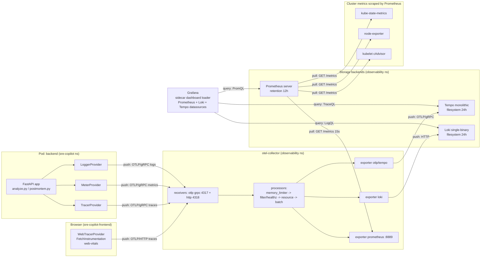

# SRE Copilot — Observability Guide

> **Audience:** Both first-time Grafana users and engineers who want to write TraceQL by hand.
> **Scope:** Every signal (trace, metric, log) emitted by this project, the path it travels, and the panels and alerts that consume it.
> **Stack:** OpenTelemetry SDK (Python + Browser) → OTel Collector → **L**oki / **G**rafana / **T**empo / **M**etrics-via-Prometheus.

This is the **most important doc in the repo**. If something looks wrong in production, it starts here.

**See also:** for how the cluster boots and how OTel ends up wired in the first place, see [INFRASTRUCTURE.md §3.6 Helm charts](INFRASTRUCTURE.md#36-helm-charts--the-project-local-templates) and [DEPLOYMENT.md §1 Overview](DEPLOYMENT.md#1-overview--what-make-up-actually-does). For how the backend emits the spans whose flow is traced below, see [APP_GUIDE.md §3.2 Backend layer](APP_GUIDE.md#32-backend-layer--fastapi).

---

## Table of Contents

1. [Architecture: How Data Flows](#1-architecture-how-data-flows)
   - [One trace's lifetime — end to end](#one-traces-lifetime--end-to-end)
2. [Each Component, Deeply](#2-each-component-deeply)
   - [2.1 OpenTelemetry SDK (Backend, Python)](#21-opentelemetry-sdk-backend-python)
   - [2.2 OpenTelemetry SDK (Browser, TypeScript)](#22-opentelemetry-sdk-browser-typescript)
   - [2.3 OTel Collector](#23-otel-collector)
   - [2.4 Loki](#24-loki)
   - [2.5 Tempo](#25-tempo)
   - [2.6 Prometheus](#26-prometheus)
   - [2.7 Grafana](#27-grafana)
3. [Dashboards — Panel-by-Panel Walkthrough](#3-dashboards--panel-by-panel-walkthrough)
   - [3.1 Dashboard: SRE Copilot Overview](#31-dashboard-sre-copilot-overview)
   - [3.2 Dashboard: LLM Performance](#32-dashboard-llm-performance)
   - [3.3 Dashboard: Cluster Health](#33-dashboard-cluster-health)
   - [3.4 Dashboard: Cost and Capacity](#34-dashboard-cost-and-capacity)
4. [Tempo — TraceQL Exploration Guide](#4-tempo--traceql-exploration-guide)
   - [4.1 Where to start](#41-where-to-start)
   - [4.2 Anatomy of the trace view](#42-anatomy-of-the-trace-view)
   - [4.3 Real TraceQL queries for this app](#43-real-traceql-queries-for-this-app)
   - [4.4 Chaining with logs](#44-chaining-with-logs)
5. [SLOs and Burn-Rate Alerts](#5-slos-and-burn-rate-alerts)
   - [5.1 SLO 1: Backend Availability — 99% over 7d](#51-slo-1-backend-availability--99-over-7d)
   - [5.2 SLO 2: TTFT — p95 < 2s over 7d](#52-slo-2-ttft--p95--2s-over-7d)
   - [5.3 SLO 3: Full Response — p90 < 30s over 7d](#53-slo-3-full-response--p90--30s-over-7d)
   - [5.4 Pod-level alerts](#54-pod-level-alerts)
6. [The Data Shape — What Gets Emitted, By Whom, How](#6-the-data-shape--what-gets-emitted-by-whom-how)
   - [6.1 A log line](#61-a-log-line)
   - [6.2 A metric sample](#62-a-metric-sample)
   - [6.3 A trace span (OTLP JSON, abridged)](#63-a-trace-span-otlp-json-abridged)
7. [Try It Yourself — Exploration Playbook](#7-try-it-yourself--exploration-playbook)
   - [7.1 Find the slowest log-analysis request in the last hour](#71-find-the-slowest-log-analysis-request-in-the-last-hour)
   - [7.2 Why is the LLM throughput tanking?](#72-why-is-the-llm-throughput-tanking)
   - [7.3 Trigger a synthetic anomaly and watch it propagate](#73-trigger-a-synthetic-anomaly-and-watch-it-propagate)
   - [7.4 Correlate a failed request to its log lines](#74-correlate-a-failed-request-to-its-log-lines)
8. [How to Add New Instrumentation](#8-how-to-add-new-instrumentation)
   - [8.1 Define the instrument](#81-define-the-instrument)
   - [8.2 Increment from app code](#82-increment-from-app-code)
   - [8.3 Verify scrape](#83-verify-scrape)
   - [8.4 Add a Grafana panel](#84-add-a-grafana-panel)
   - [8.5 Add an alert (optional)](#85-add-an-alert-optional)
- [Appendix A — File Index](#appendix-a--file-index)
- [Appendix B — Six Commandments](#appendix-b--six-commandments)

---

## 1. Architecture: How Data Flows

> **Beginner**: TL;DR — your app calls one library (OpenTelemetry). That library ships traces, metrics, and logs over a single wire protocol (OTLP) to one collector pod. The collector then forwards traces to Tempo, logs to Loki, and exposes metrics for Prometheus to scrape. Grafana reads all three. You never call Tempo/Loki/Prometheus directly.

**Mental model:** apps speak **OTLP** (OpenTelemetry Line Protocol) to one place — the OTel Collector — and the Collector fans signals out to Loki, Tempo, and Prometheus. Grafana queries all three. Nobody talks to Loki/Tempo/Prometheus directly from app code.

A subtle but critical detail: **traces and logs are pushed**, **metrics are pulled**. The backend OTLP-exports traces and logs to the Collector; the Collector OTLP-pushes traces to Tempo and HTTP-pushes logs to Loki. Metrics, however, are exposed by the Collector on `:8889/metrics` and **scraped** by Prometheus every 15s. Cluster metrics (`kube-state-metrics`, `node-exporter`, kubelet cAdvisor) are also pulled by Prometheus. The arrows in the diagram below reflect that distinction.

> **Glossary on first use**
> - **OTLP**: the wire format used by OTel SDKs. gRPC on `:4317`, HTTP on `:4318`.
> - **Receiver / Processor / Exporter**: the three-stage pipeline inside the OTel Collector.
> - **TraceQL**: Tempo's query language for traces (think "PromQL but for spans").
> - **PromQL**: Prometheus query language for metrics.
> - **LogQL**: Loki query language for logs.
> - **MWMBR**: Multi-Window Multi-Burn-Rate, a Google-SRE-Workbook alerting pattern.
> - **ServiceMonitor**: a CRD from kube-prometheus that tells Prometheus what to scrape.



### One trace's lifetime — end to end

The user clicks **Analyze** in the Next.js frontend. Here is what happens, with file pointers:

1. **Browser starts the trace.** The `FetchInstrumentation` registered in [src/frontend/observability/otel.ts](../src/frontend/observability/otel.ts#L40) wraps `window.fetch`, opens a span around the outbound call, and injects a `traceparent` header. `propagateTraceHeaderCorsUrls: [/.*/]` ([otel.ts:43](../src/frontend/observability/otel.ts#L43)) ensures the header isn't dropped on cross-origin requests.

2. **Request hits the backend ingress** at `/analyze/logs`. FastAPI's auto-instrumentation, wired by `FastAPIInstrumentor.instrument_app(...)` in [src/backend/observability/init.py:107](../src/backend/observability/init.py#L107), extracts the `traceparent` header (because `http_capture_headers_server_request=["traceparent", "x-request-id"]` at [init.py:110](../src/backend/observability/init.py#L110)) and creates a server span as a child of the browser span.

3. **Request-ID middleware** runs at [src/backend/middleware/request_id.py:14](../src/backend/middleware/request_id.py#L14) and emits a structured "request started" log entry. Because the OTel-aware `JsonFormatter` in [src/backend/observability/logging.py:9](../src/backend/observability/logging.py#L9) reads the active span context, that log line carries `trace_id` + `span_id` matching the FastAPI span.

4. **Manual span around the LLM call.** The handler in [src/backend/api/analyze.py:51](../src/backend/api/analyze.py#L51) opens `ollama.host_call` and tags it with `llm.model`, `llm.input_tokens`, `peer.service=ollama-host`, etc. Auto-instrumentation cannot follow the call into the host process (kind cluster → host Ollama), so this span is what shows up in Tempo for "the LLM bit".

5. **Custom metrics fire.** As the streaming response unfolds:
   - `LLM_INPUT_TOKENS.add(...)` at [analyze.py:48](../src/backend/api/analyze.py#L48)
   - `LLM_ACTIVE.add(1)` at [analyze.py:49](../src/backend/api/analyze.py#L49)
   - `LLM_TTFT.record(ttft)` at [analyze.py:89](../src/backend/api/analyze.py#L89) when the first delta arrives
   - `LLM_OUTPUT_TOKENS.add(...)` and `LLM_RESPONSE.record(duration)` at [analyze.py:96–97](../src/backend/api/analyze.py#L96)

6. **Synthetic Ollama child span.** Because OTel cannot auto-instrument across the kind→host boundary, [src/backend/observability/spans.py:12](../src/backend/observability/spans.py#L12) reconstructs an `ollama.inference` INTERNAL span using `time.time_ns()` boundaries and the `synthetic=true` attribute. The wall-clock fix in the comment at [spans.py:23](../src/backend/observability/spans.py#L23) is important: asyncio's clock would otherwise put the span in 1970+uptime.

7. **OTLP export.** Spans are batched by `BatchSpanProcessor` ([init.py:57](../src/backend/observability/init.py#L57)) and sent over gRPC to `otel-collector.observability.svc.cluster.local:4317`. Metrics use `PeriodicExportingMetricReader` with a 10s interval ([init.py:64–67](../src/backend/observability/init.py#L64)). Logs go via `BatchLogRecordProcessor` ([init.py:73](../src/backend/observability/init.py#L73)).

8. **Collector pipeline.** Traffic enters at [helm/observability/otel-collector/values.yaml:37](../helm/observability/otel-collector/values.yaml#L37) (`otlp` receiver), is rate-limited by `memory_limiter`, has `/healthz` and `/metrics` spans dropped by `filter/healthz` ([values.yaml:62](../helm/observability/otel-collector/values.yaml#L62)), gets `deployment.environment=kind-local` upserted ([values.yaml:57](../helm/observability/otel-collector/values.yaml#L57)), then is batched.

9. **Fan-out.** Traces → Tempo OTLP gRPC ([values.yaml:70](../helm/observability/otel-collector/values.yaml#L70)). Logs → Loki HTTP push ([values.yaml:74](../helm/observability/otel-collector/values.yaml#L74)). Metrics → exposed at `:8889` for Prometheus to scrape ([values.yaml:79](../helm/observability/otel-collector/values.yaml#L79)).

10. **Grafana queries it back.** A user opens the **LLM Performance** dashboard. Panel "Recent LLM Traces" ([observability/dashboards/llm-performance.json:161](../observability/dashboards/llm-performance.json#L161)) runs a LogQL query against Loki, extracts `traceid` from the JSON, and links each row directly to the Tempo trace view ([llm-performance.json:233](../observability/dashboards/llm-performance.json#L233)) via Grafana's `internal` data link.

Result: one user click, four hops, three signals — and you can navigate browser → backend → Ollama in a single trace tree, with logs and metrics correlated by `trace_id`.

---

## 2. Each Component, Deeply

This section walks the seven components in the diagram above (browser SDK, backend SDK, Collector, Loki, Tempo, Prometheus, Grafana) — what they are, where they're configured in this repo, and the one or two non-obvious choices each one's config makes.

### 2.1 OpenTelemetry SDK (Backend, Python)

> **Beginner**: TL;DR — the backend wires three OTel "providers" (tracer, meter, logger) at startup, *before* any module that defines metrics is imported. If you forget that ordering, your `llm.*` metrics silently bind to a no-op and never show up in Grafana. The five custom metrics live in [metrics.py](../src/backend/observability/metrics.py); the manual spans live in [analyze.py](../src/backend/api/analyze.py) and [spans.py](../src/backend/observability/spans.py).

**Files**
- [src/backend/observability/__init__.py](../src/backend/observability/__init__.py) — deliberately empty; see comment.
- [src/backend/observability/init.py](../src/backend/observability/init.py) — provider bootstrap.
- [src/backend/observability/spans.py](../src/backend/observability/spans.py) — synthetic Ollama span.
- [src/backend/observability/metrics.py](../src/backend/observability/metrics.py) — custom instruments.
- [src/backend/observability/logging.py](../src/backend/observability/logging.py) — JSON log formatter.

**Two-phase init.** The init module in [init.py:11](../src/backend/observability/init.py#L11) deliberately splits into:
1. `init_observability_providers()` — installs TracerProvider + MeterProvider + LoggerProvider on the **global** OTel APIs. This MUST run before any module that creates instruments at import time, otherwise instruments bind to the no-op `ProxyMeterProvider` permanently. This is also why [__init__.py](../src/backend/observability/__init__.py) is empty (see the comment there).
2. `instrument_app(app)` — runs after the FastAPI app object exists, attaches `FastAPIInstrumentor` and `HTTPXClientInstrumentor`.

**Resource attributes** ([init.py:46–53](../src/backend/observability/init.py#L46)):
```python
Resource.create({
  "service.name": "sre-copilot-backend",
  "service.version": os.environ.get("APP_VERSION", "dev"),
  "deployment.environment": "kind-local",
  "loki.resource.labels": "service.name,deployment.environment",
})
```
The `loki.resource.labels` hint is read by the Collector's Loki exporter and **promotes those resource attributes to Loki stream labels** — that's why `{service_name="sre-copilot-backend"}` works in LogQL.

**Custom metrics** ([metrics.py:5–15](../src/backend/observability/metrics.py#L5)):

| Instrument | Type | Purpose |
|---|---|---|
| `llm.ttft_seconds` | Histogram | Time-to-first-token from Ollama |
| `llm.response_seconds` | Histogram | Full LLM stream duration |
| `llm.tokens_output_total` | Counter | Cumulative output tokens |
| `llm.tokens_input_total` | Counter | Cumulative input tokens |
| `llm.active_requests` | UpDownCounter | In-flight LLM calls (gauge) |

When the OTel→Prometheus exporter renders these, dots become underscores and counters get `_total` suffixes:
- `llm.ttft_seconds` → `llm_ttft_seconds_bucket`, `_sum`, `_count`
- `llm.tokens_output_total` → `llm_tokens_output_total`
- `llm.active_requests` → `llm_active_requests`

**Manual spans** are added at every outbound boundary auto-instrumentation cannot see:
- `ollama.host_call` in [analyze.py:51](../src/backend/api/analyze.py#L51) and `postmortem.generate` in [src/backend/api/postmortem.py:56](../src/backend/api/postmortem.py#L56) — the LLM call.
- `ollama.inference` synthetic INTERNAL span in [spans.py:27](../src/backend/observability/spans.py#L27) — represents host-side model work that crosses the kind/host boundary.

**Structured logging with trace correlation** ([logging.py:9–28](../src/backend/observability/logging.py#L9)):
```python
class JsonFormatter(logging.Formatter):
    def format(self, record):
        span = trace.get_current_span()
        ctx = span.get_span_context() if span else None
        payload = {
            "timestamp": datetime.now(UTC).isoformat(),
            "level": record.levelname.lower(),
            "service": "backend",
            "trace_id": f"{ctx.trace_id:032x}" if ctx and ctx.trace_id else None,
            "span_id": f"{ctx.span_id:016x}" if ctx and ctx.span_id else None,
            "event": getattr(record, "event", record.name),
            "message": record.getMessage(),
        }
```
Every log line carries `trace_id` and `span_id`. Grafana's Loki datasource ([helm/observability/lgtm/grafana-values.yaml:48–62](../helm/observability/lgtm/grafana-values.yaml#L48)) defines two `derivedFields` regexes (`"traceid":"..."` and `"trace_id":"..."`) that turn those into clickable links into Tempo.

### 2.2 OpenTelemetry SDK (Browser, TypeScript)

**Files**
- [src/frontend/observability/otel.ts](../src/frontend/observability/otel.ts) — WebTracerProvider + Fetch instrumentation.
- [src/frontend/observability/web-vitals.ts](../src/frontend/observability/web-vitals.ts) — CLS / FCP / FID / LCP / TTFB.
- [src/frontend/observability/index.ts](../src/frontend/observability/index.ts) — barrel exports.

The `initBrowserOtel()` function in [otel.ts:18](../src/frontend/observability/otel.ts#L18) is idempotent and a no-op on SSR (`typeof window === "undefined"`).

**Pipeline:** `WebTracerProvider` → `BatchSpanProcessor` → `OTLPTraceExporter` over HTTP at `${COLLECTOR_ENDPOINT}/v1/traces` ([otel.ts:30](../src/frontend/observability/otel.ts#L30)).

**Trace propagation:** `propagation.setGlobalPropagator(new W3CTraceContextPropagator())` at [otel.ts:37](../src/frontend/observability/otel.ts#L37). This ensures the `traceparent` header is attached to outbound `fetch` calls, and `propagateTraceHeaderCorsUrls: [/.*/]` ([otel.ts:43](../src/frontend/observability/otel.ts#L43)) makes the SDK include it on every URL — without that, the SDK quietly omits `traceparent` on cross-origin requests and the trace tree breaks at the browser/backend boundary.

**CORS requirement:** the Collector's OTLP HTTP receiver enables CORS at [helm/observability/otel-collector/values.yaml:43–47](../helm/observability/otel-collector/values.yaml#L43) (`allowed_origins: "*"`, `allowed_headers: "*"`). Without that, browsers refuse to POST OTLP.

**Web vitals** ([web-vitals.ts:4](../src/frontend/observability/web-vitals.ts#L4)) wraps each `web-vitals` callback in a span named `web-vital.cls`, `web-vital.fcp`, etc., with `web_vital.value` and `web_vital.rating` attributes. These show up in Tempo as standalone short-lived spans.

### 2.3 OTel Collector

**Helm chart:** `open-telemetry/opentelemetry-collector` v0.108.x ([argocd/applications/otel-collector.yaml:11–13](../argocd/applications/otel-collector.yaml#L11)).
**Mode:** `mode: deployment`, single replica ([otel-collector/values.yaml:1–2](../helm/observability/otel-collector/values.yaml#L1)). Daemonset would waste RAM on 16GB-laptop kind clusters.

**Receivers** ([values.yaml:36](../helm/observability/otel-collector/values.yaml#L36)):
- OTLP gRPC on `0.0.0.0:4317` (used by backend Python SDK).
- OTLP HTTP on `0.0.0.0:4318` (used by browser).

**Processors, in order** (see pipelines block at [values.yaml:100–128](../helm/observability/otel-collector/values.yaml#L100)):
1. `memory_limiter` — drops data when the Collector approaches 75% of its 256Mi limit, with a 25% spike buffer. Without this, a flood of spans OOMs the pod.
2. `filter/healthz` — drops spans where `http.target == "/healthz"` or `"/metrics"`. Otherwise the trace store fills with noise from the kubelet probing the readiness endpoint.
3. `resource` — upserts `deployment.environment=kind-local` so resource attribute is consistent even if a forgetful future SDK omits it.
4. `batch` — accumulates 1024 records or 5s and flushes.

**Exporters** ([values.yaml:69](../helm/observability/otel-collector/values.yaml#L69)):
- `otlp/tempo` → `tempo.observability.svc.cluster.local:4317` (insecure gRPC).
- `loki` → `http://loki.observability.svc.cluster.local:3100/loki/api/v1/push`. `default_labels_enabled.exporter: false` keeps the auto-`exporter="loki"` label off (cardinality).
- `prometheus` → exposes `/metrics` on `:8889` with constant label `cluster=kind-sre-copilot`. `resource_to_telemetry_conversion: true` promotes resource attributes (like `service.name`) to Prom labels (`service_name="sre-copilot-backend"`).

**ServiceMonitor:** the chart provisions one ([values.yaml:130–136](../helm/observability/otel-collector/values.yaml#L130)) with `release: prometheus` so kube-prometheus-stack-style scraping picks it up. **NetworkPolicy** for the namespace lives at [argocd/applications/networkpolicies.yaml](../argocd/applications/networkpolicies.yaml).

### 2.4 Loki

**Helm chart:** `grafana/loki` 6.x.x ([argocd/applications/loki.yaml:13](../argocd/applications/loki.yaml#L13)).
**Mode:** `deploymentMode: SingleBinary` ([helm/observability/lgtm/loki-values.yaml:1](../helm/observability/lgtm/loki-values.yaml#L1)). Microservices mode wants 6–8 services; single-binary is one pod.

**Storage:** `filesystem`, `1Gi` PVC ([loki-values.yaml:40–43](../helm/observability/lgtm/loki-values.yaml#L40)).
**Retention:** `24h` enforced by the compactor ([loki-values.yaml:18–27](../helm/observability/lgtm/loki-values.yaml#L18)).
**Cardinality safeguards:** `max_label_names_per_series: 30` ([loki-values.yaml:24](../helm/observability/lgtm/loki-values.yaml#L24)). High-cardinality labels (`request_id`, `trace_id`) are kept as **structured fields inside the JSON body**, not as Loki stream labels. Querying them uses `| json` parser plus a field filter, e.g. `{service_name="sre-copilot-backend"} | json | attributes_request_id="abc"`.

**Stream labels promoted from OTel resource:** `service.name`, `deployment.environment`. Set at the SDK via `loki.resource.labels` ([init.py:52](../src/backend/observability/init.py#L52)).

### 2.5 Tempo

**Helm chart:** `grafana/tempo` 1.x.x ([argocd/applications/tempo.yaml:13](../argocd/applications/tempo.yaml#L13)).
**Mode:** monolithic (single binary).
**Storage:** local filesystem at `/var/tempo/traces`, WAL at `/var/tempo/wal` ([tempo-values.yaml:11–18](../helm/observability/lgtm/tempo-values.yaml#L11)).
**Retention:** `24h` block retention ([tempo-values.yaml:19](../helm/observability/lgtm/tempo-values.yaml#L19), [tempo-values.yaml:39–40](../helm/observability/lgtm/tempo-values.yaml#L39)).

**Critical config: `metricsGenerator.enabled: true`** at [tempo-values.yaml:53](../helm/observability/lgtm/tempo-values.yaml#L53). Without this, Grafana's TraceQL search returns "backend TraceQL search queries are not supported" — the comment at [tempo-values.yaml:46–52](../helm/observability/lgtm/tempo-values.yaml#L46) explains the camelCase/snake_case gotcha. The `local-blocks` processor ([tempo-values.yaml:67–70](../helm/observability/lgtm/tempo-values.yaml#L67)) builds an in-process searchable index over recent blocks so backend TraceQL queries succeed against filesystem storage.

**Receivers:** OTLP gRPC :4317 + HTTP :4318 ([tempo-values.yaml:25–32](../helm/observability/lgtm/tempo-values.yaml#L25)).

### 2.6 Prometheus

**Helm chart:** `prometheus-community/prometheus` 25.x.x — upstream chart, **not** kube-prometheus-stack ([argocd/applications/prometheus.yaml:11–13](../argocd/applications/prometheus.yaml#L11)). Sub-charts: `kube-state-metrics`, `prometheus-node-exporter`. Alertmanager and pushgateway are disabled. `prometheus-operator-crds` is deployed separately ([argocd/applications/prometheus-operator-crds.yaml](../argocd/applications/prometheus-operator-crds.yaml)) so we get `ServiceMonitor` and `PrometheusRule` CRDs without the full operator.

**Retention:** 12h ([prometheus-values.yaml:2](../helm/observability/lgtm/prometheus-values.yaml#L2)).
**Persistence:** none (`emptyDir`).
**Scrape interval:** 30s ([prometheus-values.yaml:14](../helm/observability/lgtm/prometheus-values.yaml#L14)).

**Scrape jobs** ([prometheus-values.yaml:51–98](../helm/observability/lgtm/prometheus-values.yaml#L51)):
- `otel-collector` — pulls `:8889/metrics` every 15s. This is where ALL backend custom metrics (`llm_*`) and FastAPI auto-instrumentation (`http_server_duration_*`) come from.
- `kubernetes-pods` — discovers any pod with `prometheus.io/scrape: "true"`.
- `kubernetes-cadvisor` — uses the apiserver as a TLS proxy to pull `container_*` metrics from each kubelet. Drops `id=~/system.slice/.*` series to keep cardinality down ([prometheus-values.yaml:96–98](../helm/observability/lgtm/prometheus-values.yaml#L96)).

**Recording + alerting rules** are deployed as `PrometheusRule` CRDs in the `observability` namespace, labelled `release: prometheus` so Prometheus picks them up. See [observability/alerts/recording-rules.yaml](../observability/alerts/recording-rules.yaml) and [observability/alerts/alert-rules.yaml](../observability/alerts/alert-rules.yaml).

### 2.7 Grafana

**Helm chart:** `grafana/grafana` 8.x.x ([argocd/applications/grafana.yaml:13](../argocd/applications/grafana.yaml#L13)).
**Auth:** admin login `admin / sre-copilot-admin` ([grafana-values.yaml:1](../helm/observability/lgtm/grafana-values.yaml#L1)). Anonymous Viewer also enabled ([grafana-values.yaml:91–93](../helm/observability/lgtm/grafana-values.yaml#L91)).
**Persistence:** none — restart wipes user-created dashboards. The provisioned dashboards survive because they live in ConfigMaps.

**Dashboard sidecar** ([grafana-values.yaml:18–26](../helm/observability/lgtm/grafana-values.yaml#L18)) watches **every namespace** for ConfigMaps with label `grafana_dashboard=1` and auto-loads them. This is how [observability/dashboards/configmaps.yaml](../observability/dashboards/configmaps.yaml) gets picked up — `make dashboards` regenerates that ConfigMap from the four JSON files in [observability/dashboards/](../observability/dashboards/).

**Datasources** are provisioned at startup ([grafana-values.yaml:33–84](../helm/observability/lgtm/grafana-values.yaml#L33)):
- **Prometheus** (`uid: prometheus`, default) — `http://prometheus-server.observability.svc.cluster.local:80`.
- **Loki** (`uid: loki`) — with two `derivedFields` regexes that turn `traceid` and legacy `trace_id` JSON fields into clickable Tempo links.
- **Tempo** (`uid: tempo`) — `streamingEnabled: { search: false, metrics: false }` ([grafana-values.yaml:74–76](../helm/observability/lgtm/grafana-values.yaml#L74)) is a workaround for an HTTP/2 frame-size bug; without it, trace-id click opens "No data". `tracesToLogsV2.filterByTraceID: true` ([grafana-values.yaml:77–79](../helm/observability/lgtm/grafana-values.yaml#L77)) lets you jump from a span to the matching Loki logs.

---

## 3. Dashboards — Panel-by-Panel Walkthrough

Four dashboards live in [observability/dashboards/](../observability/dashboards/). Each is a JSON file converted to a ConfigMap by [observability/dashboards/regen-configmaps.py](../observability/dashboards/regen-configmaps.py) and applied via `make dashboards`.

> **Reading guide.** For every panel: title and type, the exact query, the metric/log/trace it depends on, where in code that signal is generated, what good vs bad looks like, and what to investigate when it goes red.

### 3.1 Dashboard: SRE Copilot Overview

UID `sre-overview`. Refresh 15s. Source: [observability/dashboards/overview.json](../observability/dashboards/overview.json).

This is the at-a-glance "is the service alive" board. 11 panels.

#### Panel 1 — Request Rate (stat, reqps)

- **Query** ([overview.json:31](../observability/dashboards/overview.json#L31)):
  ```promql
  sum(rate(http_server_duration_milliseconds_count{service_name="sre-copilot-backend"}[1m])) or vector(0)
  ```
- **Source signal:** the histogram emitted automatically by `FastAPIInstrumentor.instrument_app(app)` at [src/backend/observability/init.py:107](../src/backend/observability/init.py#L107). Every HTTP server request increments the bucket count.
- **The `or vector(0)`** suffix prevents "No data" on an idle service.
- **Good:** non-zero req/s while the demo is running. **Bad:** flatlines at 0 while you're clicking buttons → backend is down or OTel export is broken.
- **Investigate when red:** `kubectl -n sre-copilot logs deploy/backend`, then check **OtelCollectorDown** alert and the Collector pod logs.

#### Panel 2 — 5xx Error Rate (stat, percentunit)

- **Query** ([overview.json:68](../observability/dashboards/overview.json#L68)):
  ```promql
  (sum(rate(http_server_duration_milliseconds_count{service_name="sre-copilot-backend",http_response_status_code=~"5.."}[1m])) or vector(0))
  / clamp_min(sum(rate(http_server_duration_milliseconds_count{service_name="sre-copilot-backend"}[1m])), 1)
  or vector(0)
  ```
- **Thresholds** ([overview.json:50–56](../observability/dashboards/overview.json#L50)): green<1%, yellow ≥1%, red ≥5%.
- **`clamp_min(..., 1)`** prevents division-by-zero spikes.
- **Source signal:** same histogram; `http_response_status_code` is filled by FastAPI auto-instrumentation.
- **Good:** 0%. **Bad:** sustained >1% — investigate which endpoint by changing the query to `sum by (http_route)(...)`.

#### Panel 3 — Backend Pods Ready (stat)

- **Query** ([overview.json:104](../observability/dashboards/overview.json#L104)):
  ```promql
  count(kube_pod_status_phase{namespace="sre-copilot",pod=~"backend-.*",phase="Running"} == 1) or vector(0)
  ```
- **Source signal:** `kube-state-metrics` ([prometheus-values.yaml:33](../helm/observability/lgtm/prometheus-values.yaml#L33)).
- **Thresholds:** red<1, yellow at 1, green at 2 (we run 2 replicas via the Argo Rollout).
- **Bad:** 0 → alert `BackendNoReplicas` ([alert-rules.yaml:139](../observability/alerts/alert-rules.yaml#L139)) is firing. Run `kubectl -n sre-copilot describe rollout backend`.

#### Panel 4 — Availability 1h (stat, percentunit)

- **Query** ([overview.json:142](../observability/dashboards/overview.json#L142)):
  ```promql
  1 - ((sum(rate(http_server_duration_milliseconds_count{service_name="sre-copilot-backend",http_response_status_code=~"5.."}[1h])) or vector(0))
       / clamp_min(sum(rate(http_server_duration_milliseconds_count{service_name="sre-copilot-backend"}[1h])), 1))
  ```
- **Thresholds:** red<99%, yellow at 99%, green at 99.9%.
- The comment at [overview.json:114](../observability/dashboards/overview.json#L114) explains why it's a 1h window: kind clusters never have 7 days of data.
- **Bad:** drops below 99% → cross-reference with `BackendAvailabilityBurnSlow`/`Fast` alerts.

#### Panel 7 — Active LLM Requests (stat)

- **Query** ([overview.json:178](../observability/dashboards/overview.json#L178)):
  ```promql
  sum(llm_active_requests) or vector(0)
  ```
- **Source signal:** `LLM_ACTIVE` UpDownCounter at [src/backend/observability/metrics.py:15](../src/backend/observability/metrics.py#L15). Incremented at [src/backend/api/analyze.py:49](../src/backend/api/analyze.py#L49) and decremented at [analyze.py:108](../src/backend/api/analyze.py#L108) (and the analogous lines in [postmortem.py:54](../src/backend/api/postmortem.py#L54)/[postmortem.py:103](../src/backend/api/postmortem.py#L103)).
- **Good:** 0 when idle. **Bad:** stuck >0 with no traffic → an SSE generator's `finally` never ran (client disconnected mid-stream and we leaked the gauge). Check Tempo for `ollama.host_call` spans with `cancelled` status.

#### Panel 8 — p95 LLM TTFT (stat, s)

- **Query** ([overview.json:214](../observability/dashboards/overview.json#L214)):
  ```promql
  histogram_quantile(0.95, sum by (le) (rate(llm_ttft_seconds_bucket[5m])))
  ```
- **Source signal:** histogram `LLM_TTFT` at [metrics.py:5–8](../src/backend/observability/metrics.py#L5), recorded at [analyze.py:89](../src/backend/api/analyze.py#L89) and [postmortem.py:92](../src/backend/api/postmortem.py#L92) when the first delta arrives.
- **Thresholds:** green<1s, yellow ≥1s, red ≥2s. **2s is the canary AnalysisTemplate gate** — exceed it and Argo Rollouts auto-aborts the rollout.
- **Bad:** climbing >1.5s → investigate Ollama host (model swap, host RAM pressure, thermal throttle). Open Tempo, query `{ name="ollama.host_call" duration > 1.5s }`.

#### Panel 9 — LLM Tokens/sec (stat)

- **Query** ([overview.json:243](../observability/dashboards/overview.json#L243)):
  ```promql
  sum(rate(llm_output_tokens_total[1m])) or vector(0)
  ```
- **Source signal:** Counter `LLM_OUTPUT_TOKENS` at [metrics.py:13](../src/backend/observability/metrics.py#L13), incremented at [analyze.py:96](../src/backend/api/analyze.py#L96) once per stream finishes.
- **Bad:** flatlines while `Active LLM Requests > 0` → Ollama is hung emitting tokens. Likely stuck in inference; check `ollama ps` on the host.

#### Panel 10 — Memory avg (stat, decbytes)

- **Query** ([overview.json:272](../observability/dashboards/overview.json#L272)):
  ```promql
  avg(container_memory_working_set_bytes{namespace="sre-copilot",pod=~"backend-.*",container!="",container!="POD"})
  ```
- **Source signal:** kubelet cAdvisor scraped via the apiserver TLS proxy ([prometheus-values.yaml:77–93](../helm/observability/lgtm/prometheus-values.yaml#L77)).
- **Bad:** approaches the container memory limit → restart imminent (OOMKill).

#### Panel 5 — Request Rate Over Time (timeseries)

- **Queries** ([overview.json:296](../observability/dashboards/overview.json#L296), [overview.json:301](../observability/dashboards/overview.json#L301)): total req/s and 5xx-only req/s. Two series stacked.
- **Bad:** the 5xx series visibly tracking the total → systemic failure, not a single bad endpoint.

#### Panel 11 — LLM Latency p50 / p95 / p99 TTFT (timeseries)

- **Queries** ([overview.json:325–336](../observability/dashboards/overview.json#L325)):
  ```promql
  histogram_quantile(0.50, sum by (le) (rate(llm_ttft_seconds_bucket[5m])))
  histogram_quantile(0.95, sum by (le) (rate(llm_ttft_seconds_bucket[5m])))
  histogram_quantile(0.99, sum by (le) (rate(llm_ttft_seconds_bucket[5m])))
  ```
- **Good:** p99 < 2s. **Bad:** p95 above 2s for sustained periods → rollout fails its analysis gate; the page alert `BackendTTFTBurnFast` will fire.

#### Panel 6 — Backend Logs (logs panel, Loki)

- **Query** ([overview.json:351](../observability/dashboards/overview.json#L351)):
  ```logql
  {service_name="sre-copilot-backend"} | json | line_format "{{.severity}} {{.body}} {{.attributes_endpoint}}"
  ```
- **Source signal:** every log written via the `logging` module on the backend ([src/backend/middleware/request_id.py:18](../src/backend/middleware/request_id.py#L18) etc.), routed through `OTelJsonFormatter` and the `LoggingHandler` attached at [init.py:78–79](../src/backend/observability/init.py#L78), exported via OTLP, ingested by Loki.
- **What to do:** click any log row and the Tempo "TraceID" derived field jumps to the trace.

### 3.2 Dashboard: LLM Performance

UID `llm-perf`. Refresh 15s, default range 1h. Source: [observability/dashboards/llm-performance.json](../observability/dashboards/llm-performance.json). 7 panels.

#### Panel 1 — TTFT p95 (10m) — stat

- **Query** ([llm-performance.json:29](../observability/dashboards/llm-performance.json#L29)):
  ```promql
  histogram_quantile(0.95, sum by (le) (rate(llm_ttft_seconds_bucket[10m])))
  ```
- Same instrument as Overview panel 8, **but** 10m window for less jitter — useful when reviewing canary gating decisions.
- **Threshold:** red ≥2s. This is what the Argo Rollout AnalysisTemplate watches.

#### Panel 2 — Full Response p90 (10m) — stat

- **Query** ([llm-performance.json:56](../observability/dashboards/llm-performance.json#L56)):
  ```promql
  histogram_quantile(0.90, sum by (le) (rate(llm_response_seconds_bucket[10m])))
  ```
- **Source signal:** `LLM_RESPONSE` histogram at [metrics.py:9–12](../src/backend/observability/metrics.py#L9), recorded at [analyze.py:97](../src/backend/api/analyze.py#L97) (and [postmortem.py:100](../src/backend/api/postmortem.py#L100)) inside the `finally` block — so it always fires, even on cancelled streams.
- **Thresholds:** green<20s, yellow ≥20s, red ≥30s. SLO is p90<30s.

#### Panel 3 — Output Tokens/s — stat

- **Query** ([llm-performance.json:80](../observability/dashboards/llm-performance.json#L80)):
  ```promql
  sum(rate(llm_tokens_output_total[1m])) or vector(0)
  ```
- Pure throughput. Use to verify Ollama is generating at expected speed (~30–60 tok/s on Apple Silicon).

#### Panel 4 — Active LLM Requests — stat

Same query/instrument as Overview panel 7 — duplicated here so this dashboard is self-contained.

#### Panel 5 — TTFT Distribution Over Time (timeseries)

- **Queries** ([llm-performance.json:122–134](../observability/dashboards/llm-performance.json#L122)) — p50/p95/p99 over 5m windows, charted.
- **Bad shape:** p99 detaches from p50 → long-tail latency. Often a sign of cold starts or GC pauses on the host model.

#### Panel 6 — Token Throughput (timeseries)

- **Queries** ([llm-performance.json:147,152](../observability/dashboards/llm-performance.json#L147)):
  ```promql
  rate(llm_tokens_output_total[5m])
  rate(llm_tokens_input_total[5m])
  ```
- **Source signals:** `LLM_OUTPUT_TOKENS` ([metrics.py:13](../src/backend/observability/metrics.py#L13)), `LLM_INPUT_TOKENS` ([metrics.py:14](../src/backend/observability/metrics.py#L14)). The input counter is incremented at the **start** of the request ([analyze.py:48](../src/backend/api/analyze.py#L48), [postmortem.py:53](../src/backend/api/postmortem.py#L53)), the output counter at the **end** ([analyze.py:96](../src/backend/api/analyze.py#L96)).
- **Bad:** input climbs but output flatlines → Ollama isn't returning tokens. Check `ollama ps`.

#### Panel 7 — Recent LLM Traces — table (Loki + Tempo data link)

The crown jewel. Lets you click a trace ID and jump straight into Tempo.

- **LogQL** ([llm-performance.json:167](../observability/dashboards/llm-performance.json#L167)):
  ```logql
  {service_name="sre-copilot-backend"} | json | attributes_event="http.request" | attributes_endpoint=~"/analyze/.*|/generate/.*" | line_format ""
  ```
- **Source signal:** the "request started" log line in [src/backend/middleware/request_id.py:18–26](../src/backend/middleware/request_id.py#L18). The `event=http.request` filter ensures one row per request (the response side is `event=http.response`).
- **Transformations** ([llm-performance.json:171–223](../observability/dashboards/llm-performance.json#L171)) extract `traceid`, `attributes_method`, `attributes_endpoint`, `attributes_request_id`. The Trace ID column gets a Grafana **internal data link** ([llm-performance.json:230–250](../observability/dashboards/llm-performance.json#L230)) targeting the `tempo` datasource with `queryType: traceql`.
- **What good looks like:** every recent request shows a clickable trace ID. **Bad:** missing `traceid` column → SDK didn't emit context, or the OTel `LoggingHandler` isn't attached. Check [init.py:78](../src/backend/observability/init.py#L78).

### 3.3 Dashboard: Cluster Health

UID `cluster-health`. Refresh 30s. Source: [observability/dashboards/cluster-health.json](../observability/dashboards/cluster-health.json). 6 panels.

#### Panel 1 — Pods Running (stat)

- **Query** ([cluster-health.json:18](../observability/dashboards/cluster-health.json#L18)):
  ```promql
  count(kube_pod_status_phase{phase="Running", namespace=~"sre-copilot|platform|observability"})
  ```
- **Source:** kube-state-metrics. **Bad:** sudden drop → check Pod Restarts panel (panel 6) for which pod.

#### Panel 2 — Node Count (stat)

- **Query** ([cluster-health.json:34](../observability/dashboards/cluster-health.json#L34)): `count(kube_node_info)`.
- Sanity check on the kind cluster shape (3 nodes by default).

#### Panel 3 — Container Memory Usage (timeseries, by pod)

- **Query** ([cluster-health.json:49](../observability/dashboards/cluster-health.json#L49)):
  ```promql
  sum by (pod) (container_memory_working_set_bytes{namespace="sre-copilot", container!=""})
  ```
- **Source:** cAdvisor.
- **Bad:** any backend pod climbing toward its memory limit (256–512Mi depending on profile) → next spike will OOM-kill it, the deployment will lose a replica, and **BackendNoReplicas** could trip if both pods OOM in the same window.

#### Panel 4 — Container CPU Usage (timeseries, by pod)

- **Query** ([cluster-health.json:64](../observability/dashboards/cluster-health.json#L64)):
  ```promql
  sum by (pod) (rate(container_cpu_usage_seconds_total{namespace="sre-copilot", container!=""}[5m]))
  ```
- Units: cores. **Bad:** sustained at limit → throttling. Cross-reference with TTFT.

#### Panel 5 — Observability Stack Memory (timeseries)

- **Query** ([cluster-health.json:79](../observability/dashboards/cluster-health.json#L79)):
  ```promql
  sum by (pod) (container_memory_working_set_bytes{namespace="observability", container!=""})
  ```
- **Bad:** Loki/Tempo/Prometheus climbing → retention or scrape interval may need tightening; this is the canary for "your laptop is about to swap".

#### Panel 6 — Pod Restarts (timeseries, by pod/container)

- **Query** ([cluster-health.json:94](../observability/dashboards/cluster-health.json#L94)):
  ```promql
  increase(kube_pod_container_status_restarts_total{namespace=~"sre-copilot|platform|observability"}[1h])
  ```
- **Bad:** any nonzero spike → `BackendPodCrashLoop` alert ([alert-rules.yaml:128](../observability/alerts/alert-rules.yaml#L128)) at risk of firing.

### 3.4 Dashboard: Cost and Capacity

UID `cost-capacity`. Refresh 60s, default range 6h. Source: [observability/dashboards/cost-capacity.json](../observability/dashboards/cost-capacity.json). 7 panels.

#### Panel 1 — Total Cluster Memory Requested (stat, bytes)

- **Query** ([cost-capacity.json:18](../observability/dashboards/cost-capacity.json#L18)):
  ```promql
  sum(kube_pod_container_resource_requests{resource="memory", namespace=~"sre-copilot|platform|observability"})
  ```
- Sum of all pod container memory `requests` — this is what the scheduler reserves, regardless of actual use.

#### Panel 2 — Total Cluster CPU Requested (stat)

- **Query** ([cost-capacity.json:34](../observability/dashboards/cost-capacity.json#L34)): same as panel 1 with `resource="cpu"`. Units: cores.

#### Panel 3 — Total Input Tokens session (stat, sum over 6h)

- **Query** ([cost-capacity.json:50](../observability/dashboards/cost-capacity.json#L50)):
  ```promql
  increase(llm_tokens_input_total[6h])
  ```
- Source: `LLM_INPUT_TOKENS` ([metrics.py:14](../src/backend/observability/metrics.py#L14)).

#### Panel 4 — Total Output Tokens session (stat)

- **Query** ([cost-capacity.json:66](../observability/dashboards/cost-capacity.json#L66)):
  ```promql
  increase(llm_tokens_output_total[6h])
  ```

#### Panel 5 — Memory Utilization by Namespace (timeseries)

- **Query** ([cost-capacity.json:81](../observability/dashboards/cost-capacity.json#L81)):
  ```promql
  sum by (namespace) (container_memory_working_set_bytes{namespace=~"sre-copilot|platform|observability", container!=""})
  ```
- Use to compare "what we asked for" (panels 1–2) vs "what we use".

#### Panel 6 — CPU Utilization by Namespace (timeseries)

- **Query** ([cost-capacity.json:96](../observability/dashboards/cost-capacity.json#L96)): same shape, cores.

#### Panel 7 — Token Cost Proxy (timeseries)

- **Queries** ([cost-capacity.json:122,127](../observability/dashboards/cost-capacity.json#L122)):
  ```promql
  (sum(rate(llm_tokens_output_total[10m])) or vector(0))
  / clamp_min(sum(rate(http_server_duration_milliseconds_count{service_name="sre-copilot-backend",http_target=~"/analyze/.*|/generate/.*"}[10m])), 1)

  (sum(rate(llm_tokens_input_total[10m])) or vector(0))
  / clamp_min(sum(rate(http_server_duration_milliseconds_count{service_name="sre-copilot-backend",http_target=~"/analyze/.*|/generate/.*"}[10m])), 1)
  ```
- **What it computes:** average tokens **per LLM endpoint call**. The `http_target=~"/analyze/.*|/generate/.*"` filter excludes `/healthz`/`/metrics` so the ratio isn't diluted by probes.
- **Why this matters:** it's a pseudo cost proxy for hosted-model deployments. Sudden jumps in input-tokens-per-call usually mean a prompt regression.

---

## 4. Tempo — TraceQL Exploration Guide

This section is a working reference for poking at traces by hand. It assumes you have a running cluster ([DEPLOYMENT.md §5](DEPLOYMENT.md#5-step-by-step-deploy)) and have generated some traffic (e.g., via [`make demo`](DEPLOYMENT.md#make-demo--paced-narrated-walkthrough)).

### 4.1 Where to start

1. Open Grafana → **Explore** (compass icon).
2. Datasource dropdown (top left) → **Tempo**.
3. **Search tab** for filtered queries by service / span name / duration.
4. **TraceQL tab** for full query language.
5. **Trace ID** if you have one (e.g., from a log line).

### 4.2 Anatomy of the trace view

When a trace opens you get a flame chart on the right and a span list on the left. Each row:

| Column | Meaning |
|---|---|
| **Span name** | e.g., `POST /analyze/logs`, `ollama.host_call`, `ollama.inference` |
| **Service** | resource attribute `service.name` (e.g., `sre-copilot-backend`, `sre-copilot-frontend`) |
| **Duration** | wall-clock time for that span |
| **Status** | `unset` / `ok` / `error` |
| **Span attributes panel** | every attribute set via `span.set_attributes(...)` — see e.g., [analyze.py:53–59](../src/backend/api/analyze.py#L53) |
| **Events** | `span.add_event(...)` — e.g., the `first_token` event at [analyze.py:90](../src/backend/api/analyze.py#L90) |

### 4.3 Real TraceQL queries for this app

> Syntax notes: `{...}` is a span filter. `&&` is AND, `||` is OR. `>>` is a structural "descendant of". `select(...)` projects extra columns into the result table.

**Find all log-analyzer requests**
```traceql
{ name="POST /analyze/logs" }
```
Returns the FastAPI server span emitted by auto-instrumentation at [init.py:107](../src/backend/observability/init.py#L107).

**Slow Ollama calls**
```traceql
{ name="ollama.host_call" && duration > 5s }
```
Targets the manual span at [analyze.py:51](../src/backend/api/analyze.py#L51). Use this to surface the worst-case "first-token took forever" outliers — these are exactly the kind of events the TTFT histogram smooths over.

**Backend errors**
```traceql
{ resource.service.name="sre-copilot-backend" && status=error }
```
Anything where `span.set_status(StatusCode.ERROR, ...)` was called — e.g., [analyze.py:70](../src/backend/api/analyze.py#L70) when Ollama is unreachable, or [analyze.py:82](../src/backend/api/analyze.py#L82) on client disconnect.

**Filter by LLM model attribute**
```traceql
{ span.llm.model="qwen2.5:7b-instruct-q4_K_M" }
```
The `llm.model` attribute is set on `ollama.host_call` ([analyze.py:54](../src/backend/api/analyze.py#L54)), `postmortem.generate` ([postmortem.py:59](../src/backend/api/postmortem.py#L59)), and `ollama.inference` ([spans.py:32](../src/backend/observability/spans.py#L32)). Useful when the canary swaps models.

**Postmortems and their child Ollama call (structural)**
```traceql
{ name="postmortem.generate" } >> { name="ollama.host_call" }
```
The `>>` operator means "has a descendant matching". This finds the parent-child pair as a single trace, helpful when you want to see only the postmortem flows that actually hit Ollama (vs. errored before).

**Frontend telemetry projection**
```traceql
{ resource.service.name="sre-copilot-frontend" } | select(span.http.url, span.duration)
```
Projects URL and duration into the Search result columns. Useful for finding which page route was the slowest, sourced from `FetchInstrumentation` registered in [otel.ts:42](../src/frontend/observability/otel.ts#L42).

### 4.4 Chaining with logs

Every backend log carries `traceid`. To pivot from a Tempo span to its log lines:

1. In the Tempo trace view, click any span.
2. Click **Logs for this span** (this works because the Tempo datasource has `tracesToLogsV2.filterByTraceID: true` ([grafana-values.yaml:77–79](../helm/observability/lgtm/grafana-values.yaml#L77))).
3. Grafana opens Loki Explore with the query:
   ```logql
   {service_name="sre-copilot-backend"} |= "<trace-id>"
   ```
4. From the log row, the `TraceID` derived field ([grafana-values.yaml:48–62](../helm/observability/lgtm/grafana-values.yaml#L48)) lets you jump back to Tempo.

This **two-way bridge** is the killer correlation feature: errors from a postmortem? Click the log → see the trace → see TTFT timing on `ollama.host_call` → understand whether the LLM was slow or the backend was.

---

## 5. SLOs and Burn-Rate Alerts

This section covers the three SLOs that gate canaries and alerts: backend availability, time-to-first-token (TTFT), and full LLM response duration. Each SLO has paired fast-burn and slow-burn alerts using the MWMBR pattern.

> **Beginner**: TL;DR — an SLO is a target like "99% of requests succeed". A burn-rate alert fires when you're consuming your error budget faster than that target allows. We use **two windows that must agree** (e.g., a 1h window AND a 5m window) so a single noisy 30-second blip doesn't page you. Fast-burn = page now; slow-burn = ticket for tomorrow.

> **Multi-Window Multi-Burn-Rate (MWMBR)** is the Google SRE Workbook §5 pattern. Two windows must AGREE that you're burning the error budget faster than threshold before the alert fires. A "fast burn" alert (page) uses a 14.4× rate over 1h confirmed by 5m. A "slow burn" alert (ticket) uses a 6× rate over 6h confirmed by 30m. The dual-window AND prevents flapping; the burn multiplier maps to "you'll exhaust X% of your monthly budget in Y hours if this continues".

The SLOs and their alerts live in:
- [observability/alerts/recording-rules.yaml](../observability/alerts/recording-rules.yaml) — the SLI ratios as recording rules (smoothed, fast to query)
- [observability/alerts/alert-rules.yaml](../observability/alerts/alert-rules.yaml) — the alert pairs

### 5.1 SLO 1: Backend Availability — 99% over 7d

- **SLI:** `http_server_duration_milliseconds_count` 5xx ratio (auto-instrumented by FastAPI).
- **Recording rules** ([recording-rules.yaml:14–48](../observability/alerts/recording-rules.yaml#L14)):
  - `backend:availability:error_ratio_5m`
  - `backend:availability:error_ratio_30m`
  - `backend:availability:error_ratio_1h`
  - `backend:availability:error_ratio_6h`
- **Alerts** ([alert-rules.yaml:18–46](../observability/alerts/alert-rules.yaml#L18)):

  | Alert | Burn × budget | Windows | for | Severity |
  |---|---|---|---|---|
  | `BackendAvailabilityBurnFast` | 14.4 × 0.01 = 14.4% errors | 1h AND 5m | 2m | page |
  | `BackendAvailabilityBurnSlow` | 6 × 0.01 = 6% errors | 6h AND 30m | 15m | page |

  Fast burn means "will exhaust 30d budget in ~2 days if continued". Runbook: [docs/runbooks/backend-pod-loss.md](runbooks/backend-pod-loss.md).

### 5.2 SLO 2: TTFT — p95 < 2s over 7d

- **SLI:** "bad-events ratio" — the fraction of requests whose TTFT exceeded 2s. Computed as
  ```
  (count - bucket{le="2.0"}) / count
  ```
  using the histogram `LLM_TTFT` (`llm_ttft_seconds_*`).
- **Recording rules** ([recording-rules.yaml:51–89](../observability/alerts/recording-rules.yaml#L51)):
  - `backend:ttft:bad_ratio_5m`
  - `backend:ttft:bad_ratio_30m`
  - `backend:ttft:bad_ratio_1h`
  - `backend:ttft:bad_ratio_6h`
- **Alerts** ([alert-rules.yaml:54–84](../observability/alerts/alert-rules.yaml#L54)):

  | Alert | Threshold | Windows | for | Severity |
  |---|---|---|---|---|
  | `BackendTTFTBurnFast` | 14.4 × 0.05 = **72% bad** over 1h+5m | 1h AND 5m | 2m | page |
  | `BackendTTFTBurnSlow` | 6 × 0.05 = **30% bad** over 6h+30m | 6h AND 30m | 15m | page |

  Most common causes: Ollama model swap, host RAM pressure, thermal throttle. Runbook: [docs/runbooks/ollama-host-down.md](runbooks/ollama-host-down.md).

### 5.3 SLO 3: Full Response — p90 < 30s over 7d

- **SLI:** bad-events ratio against `llm_response_seconds_bucket{le="30.0"}`.
- **Recording rules** ([recording-rules.yaml:92–130](../observability/alerts/recording-rules.yaml#L92)).
- **Alerts** ([alert-rules.yaml:92–122](../observability/alerts/alert-rules.yaml#L92)):

  | Alert | Threshold | Windows | for |
  |---|---|---|---|
  | `BackendResponseBurnFast` | 14.4 × 0.10 (clamped) | 1h AND 5m | 2m |
  | `BackendResponseBurnSlow` | 60% bad | 6h AND 30m | 15m |

  The math note at [alert-rules.yaml:88–91](../observability/alerts/alert-rules.yaml#L88) explains why the fast burn is effectively single-window: 14.4 × 0.10 = 144%, clamped at 100%.

### 5.4 Pod-level alerts

Defined in the `backend.pods` group ([alert-rules.yaml:127–158](../observability/alerts/alert-rules.yaml#L127)):

| Alert | Expression | Severity |
|---|---|---|
| `BackendPodCrashLoop` | `rate(kube_pod_container_status_restarts_total{pod=~"backend-.*"}[10m]) > 0` for 5m | warning |
| `BackendNoReplicas` | `kube_deployment_status_replicas_available{deployment="backend"} == 0` for 1m | page |
| `OtelCollectorDown` | `up{job="otel-collector"} == 0` for 5m | warning |

`OtelCollectorDown` is the "your eyes are gone" alert — when it fires, the dashboards stop updating because no telemetry can reach Loki/Tempo/Prometheus.

---

## 6. The Data Shape — What Gets Emitted, By Whom, How

This section shows the *exact* wire payload for one log line, one metric sample, and one trace span — from the Python source statement that emits it, through the OTel SDK, to the Loki/Prometheus/Tempo backend. Use it to reverse-engineer what a query should look like.

### 6.1 A log line

**Source code:** `log.info("request started", extra={...})` at [src/backend/middleware/request_id.py:18](../src/backend/middleware/request_id.py#L18).
**Formatter:** `JsonFormatter.format()` at [src/backend/observability/logging.py:10](../src/backend/observability/logging.py#L10).
**stdout payload (the line your container emits to the local console):**
```json
{"timestamp":"2026-04-27T21:34:00.123Z","level":"info","service":"backend","trace_id":"4f7d3a1b9c8e2d6a5b4c3d2e1f0a9b8c","span_id":"a1b2c3d4e5f60718","event":"http.request","message":"request started","endpoint":"/analyze/logs","method":"POST","request_id":"e8b3..."}
```
The same record also goes via the OTel `LoggingHandler` ([init.py:78](../src/backend/observability/init.py#L78)) over OTLP to the Collector. There it's wrapped by the Loki exporter into a Loki push-API payload:
```json
{"streams":[{"stream":{"service_name":"sre-copilot-backend","deployment_environment":"kind-local","level":"info","job":"backend"},"values":[["1745784840123000000","{\"body\":\"request started\",\"attributes_endpoint\":\"/analyze/logs\",...,\"traceid\":\"4f7d...\",\"spanid\":\"a1b2...\"}"]]}]}
```
Loki indexes the stream labels (`service_name`, `deployment_environment`, `level`, `job`) and stores the JSON line as the body. LogQL queries use `| json` to parse the body on read.

### 6.2 A metric sample

**Source code:** `LLM_TTFT.record(ttft)` at [src/backend/api/analyze.py:89](../src/backend/api/analyze.py#L89), defined at [src/backend/observability/metrics.py:5](../src/backend/observability/metrics.py#L5).
**OTLP** is sent every 10s ([init.py:64–67](../src/backend/observability/init.py#L64)).
**Prometheus exposition** at `otel-collector.observability:8889/metrics`:
```
# HELP llm_ttft_seconds Time to first token from Ollama
# TYPE llm_ttft_seconds histogram
llm_ttft_seconds_bucket{cluster="kind-sre-copilot",service_name="sre-copilot-backend",deployment_environment="kind-local",le="0.005"} 0
llm_ttft_seconds_bucket{cluster="kind-sre-copilot",service_name="sre-copilot-backend",deployment_environment="kind-local",le="0.01"} 0
...
llm_ttft_seconds_bucket{cluster="kind-sre-copilot",service_name="sre-copilot-backend",deployment_environment="kind-local",le="2.0"} 47
llm_ttft_seconds_bucket{cluster="kind-sre-copilot",service_name="sre-copilot-backend",deployment_environment="kind-local",le="+Inf"} 51
llm_ttft_seconds_count{cluster="kind-sre-copilot",service_name="sre-copilot-backend",deployment_environment="kind-local"} 51
llm_ttft_seconds_sum{cluster="kind-sre-copilot",service_name="sre-copilot-backend",deployment_environment="kind-local"} 38.42
```
The constant label `cluster="kind-sre-copilot"` is added by `prometheus.const_labels` ([otel-collector/values.yaml:81–82](../helm/observability/otel-collector/values.yaml#L81)). Resource attributes (`service_name`, `deployment_environment`) get promoted to labels by `resource_to_telemetry_conversion: true` ([values.yaml:83–84](../helm/observability/otel-collector/values.yaml#L83)).

Prometheus scrapes this endpoint every 15s ([prometheus-values.yaml:52–56](../helm/observability/lgtm/prometheus-values.yaml#L52)).

### 6.3 A trace span (OTLP JSON, abridged)

**Source code:** `tracer.start_as_current_span("ollama.host_call", attributes={...})` at [src/backend/api/analyze.py:51](../src/backend/api/analyze.py#L51).
**OTLP gRPC** out via `BatchSpanProcessor` ([init.py:57](../src/backend/observability/init.py#L57)).
**Wire payload** (the Collector's debug exporter would print something like):
```json
{
  "resource": {
    "attributes": {
      "service.name": "sre-copilot-backend",
      "service.version": "v1",
      "deployment.environment": "kind-local",
      "loki.resource.labels": "service.name,deployment.environment"
    }
  },
  "scopeSpans": [{
    "scope": {"name": "backend.api.analyze"},
    "spans": [{
      "traceId": "4f7d3a1b9c8e2d6a5b4c3d2e1f0a9b8c",
      "spanId": "9f8e7d6c5b4a3210",
      "parentSpanId": "a1b2c3d4e5f60718",
      "name": "ollama.host_call",
      "kind": "SPAN_KIND_INTERNAL",
      "startTimeUnixNano": "1745784840100000000",
      "endTimeUnixNano": "1745784842450000000",
      "attributes": {
        "llm.model": "qwen2.5:7b-instruct-q4_K_M",
        "llm.input_tokens": 412,
        "peer.service": "ollama-host",
        "net.peer.name": "host.docker.internal",
        "net.peer.port": 11434
      },
      "events": [{
        "timeUnixNano": "1745784840980000000",
        "name": "first_token",
        "attributes": {"ttft_seconds": 0.88}
      }],
      "status": {"code": "STATUS_CODE_UNSET"}
    }]
  }]
}
```
The Collector forwards this verbatim (after `batch` and `filter/healthz`) to Tempo over OTLP gRPC. Tempo writes blocks to `/var/tempo/traces` ([tempo-values.yaml:14](../helm/observability/lgtm/tempo-values.yaml#L14)) and the `local-blocks` metrics generator ([tempo-values.yaml:67–70](../helm/observability/lgtm/tempo-values.yaml#L67)) builds the searchable index.

---

## 7. Try It Yourself — Exploration Playbook

Each scenario assumes `make up` succeeded and Ollama is running on the host. Grafana: `https://grafana.sre-copilot.localtest.me/`. Login `admin / sre-copilot-admin`.

### 7.1 Find the slowest log-analysis request in the last hour

1. Grafana → Explore → Tempo datasource → TraceQL tab.
2. Run:
   ```traceql
   { name="ollama.host_call" && duration > 3s }
   ```
3. Sort the result table by **Duration** desc. Top row = slowest.
4. Click the trace → flame chart shows backend FastAPI span (parent), `ollama.host_call` (manual), and `ollama.inference` (synthetic, `synthetic=true` attribute confirms it).
5. Cross-check on **LLM Performance** dashboard panel 5 (TTFT distribution): does the timing of this trace align with a p99 spike?

### 7.2 Why is the LLM throughput tanking?

Walk this order, top to bottom:

1. **Overview → Active LLM Requests** ([overview.json:151](../observability/dashboards/overview.json#L151)). Stuck >0 with no traffic? Leaked gauge.
2. **Overview → LLM Tokens/sec** vs **TTFT p95**. If TTFT is fine but tokens/s is collapsing, Ollama is generating slowly mid-stream — check host CPU / thermal.
3. **LLM Performance → TTFT Distribution Over Time**. p99 detached from p50? Long-tail problem (cold starts, GC).
4. **LLM Performance → Token Throughput**. Input climbing but output flat → backend is feeding prompts but Ollama isn't responding.
5. **Cluster Health → Container CPU Usage**. Backend CPU pinned? Reformatting/parsing is the culprit, not the LLM. Backend idle but TTFT bad? It's the host.
6. **LLM Performance → Recent LLM Traces** table → click the latest slow trace → view spans.

### 7.3 Trigger a synthetic anomaly and watch it propagate

The repo includes `make demo` which paces the demo for recording. The relevant beats for observability:

1. **Open dashboards in 4 tabs:** Overview, LLM Performance, Cluster Health, Cost & Capacity.
2. **Issue a request:** `curl -N https://api.sre-copilot.localtest.me/analyze/logs -d @datasets/sample-log.json`. Watch:
   - Overview → Request Rate ticks up.
   - Overview → Active LLM Requests bumps to 1.
   - **LLM Performance → Recent LLM Traces** gains a row in <15s (Loki's index lag).
3. **Click the new row's Trace ID.** Expect: browser span (if you went through the UI), backend `POST /analyze/logs`, `ollama.host_call`, `ollama.inference`.
4. **Trigger a canary:** `make demo-canary`. The Argo Rollout's AnalysisTemplate watches `histogram_quantile(0.95, ... llm_ttft_seconds_bucket)` for 10m. If the canary ENABLE_CONFIDENCE flag adds latency, the gate fails and the rollout aborts.
5. **Reset:** `make demo-reset`.

### 7.4 Correlate a failed request to its log lines

You have a trace ID `4f7d3a1b9c8e2d6a5b4c3d2e1f0a9b8c`. Find every log line for that request:

1. Grafana → Explore → Loki datasource.
2. Query:
   ```logql
   {service_name="sre-copilot-backend"} |= "4f7d3a1b9c8e2d6a5b4c3d2e1f0a9b8c"
   ```
3. Or use the bidirectional bridge: open the trace in Tempo → click any span → **Logs for this span**. Grafana auto-builds the LogQL above.
4. Inverse direction: from a log line in the **Backend Logs** panel ([overview.json:344](../observability/dashboards/overview.json#L344)), click the row, then the `TraceID` derived field.

---

## 8. How to Add New Instrumentation

Worked example: **add a metric for cache hit rate.**

### 8.1 Define the instrument

Edit [src/backend/observability/metrics.py](../src/backend/observability/metrics.py) and append:
```python
CACHE_HITS = m.create_counter(
    "cache.hits_total",
    description="Cache lookups that returned a value",
)
CACHE_MISSES = m.create_counter(
    "cache.misses_total",
    description="Cache lookups that returned nothing",
)
```
The OTel exporter will render these as `cache_hits_total` and `cache_misses_total` in Prometheus.

### 8.2 Increment from app code

Wherever you do a cache lookup (e.g., a hypothetical `backend/cache.py`):
```python
from backend.observability.metrics import CACHE_HITS, CACHE_MISSES

if value := cache.get(key):
    CACHE_HITS.add(1, attributes={"cache": "prompt-render"})
    return value
CACHE_MISSES.add(1, attributes={"cache": "prompt-render"})
```
Attribute `cache` becomes a Prometheus label, allowing `sum by (cache)(rate(...))`.

### 8.3 Verify scrape

```bash
kubectl -n observability port-forward svc/otel-collector 8889:8889 &
curl -s localhost:8889/metrics | grep cache_
# expect: cache_hits_total{...} 0
#         cache_misses_total{...} 0
```
Once an event fires, the counter increments. Wait for the next 30s Prometheus scrape, then in Grafana Explore (Prometheus):
```promql
sum(rate(cache_hits_total[5m])) / clamp_min(sum(rate(cache_hits_total[5m])) + sum(rate(cache_misses_total[5m])), 1)
```

### 8.4 Add a Grafana panel

Append to [observability/dashboards/overview.json](../observability/dashboards/overview.json) (or a new dashboard):
```json
{
  "id": 12,
  "type": "stat",
  "title": "Cache Hit Rate (5m)",
  "gridPos": { "h": 5, "w": 6, "x": 0, "y": 28 },
  "datasource": { "uid": "prometheus" },
  "fieldConfig": {
    "defaults": {
      "unit": "percentunit",
      "decimals": 2,
      "thresholds": {
        "mode": "absolute",
        "steps": [
          { "color": "red", "value": null },
          { "color": "yellow", "value": 0.5 },
          { "color": "green", "value": 0.8 }
        ]
      }
    }
  },
  "options": { "reduceOptions": { "calcs": ["lastNotNull"] }, "graphMode": "area", "colorMode": "value" },
  "targets": [
    {
      "expr": "sum(rate(cache_hits_total[5m])) / clamp_min(sum(rate(cache_hits_total[5m])) + sum(rate(cache_misses_total[5m])), 1)",
      "legendFormat": "hit rate",
      "refId": "A"
    }
  ]
}
```
Then `make dashboards` regenerates the ConfigMap and the Grafana sidecar reloads within a few seconds.

### 8.5 Add an alert (optional)

If "cache hit rate < 50% for 30m" should page someone, append to [observability/alerts/alert-rules.yaml](../observability/alerts/alert-rules.yaml):
```yaml
- alert: CacheHitRateLow
  expr: |
    sum(rate(cache_hits_total[30m]))
    /
    clamp_min(sum(rate(cache_hits_total[30m])) + sum(rate(cache_misses_total[30m])), 1)
    < 0.5
  for: 30m
  labels:
    severity: warning
  annotations:
    summary: "Prompt cache hit rate < 50%"
    description: "Investigate prompt-template churn or recent deploy."
```
Prometheus picks the rule up automatically (the rule sits in a `PrometheusRule` CRD with `release: prometheus`).

---

## Appendix A — File Index

| Concern | File |
|---|---|
| Backend OTel bootstrap | [src/backend/observability/init.py](../src/backend/observability/init.py) |
| Backend metrics | [src/backend/observability/metrics.py](../src/backend/observability/metrics.py) |
| Backend log formatter | [src/backend/observability/logging.py](../src/backend/observability/logging.py) |
| Synthetic Ollama span | [src/backend/observability/spans.py](../src/backend/observability/spans.py) |
| Frontend OTel bootstrap | [src/frontend/observability/otel.ts](../src/frontend/observability/otel.ts) |
| Frontend web vitals | [src/frontend/observability/web-vitals.ts](../src/frontend/observability/web-vitals.ts) |
| Manual span sites | [src/backend/api/analyze.py](../src/backend/api/analyze.py), [src/backend/api/postmortem.py](../src/backend/api/postmortem.py) |
| Request-ID middleware | [src/backend/middleware/request_id.py](../src/backend/middleware/request_id.py) |
| OTel Collector helm values | [helm/observability/otel-collector/values.yaml](../helm/observability/otel-collector/values.yaml) |
| Loki helm values | [helm/observability/lgtm/loki-values.yaml](../helm/observability/lgtm/loki-values.yaml) |
| Tempo helm values | [helm/observability/lgtm/tempo-values.yaml](../helm/observability/lgtm/tempo-values.yaml) |
| Prometheus helm values | [helm/observability/lgtm/prometheus-values.yaml](../helm/observability/lgtm/prometheus-values.yaml) |
| Grafana helm values | [helm/observability/lgtm/grafana-values.yaml](../helm/observability/lgtm/grafana-values.yaml) |
| Dashboards (JSON) | [observability/dashboards/overview.json](../observability/dashboards/overview.json), [llm-performance.json](../observability/dashboards/llm-performance.json), [cluster-health.json](../observability/dashboards/cluster-health.json), [cost-capacity.json](../observability/dashboards/cost-capacity.json) |
| Recording rules | [observability/alerts/recording-rules.yaml](../observability/alerts/recording-rules.yaml) |
| Alert rules | [observability/alerts/alert-rules.yaml](../observability/alerts/alert-rules.yaml) |
| ArgoCD apps | [argocd/applications/](../argocd/applications/) |

## Appendix B — Six Commandments

1. **One SDK in, three signals out.** No direct Prometheus/Loki/Tempo SDKs in app code. The Collector is the integration point.
2. **Trace ID in every log.** [logging.py:9](../src/backend/observability/logging.py#L9). Correlation is the killer feature.
3. **Manual spans at every outbound call.** [analyze.py:51](../src/backend/api/analyze.py#L51), [postmortem.py:56](../src/backend/api/postmortem.py#L56), [spans.py:27](../src/backend/observability/spans.py#L27). Auto-instrumentation can't see across the kind/host boundary.
4. **MWMBR alerts.** Single-window threshold alerts are theater. See [alert-rules.yaml](../observability/alerts/alert-rules.yaml).
5. **Dashboards have units and SLO-aligned thresholds.** Numbers without units lie. See every panel's `fieldConfig.defaults.unit`.
6. **Pick the local-friendly profile.** Loki single-binary, Tempo monolithic, Prometheus over Mimir, OTel Collector single-replica deployment.
